<!-- License -->

## ترخيص

موارد SAFETAG متوفّرة تحت رخصة المشاع الإبداعي "نَسب المُصنَّف - الترخيص بالمثل " عند المشاركة و/أو التعديل (CC BY-SA 3.0)

يمكن استخدام ومشاركة إطار وقائمة التدقيق لأغراض تعليميّة، غير تجاريّة، وغير ربحيّة مع النسبة إلى Internews. بإمكان المستخدمين تعديل وتوزيع المحتوى تحت الشروط المذكورة في الترخيص.

القصد من إطار وقائمة التدقيق هو استخدامها كمرجعيّة ولا يتحمّل المؤلفون مسؤولية أمن وأمان الأشخاص الذين يستخدمونه بصفة شخصيّة أو مهنيّة

### نسب المحتوى التابع لتراخيص أخرى

  * The Interview and Capacity Assessment components borrows heavily from [the engine room's](https://www.theengineroom.org) [TechScape](https://www.theengineroom.org/projects/techscape/) project. They have [made their content available](https://www.theengineroom.org/attribution-policy/) under the [Creative Commons Attribution License](https://creativecommons.org/licenses/by/3.0/us/).
  * The Data Assessment Activity was taken from the [Level Up Project](https://level-up.cc) is available under a [Creative Commons Attribution-Share Alike Unported 3.0 license](https://creativecommons.org/licenses/by-sa/3.0/). This activity is credited to Pablo, Daniel O’Clunaigh, Ali Ravi, and Samir Nassar.

### كيفية استخدام "SAFETAG"

SAFETAG بحد ذاته إطار ونموذج للتدقيق في المنظمات. لذا، يمكن الإشارة لأي تدقيقات تطبق أو تعتمد على استخدام مواد SAFETAG على أنها "تعتمد على منهجية SAFETAG" أو "مبنية على إطار SAFETAG" أو أي تعبيرات مشابهة، ولكن لا يمكن أن توصف بأنّها  "تدقيقات SAFETAG".

هذا لا يعني بالضرورة أن أي تدقيق يستخدم بعض أو كل مواد SAFETAG يحتاج أن يشير إلى SAFETAG على الإطلاق.

سياسة الاستخدام هذه لا تشمل توزيع مواد SAFETAG، تلك مغطاه تحت بند الترخيص في الأعلى.

\newpage

<!-- Introduction -->

## المقدمة

نموذج إطار التدقيق الأمني والتقييم لمجموعات المناصرة (SAFETAG) هو إطار تقييمي محترف يتبنى الوسائل المعتادة لاختبار الإختراق ومنهجيات تحليل الخطر ليكون مناسبا لمنظمات حقوق الإنسان، وتلك الغير ربحية، الصغيرة والتي تتواجد أو تعمل في الدول النامية، آخذاً بعين الاعتبار المقييدات القدراتية والتهدديدات الفريدة التي تواجه فى هذا المجتمع.

SAFETAG تستخدم أنشطة تقييميّة مستمدة من معايير في عالم التدقيقات الأمنية والممارسات المثلى للعمل مع المنظمات الصغيرة التى تعمل فى ظروف خطرة، وذلك لتقديم تحليل الخطر   واستشارات علاجية تقودها احتياجات المنظمة. مدققي SAFETAG يقودون عملية نمذجة المخاطر التي تواجهها المنظمات لمساعدة قيادة المنظمة والعاملين فيها على الحصول على نظرة مؤسساتية لمشاكل الأمن الرقمي في منظمتهم، كما تقوم بعمل تدقيق أمن رقمي للكشف عن الثغرات التي تؤثر على العمليات الحيويّة والأصول التي تم تحديدها، وبعد التدقيق تقدم تقرير ومتابعة تساعد المنظمة والعاملين فيها على تحديد نوعية التدريب والدعم التقني الذى يحتاجونه لمواجهة الاحتياجات التي تمّ تحديدها من خلال التدقيق وفي المستقبل.

info@safetag.org | https://safetag.org

\newpage

<!-- Audit Lifecyce -->

## صميم عمل إطار تدقيق SAFETAG

تدقيق SAFETAG يتكون من عدة خطوات لتجميع وتأكيد المعلومات، وكذلك إجر اء بحث وتمارين بناء القدرات للعاملين. هذه الخطوات مرتبة في مجموعة من المهمات كل منها يدعم صميم أهداف SAFETAG في عمل تحليل الخطر وفي نفس الوقت بناء قدرة المنظمة.

تقدم هذه المهمات مجموعة من الأنشطة والمنهجيات تهدف إلى جمع المعلومات والتحقق منها من خلال وسائل تقنية وتفاعلية/اجتماعية، تقييم وبناء القدرات، والقيام بتمارين هادفة، مع إعطاء تمارين وإرشادات مصاحبة في أغلب الأحيان.

ليس المقصود من هذه الأهداف أن تكون "قائمة مرجعية" أو حتى مجموعة من الإجراءات الإلزامية -- في الواقع، العديد من المدققين من ذوي الخبرة سينحرفون عن الكثير من هذه الأنشطة المحددة.  هذه الأهداف توفر "حد أدنى" من الأنشطة المركّزة فقط.

بالتأكيد، فإن العديد من الأهداف والتدريبات الخاصة بها ستتداخل، أو يكون بالإمكان القيام بها معا -- يمكن أن تتوافق المقابلات مع الموظفين في المكان مع تقييم أجهزتهم وإبقاء الأعين مفتوحة على مشاكل الأمن المادي. قد توفر تمارين تقييم البيانات معلومات كافية بحيث تكون مشاركات الموظفين الآخرين غير ضرورية.

## دورة حياة التدقيق

عملية التدقيق عملية دورية. حيث تؤثر كل من التهديدات، والثغرات، والقدرات، والعوائق المتجددة على الأنشطة التي تمّ، وسيتم إجراؤها. في الوقت ذاته، يقوم المدقق من خلال المحادثات، والتدريبات، والأنشطة الجماعية ببناء وكالة المنظمة بفاعليّة، ومحاكاة التهديدات الحرجة، أو الآنية بقدر الإمكان فى الوقت المتاح.  تؤدي هذه العملية التكرارية في النهاية إلى نقطة يثق فيها المدقق أنه تم تحديد المخاطر الحرجة وسهلة الاقتناص، ويثق أيضاً فى قدرة المنظمة على مواصلة المضي بتنفيذ توصياته.

يتطلب كل هدف قاعدة معلومات محدّدة، وتكون مخرجاته المزيد من معلومات لهذه العملية الدورية. ويكون لكل مهمة "خريطة" لمسار البيانات التى يقدمها الهدف والأنشطة المصاحبة له بناءًا على هذه الخريطة:

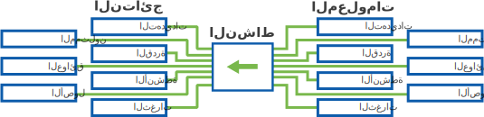

بينما سيتم تعريف المكونات بالتفصيل فى أجزاء "تحليل الخطر" و"بناء الوكالة"، هذا موجز لمكونات مسار البيانات:

* **الجهات الممثلة** الجهات الممثلة أو الممثلون هم الأشخاص ذوي الصلة بالمنظمة، من موظفين، وأعضاء مجلس الإدارة، وشكراء، ومتعاقدين مع المنظمة. يمكن أن يشمل الممثلون أيضاً المتطوعين، وأعضاء مجتمع العمل بشكل أوسع، وحتى أفراد العائلة. وقد يتضمّن الممثلون أيضاً خصوم المنظمة مثل المجموعات المنافسة لها.
* **الأنشطة** الأنشطة هى فعاليات وعمليات المنظمة. بينما تتمحور معظم أعمال المنظمات غير الحكومية حول مفاهيم المهمات المحددة، قد تتضمّن الأنشطة أشياء مثل سجل الرّواتب.
* **القدرة** مؤشرات القدرة تشمل مهارات الموظفين ومختلف أنواع المصادر التي ترتكز المنظمة عليها لإحداث التغيير.
* **العوائق** العوائق هى تحديات معينة تواجهها المنظمة والتي يمكن أن تمنع أو تحد من قدراتها.
* **الأصول** يمكن اختزال الأصول  في أنظمة الحاسوب - أي الكمبيوترات المحمولة، والخوادم، ولكنها قد تشمل أيضاً البيانات المخرنة فيها، أو خدمات مثل تخزين الملفات عن بعد، والمواقع المستضافة، والبريد الالكتروني، وغير ذلك. ويمكن أيضاً إدراج الأقراص التخزين، و أجهزة USB، وحتى الأوراق المطبوعة التي تحتوي على معلومات حساسة تحت هذا البند.
* **الثغرات** الثغرات هي عيوب معينة أوصفات لأحد الأصول التي تجعل منها عرضةً للهجوم.
* **التهديدات** التهديد هو هجوم معين ومحتمل، أو حدث يمكن أن يلحق ضرراً بالمنظمة. اذا كانت سلة من قطع قماش مبللة بمادة مشتعلة هي ثغرة، فالحريق هو التهديد - والحد من التهديد يكمن في قواعد ضد ترك قطع القماش مبللة بمادة مشتعلة في الأنحاء، وفي وجود طفّايات الحريق، وكاشفات عن الدخان، ونسخ احتياطية للسياسات عن بعد، وخطط للإخلاء.

لجعل SAFETAG متاحاً أكثر، نطرح هنا نموذج تقييم أساسي يربط  ما بين عدد من الأهداف المعينة، كل منها تشمل مجموعة أنشطة مصاحبة لكل هدف، والتي تساهم فى تحقيق الأهداف وتحصيل المعلومات التى تحتاجها. من المحتمل أن يجد المدققين الخبراء مقاربات خاصة بهم، وهذه إسهامات مرحب بها من قبل مشروع SAFETAG.

\newpage
<!-- Risk Modeling -->

## تقييم وتحليل الخطر

وظيفيّا، SAFETAG هو إطار لتحليل الخطر الرقمي. وتحليل الخطر هو أسلوب منهجي في تحديد وتقييم المخاطر المصاحبة للمجازفات والأنشطة الانسانية. تركز SAFETAG في هذه المنهجية  على مخاطر الأمن الرقمي. سيعمل تدقيق SAFETAG على جمع الأصناف التالية من المعلومات لتقييم المخاطر التى تواجهها المنظمة.

الخطر هو تقييم حالي لاحتمالية وقوع أحداث ضارة. يتم تقييم الخطر عن طريق مقارنة المخاطر التي يواجهها الممثل مع ثغراتها ومقدرتها على التجاوب أو تقليل هذه المخاطر الطارئة.

تقييم SAFETAG يتمحور حول تجميع مقدار كافي من المعلومات لتحديد وتقييم المخاطر المختلفة التى قد تواجه المنظمة والممثلين المتعلقة بها، لكي يستطيعوا أن يتّخذوا إجراءات  بشكل استراتيجي.

### تحليل البرنامج

تحليل البرنامج يحدّد المهمات ذات الأولوية للمنظمة، و يحدد قدراتها. هذه العملية تكشف عن الأنشطة، والممثلين، وقدرات المنظمة.

#### الأنشطة

**التعريف:** الممارسات والتفاعلات التى تقوم بها المنظمة لتحقيق أهدافها.

**مثال:** هذا يشمل أى نشاط تقوم به المنظمة لتحقيق أهدافها والسماح لها بالعمل (النشر، الدفع، تجميع التبرعات، التوعية، المقابلات.)

* ما هو الغرض الرئيسى للمنظمة؟
* ما هى العمليات التى تشارك بها المنظمة لتقوم بعملها؟

#### الممثلون

**التعريف:** الموظفين، والمتطوعين، والشركاء، والمستفيدين، والمتبرعين، والخصوم المتعلقين بالمنظمة.

**مثال:** جوهر العاملين بالمنظمة، والمتطوعين فيها، وعمال الصيانة، والنظافة، والأمن، أو أي من العمال الغير أساسيين، والمنظمات الشريكة، والأفراد، والمجموعات التى توفر لها المنظمة خدمات، وكذلك المجموعات من الأفراد غير المنظّمين الذين يعارضون غايات المنظمة، والعملاء ذوي النفوذ من الحكوميين، أو غير الحكوميين، والمنظمات التي تعارض غايات المنظمة.

* من توظّف المنظمة من عاملين؟
* هل هناك متطوعين، أو عمال صيانة، أو نظافة، أو أمن، أو أي من العاملين الغير أساسيين الذين يملكون قدرة الوصول إلى المكاتب؟
* من هم الذين تخدمهم المنظمة؟
* هل للمنظمة أي شركاء؟
* من هم المستفيدين من خدمات المنظمة؟

<لماذا من المهم تحديد الشركاء، والمستفيدين، الخ. بدلاً من التركيزعلى المنظمة  فقط ؟>

### تحليل الثغرات

فهم كيفية تعرض المنظمة للتهديدات، ونقاط الضعف، والطرق التى يمكن من خلالها التأثير على المنظمة.

#### ثغرة

**تعريف:** هي خاصية، أو خدمة، تجعل الكيان، أو الأصل، أو النظام، أو الشبكة عرضةً لتهديد معين.

**مثال:** من الممكن أن يشمل ذلك ما أي بناء ركيك، أو لم يتم صيانته من أجهزة، أو برامج، أو مكاتب، كما يشمل أيضاً السياسات والممارسات الأمنية المفقودة، أو المتجاهلة.

### تحليل التهديد

تحليل التهديد هو عملية تحديد المهاجمين المحتملين، وجمع معلومات خلفية عن قدرة هؤلاء المهاجمين على تهديد المنظمة. أساس هذه المعلومات هو **تاريخ** المهددين المحتملين في القيام بتهديدات معينة، و**إمكانيتهم** على القيام بهذه التهديدات فى الوقت الحالي، وإثبات أن المهدد لديه **نية** في استخدام امكانياته ضد المستهدف.

#### تهديد

**تعريف:** التهديد هو هجوم محتمل أو حدث يحتمل أن يضر بالحياة، المعلومات، العمليات، البيئة، و/أو الممتلكات.

**مثال** يمكن أن تتضمن التهديدات *الحريق* أو *السيول* إلى *البرمجيات الخبيثة* أو *التحرش المادي* أو *هجمات التصيّد*.

#### تاريخ التهديد

**التعريف:** ما هي أنواع التهديدات التى استخدمها المهاجم تاريخيا. وما أنواع الممثلين الذين تم استهدافهم بهذه التهديديات.

**مثال:**

* ما هو تاريخ ممثل التهديد من حيث الهجمات التي قامت بها؟
* ما هى التكنيكات التى استخدموها؟ هل استهدفوا ثغرات موجودة حاليا لدى المنظمة؟
* هل استهدفوا منظمات مماثلة؟
* ما هو المعروف عن أنواع التهديدات المستخدمة من قبل ممثل التهديد في مهاجمة منظمات المماثلة؟

#### إمكانية التهديد

**تعريف:** الوسائل التى يملكها المهاجم للقيام بالتهديدات ضد المنظمة.

**مثال:** هذا يشمل، وليس محصور على المهارة التقنية، والدعم المالي، وعدد ساعات العاملين، والقوة القانونية.

* هل لدى ممثل التهديد الوسائل لإستغلال ثغرة موجودة حالياً عند المنظمة؟
* هل لدى ممثل التهديد القوة للقيام بتهديدات على مستوى واسع ضد المنظمات الصغيرة المماثلة، أم أنّ عليه أن يحدد أولوياته من هجمات؟

#### نية التهديد

**تعريف:** مستوى الرغبة لدى المهاجم للقيام بالتهديدات ضد المنظمة.

**مثال:** النية ممكن أن تكون مجموعة من الأهداف أو النتائج التي يسعى إليها الخصم، أو تبعات يسعى الخصم أن يتجنّبها، وما مدى حدّة رغبة الخصم في تحقيق هذه النتائج، أو تجنب هذه التبعات.

* حاليّاً، هل لدى ممثل التهديد الرغبة في شن هجوم ضد هذا النوع من المنظمات؟
* هل المنظمة هدفا ذو أولوية لممثل التهديد؟

\newpage
<!-- Agency Building -->

## بناء الوكالة

يختلف SAFETAG عن كثير من أدوات تحليل الخطر لأنه يهدف إلى بناء قدرة المنظمة المضيفة والعاملين فيها ليكونوا قادرين على مواجهة المخاطر التى حددها المدقق. صمّم SAFETAG ليقدم أنشطة وتدريب ضمن عملية التقييم تعنى بزيادة قدرة المنظمة بالوكالة على تحرّي ومواجهة التحديات الأمنية في داخل المنظمة. حتى يتمكن من ذلك، يجب على المدقق أن يجمع معلومات تسمح بالتعرّف على مساحات الضعف والقوة لدى المنظمة (الخبرة، التمويل، الرغبة فى التعلم، وقت العاملين، ... الخ).

عادة ما يتفادى المدققون، ومطوروا البرامج، ومتخصصون آخرون في هذا القطاع الوقوع في خطأ النّظر إلى الأمن الرقمي كقضية تكنولوجيّة بحته، فهو أمن الأشخاص. وحتى أنّ وحدات SAFETAG — بالرّغم من تركيزها المباشر على التكنولوجيا — تقرّ بهذه الرؤية عن طريق إعطاء الاهتمام لدور تقرير النتائج الذي تنتجه منظمتكم في التعليم والإقناع.

#### القدرة

**التعريف:** هو مجموع نقاط القوة، والخصائص، والمصادر المتاحة في المؤسسة التي يمكن أن تستخدم للتقليل من وقع تأثير، أو احتمالية التهديدات.

**مثال:** هذا يشمل، ولكنه ليس محصورًا في الدعم المالي، ووقت الإدارة والموظفين، و العلاقات، والقوة القانونية.

#### عوائق

**التعريف:** مجموع نقاط الضعف، والافتراضات، والقوانين، والممارسات الاجتماعية و الثقافية، وأخيراً الالتزامات التي تعيق  تطبيق المنظّمة لممارسة فعّالة في الأمن رقمي.

**مثال:** يمكن أن تشمل الأمثلة قلة التمويل، أو قلة النفوذ داخل المنظمة في فرض الممارسات على الموضفين، أو مقاومة التغيير، أو كثرة التغييرات في فريق الموظفين، أو الأُمية الرّقمية.

\newpage
<!-- Operational Security -->

## الأمن التشغيلي

### ملخص

أدناه خط الأساس لإرشادات الأمن التشغيلي في تدقيق SAFETAG. يحتوي كل نشاط على إرشادات الأمن التشغيلي الخاصة به.

### غرض

يكشف التدقيق عن نسق من المعلومات الحساسة عن مؤسسة ما. مجرّد الحصول على تدقيق أمن رقمي يمكن أن يجعل من بعض المجموعات، المعرّضة أصلاً للخطر، أكثر عرضة للهجوم من قبل الخصم. أساس عملية SAFETAG هو تحقيق هدف زيادة الأمان للمنظمة المضيفة، والعاملين فيها، والمدقق. من المهم جدّاً أن يوازن المدقق بين الخطر المحتمل الذى يمكن أن يسببه القيام بتدقيق للمؤسسة أو للمدقق بعينه، وبين النتائج الممكنة من التدقيق.

### أساليب المعالجة

  * تخزين البيانات والأمن الانتقالي
    * من الأفضل الإبقاء على كل البيانات المتعلقة بالتقييم آمنة ومنفصلة عن المقابلات، وملاحظات البحث، خلال نتائج التقييم وتقرير المخرجات.  يجب على المدققون أن يلاحظوا أين تخزن الأدوات (مثل OpenVAS و recon-ng) البيانات الداخلية الخاصة بها. عمليّا، LUKS أو VeraCrypt volumes مفيدة، وآمنة، وقابلة للنقل. على المدققين أن يعدلوا من أسلوب تخزين البيانات بناءً على معلومات التهديد المستمدة من بحثهم السياقي، وكذلك بناءً على المدخلات المستمرة.
    * يجب الاعتبار في ماهية خيارات التخزين الآمن التي ستحتاجها المنظمة لتخزين التقرير النهائي ومستندات النتائج.
    * الاعتبار في ما إذا كانت البيانات الأولية في خطر أثناء الانتقال بعد التدقيق، والتخطيط  للتقليل من هذا الخطر قبل السفر (مثلاً إنهاء التقرير في الموقع، أو رفعه عن بعد لخادوم آمن، ومسح كل البيانات المحلية بطريقة آمنة).
    * الرجوع إلى الاتفاقية المتعاقد عليها مع المنظمة.

  * أمن الاتصالات
    * يجب القيام بجميع الاتصالات مع العميل عبر قنوات مؤمّنة بحد أدنى، حيث تكون جميع الاتصالات مشفرة أثناء الانتقال طوال الوقت، وكذلك دراسة المخاطر على المنظمة والمدقق(ين) لو تم إختراق المنظمة.
    * عند نقل الملفات والمستندات، يجب استخدام مستويات أعلى من الأمان تضمن التشفير  من طرف إلى طرف (مثل Singal، أو PGP، أو veracrypt، أو peerio/minilock).
    * من المحتمل أن يكون هناك حاجة للتدريب والدعم للتأكد من أن المنظمة قادرة على القيام بهذه النوعية من الاتصالات بشكل آمن ومستقر.

  * حذف البيانات
    * يجب التأكد من اتباع طرق آمنة لحذف البيانات عند تدمير بيانات التقييم (عن طريق المدقق أو المنظمة).

### الموارد

* *معيار*: [NIST SP 800-115, Technical Guide to Information Security Testing and Assessment](http://nvlpubs.nist.gov/nistpubs/Legacy/SP/nistspecialpublication800-115.pdf) (Section 7.4)
* *معيار*: [Pentest Standards for data security](http://www.pentest-standard.org/index.php/Pre-engagement#PGP_and_Other_Alternatives)
* *دليل*:[Surveillance Self Defense](https://ssd.eff.org/en/index) (cross-platform guides for WhatsApp, Signal, PGP, and OTR secure communications)
* *دليل*: [الأمن في صندوق: التخزين الآمن للملفات](https://securityinabox.org/ar/guide/secure-file-storage/)
* *دليل*: [عدة الإسعافات الأولية الرقمية: تأمين الإتصالات](https://rarenet.github.io/DFAK/en/SecureCommunication/)

# أساليب

\newpage
<!-- Audit Prep-->

---
Authors:
- SAFETAG
Info_provided:
- unknown
Info_required:
- unknown
---

## تحضير

### ملخص
يتألف هذا المكوّن من أنشطة تحضيرية للرحلة للتأكد من أن مكونات التدقيق، التقنية و المُسهّلة، قادرة على أن تعمل بشكل فعال، وضمن الإطار الزمني، في الموقع، وبالتنسيق مع المنظمة.

### غرض
تدقيق SAFETAG لديه إطار زمني قصير. يعد التحضير أمرًا محوريًا لتجنّب قضاء الوقت على الأرض في التفاوض حول نطاق التدقيق، أو تحديث أنظمة مدققي الحسابات، أو البحث عن الأجهزة المفقودة، أو التعرّف إلى إطار SAFETAG. لهذه الغاية، تساعد المفاوضات مع المنظمة المضيفة في الكشف عمّا إذا كانت لدى المنظمة القدرة على إجراء التدقيق، والاستجابة لنتائجها.

### أسئلة إرشاديّة

* هل لدى المنظمة ممارسات أمن رقمي قائمة، أو حاولت تنفيذها في الماضي؟
* ما هي الإجراءات في التعامل مع الحوادث، في حال تسبب المدقق أو كشف عن حادثة أثناء عملية التقييم؟
* ما هي المخاطر القانونية، المادية، أو الاجتماعية التي سيتعرض لها المدقق والمنظمة، عند إجراء التدقيق أو في حال تسريب نتائجه؟ [PETS_legal_considerations^]
* هل يتطلب الوضع الأمني ​​للموقع أو المنظمة تخطيطًا إضافيًا؟ هل أدوات البرامج الخاصة بكم محدثة وتعمل كما هو متوقع؟

### منهجية

* **إنشاء خطة تقييم:** إجراء اجتماع "تحديد النطاق" الذي يلخّص مستوى الوصولية التي سيتمكن منها المدقق، وما هي الخطوط الحمراء، وما هي عملية تعديل نطاق التدقيق عند ظهور معلومات جديدة. [^PETS_legal_considerations]^,^[^PETS_separate_permissions]
* **التفاوض على اتفاقية سرية:** التفاوض على اتفاقية مع المنظمة تلخّص كيفية قيام المدقق بحماية خصوصية المنظمة ومخرجات التدقيق.
* **اعتماد جهة اتصال عند الطوارئ:** اعتماد إجراء للتعامل مع الحوادث وجهة اتصال في حالات الطوارئ عند تسبب المدقق في، أو كشفه عن، حادثة أثناء دورة التقييم؟                                                                                  [^NIST_SP_800-115-Section_7.1]^,^[^PETS_emergency_contact]
* **إجراء البحوث** (انظر [البحث السياقي](#context-research)) لتحديد الخصوم المحتملين وقدراتهم، واستكشاف آخر الاتجاهات في الأمن الرقمي والمواضيع المتعلقة، لتقييم مخاطر عملية التدقيق ذاتها.
* **الاستعداد للسفر:** تحقق من احتياجات السفر اللوجستية - التأشيرة ، خطاب الدعوة ، تذاكر السفر وحجوزات الفنادق. لاحظ أن بعض التأشيرات يمكن أن تأخذ مجهودًا كبيراً وقد تتطلب أن يكون المدقق بدون جواز سفر أثناء معالجتها.
* **تحضير الأنظمة:** قم بتحديث واختبار الأنظمة الخاصة بك ، A / V وأدوات التدقيق[^latest_version_of_tools] ، وقم بتحضير أجهزة التخزين والأنظمة لتعكس الأمان التشغيلي المطلوب، وتأكد من أن لديك محولات طاقة وكابلات ومحولات ملائمة، محركات الأقراص USB، وبطاقات لاسلكية خارجية وأي معدات أخرى مطلوبة للاختبار. [^travel_kit_appendix]^,^[^NIST_SP_800-115-travel_prep]

\newpage
<!-- Audit Scoping-->

---
Authors:
- SAFETAG
Info_provided:
- unknown
Info_required:
- unknown
---

## البحث السياقي

### ملخص

هذا المكون يسمح للمدقق بتحديد السياق المتعلق بالمنطقة، والتكنولوجيا اللازمة لتقديم تدقيق آمن ومطّلع. هذا المكون يتكون من بحث مكتبب يتم تجميعه وتحليله عن طريق المدقق وأيضا من المدخلات من مكوّن المقابلة.

### غرض

تحليل السياق هو أساس إدارة الخطر الفعالة. كل من المنظمات التي فى خطر والمدققون سيطورون افتراضات بناءا على خبراتهم. من المهم أن يكون التدقيق مبني على معلومات حاليّة ودقيقة.

فحص الافتراضات الخاصة بكلا من المنظمة والمدقق عن طريق بحث السياق الاقليمي والتكنولوجي سيقوم بتأكيد أن المدقق يؤسس عمله على تقييمات دقيقة للأحوال التي تواجهها المنظمة وأنهم يقومون بأخذ احتياطات أمنية مبنية على معرفة.

### تدفق المعلومات

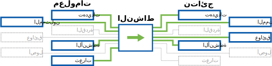

### أسئلة إرشاديّة

* ما هى المعوقات الخاصة بالبنية التحتية المتواجدة في المنطقة؟
* ما هى أهم التهديدات الرقمية، الغير مستهدفة في هذه المنطقة؟
* ما هي أهم التهديدات الرقمية المحددة الهدف، والتي تواجهها المنظمات التي تقوم بهذا العمل في هذه المنطقة/ البلد؟
* هل هناك عواقب قانونية على الأمن الرقمي فى البلد؟ (مثال قانونية التشفير، وسائل المجهولية، الخ).
* هل هناك منظمة أو شخص قام بتهديدات محددة، أو أبدى النية، أو العقلية لمهاجمة المنظمة أو منظمات مماثلة؟

### أساليب المعالجة

* إجراء بحث: البحث عن المعلومات الخلفية التى تساعدك في الحصول على فهم أفضل للتهديدات المحتملة، والسياق الإجمالي للمنظمة، وعملية التدقيق.
\newpage

---
Authors:
- SAFETAG
Info_provided:
- unknown
Info_required:
- unknown
---

## تقييم القدرة

### ملخص

فى هذا المكون يتفاعل المدقق مع العاملين من خلال المقابلات والمناقشات لتحديد نقاط القوة والضعف لدى المنظمة (الخبرة، التمويل، الرغبة فى التعلم، وقت العاملين، الخ.) لتبنى ممارسات رقمية ومادية جديدة. يستخدم المدقق هذه المعلومات لتعديل نطاق التقييم والتوصيات تبعا لها.

### غرض

معرفة نقاط القوة والضعف في المنظمة تسمح للمدقق بتقديم توصيات أكثر تفصيلاً ومن المرجح أن تحاول المنظمة تحقيقها. سيستخدم المدقق هذا التقييم في التحضير للتدقيق نفسه وكذلك عند تقييم صعوبة تنفيد توصية ما. توفر هذه المعلومات أيضًا نقطة بداية في فهم استخدام التكنولوجيا وإدراكها الحالي من قبل المنظمة، الأمن الرقمي، ومشهد التهديد الحالي، وكذلك العناصر المهمّة في سير عمل المنظمة، والبنية التحتية، وحتى الثغرات التي قد يتم تجاهلها بدون هذه المعلومات.

### مجرى المعلومات

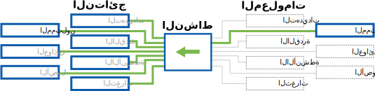

### أسئلة إرشاديّة

 * ما هي قدرة المنظمة على تبني تقنيات أو ممارسات جديدة؟
 * ما هي الموارد المتوفرة لدى المنظمة؟
 * ما طبيعة البيئة التي تعمل فيها المنظمة؟ ما العوائق، ممثلي التهديدات، والعوامل الأخرى التي تؤثّر على عملها؟
 * هل هناك اعتبارات معينة للتدقيق التي تتطلب تعديل المنهجية بشكل عام، الأدوات، خطوات الاستعداد، أو الإطار الزّمني؟

### أساليب المعالجة

 * القيام بمقابلات قبل التدقيق مع الموظفين الرئيسيين في المناصب الإدارية والتقنية لتحديد مناطق القوى والضعف للمنظمة المعنية (الخبرة، المالية، وقت الموظفين، الخ.).
 * القيام بمحادثات غير رسمية مع الموظفين خلال فترة التدقيق لتعديد جمع القدرات وال "قصص" التاريخية عن تبني التكنولوجيا.  
 * توليد قوائم سهلة المتابعة للتقييم الذاتي، والتي يمكن استخدامها بشكل مستمر، وتعديلها عن طريق المنظمة عبر الوقت.  

### المخرجات

  * قدرة المنظمة على:
    * تبني تكنولوجيا جديدة
    * التعلم من الآخرين
  * موارد المنظمة (المالية، الوقت، الانضمام، الخبرة ...) المتوفرة لتبنّي حلول تكنولوجيا
 * توفر وجودة الاتصالات والبنية التحتية الالكترونية
 * التهديدات الموجهة للأمن الرقمي والمادي للمنظمة والعاملين فيها، والقضايا الأمنية السابقة التي تم مواجهتها من قبل المنظمة وشركاؤها.
 * المخاوف الأمنية ذات الأولوية
 * عتاد الأجهزة والبرامج التكنولوجية التي يتم استخدامها حاليا لحماية الأمن الرقمي والمادي للمنظمة والعاملين فيها.
 * الاستخدام الماضي، الحالي، أو المرجو من المواقع، المدوّنات، والإعلام الاجتماعي، وغيرها من الأدوات والمنصات المبنية على الانترنت للقيام بالتواصل، إدارة المعلومات، المناصرة، أو التفاعل مع مجموعات معينة.
 * الاستخدام السابق، الحالي، أو المرجو من الاتصال الهاتفي الحلوي والأجهزة والبرامج ذات الصلة لأنشطة مثل إدارة الرسائل النصية وجمع البيانات.

\newpage
<!-- Recon-->

---
Authors:
- SAFETAG
Info_provided:
- unknown
Info_required:
- unknown
---

## استطلاع

### ملخص

منهجية التقييم بعيدة المدى تركز على المراقبة المباشرة للمؤسسة وبنيتها التحتية. يشمل ذلك استطلاعات مصادر البيانات المتوفرة بشكل علني ("إستخبارات المصدر المفتوح") مما يسمح للمدقق بتحديد المصادر المتاحة (مثل: المواقع الإلكترونية، الشبكات الخارجية، خوادم البريد الإلكتروني، و أيضا بيانات مواقع التواصل الإجتماعي) الموصولة بالمؤسسة والتي يمكن جمع بيانات عنها عن بعد.

### غرض

بينما يصب أكثر تركيز SAFETAG على تحديات الأمن الرقمي داخل وحول المكتب، فإن المعلومات غير المقصودة المتاحة من "المصادر المفتوحة" يمكن أن تشكل تهديدات حقيقية وتستحق اهتماما أكبر. هذا أيضا يبني فهم المدقق للحضور الرقمي للمنظمة، ويرشده لنقاط ضعف محددة للتحقيق مرة أخرى في الموقع.

### مجرى المعلومات

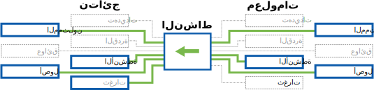

### أسئلة إرشاديّة

* إعتماداً على الحاجة الأمنية للمنظمة ، هل هناك أي "تسرب" لأي بيانات حساسة عبر الإنترنت (الموقع ، هويات الموظفين ، مواقع البرامج؟)
* هل من الممكن تحديد الشركاء أو المنتفعين من الخدمات من خلال مواقع المنظمات؟
* ما هو نمط عناوين إيميلات الموظفين؟
* هل تم تنفيذ أي انتهاكات لخوادم المنظمة، المستخدمين التابعين لها، أو حسابات إيميلاتها في الماضي؟

### أساليب المعالجة

* **دليل OSINT:**: تحديد مدى توفر المعلومات على الانترنت حاليّا عن الشركاء، والمنتفعين، وعن المشروع الحالي من خلال استخدام محركات بحث جوجل المتقدمة وحصاد المواقع. [^PETS_logical_intel]
* **Recon-NG:**: استخدام recon-ng لإجراء استطلاع تلقائي مفتوح المصدر مبني على شبكة الانترنت [recon-ng_data_flow^]
* **OSINT الشبكة الإجتماعية :** تحديد مدى توافر المعلومات عن  الموظفين، الشركاء، المستفيدين، ومعلومات المشروع الحالي من خلال البحث في الشبكات الاجتماعية للحصول على معلومات تم تسريبها حول المنظمة.

\newpage

<!-- Network Mapping -->

---
Authors:
- SAFETAG
Info_provided:
- unknown
Info_required:
- unknown
---

## تخطيط الشبكة

### ملخص

هذا المكوّن يسمح للمدقق بتحديد القضايا الأمنية في شبكة المضيف وتخطيط الأجهزة على شبكة المضيف، والخدمات التي يتم استخدامها عن طريق هذه الأجهزة، وأي حمايات متوفرة.

### غرض

تخطيط الشبكة التابعة لمنظمة يكشف عن أعداد الأجهزة المتصلة بها -- بما في ذلك الخوادم التي تمّ نسيانها -- وهذا يزود قاعدة أساس للعمل على تقييم الأجهزة والبحث في نقاط الضعف في المستقبل.

هذه العملية تكشف أيضاً عن الاستخدامات الخارجية للخدمة (مثل خدمات جوجل، أو دروب بكس، أو غيرها) والتي تعمل بدورها -سواء بنية أو لا -- كظل للبنية التحتية للمنظمة. يمكن تحديد العديد من الأجهزة التابعة لمستخدمين عند اتباع هذه العملية بالأضافة إلى تمرين *مراقبة الحركة في الشبكة اللاسلكية المفتوحة*.

### مجرى المعلومات

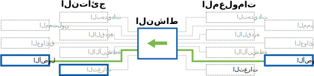

### أسئلة إرشاديّة

* ماهو نظام التشغيل، أو الخدمات التي بدأت بإستضافتها المنظمة؟ هل يُشغل أياً من المضيفين أنظمة تشغيل  أو خدمات أستثنائية أو مخصصة أو قديمة؟
* هل هناك أجهزة أو خدمات غيرعادية/متوقعة على الشبكة؟
* ماهو شكل الشبكة؟ وماهي أجهزة المودم والراوتر أو الموجهات؟
إدارتها ؟
* ماهي الخدمات (على سبيل المثال: الدربوكس،الويب ميل، الخ) التي تعمل على الشبكة والتي لم تذكر من قِبل العاملين في المنظمة؟
* ما هي أصول الشبكة التي يستطيع المهاجم الوصول إليها بمجرد وصوله إلى الشبكة الداخلية؟

### أساليب المعالجة

* **رسم خرائط الشبكة :** مستضيفي الخريطة، والخدمات، وأجهزة الشبكة عن طريق فحص أجهزة الشبكة.
* **مراقبة الحركة في الشبكة اللاسلكية المفتوحة:** مراقبة الحركة في اللاسلكي للتسليم، المرشدات اللاسلكية، وعناوين MAC.
* **تعيين المدى اللاسلكي:** قم بتعيين نطاق الشبكة الاسلكية للمنظمة خارج مساحة المكتب.

\newpage
<!-- Organizational Device Assessment -->

---
Authors:
- SAFETAG
Info_provided:
- unknown
Info_required:
- unknown
---

## استخدام المنظمة للأجهزة

### ملخص

يسمح هذا المكون للمدقق باكتشاف وتقييم أمن الأجهزة على الشبكة و/أو استخدامها في المؤسسة. يتكون هذا المكون من المقابلات، الاستطلاعات، رسم خرائط الشبكة وفحص الأجهزة.

### غرض

الأجهزة المخترقة بإمكانها إضعاف قدرة أي مؤسسة على تأمين بياناتها. من الضروري معرفة ما إذا كانت الأجهزة تحصل على برامج وتحديثات الأمان الأساسية. ومعرفة سبل الحماية الأساسية المتوفرة ضد أي دخول غير مصرح به، قد تساعد على تصميم إستراتيجية لجعل الحواسيب أكثر أمانا. و لأن هيكل SAFETAG يركز على أمان البيانات، من الضروري أيضا عدم غض النظر عن الأجهزة نفسها التي تخزن البيانات بما في ذلك الشبكات السلكية.

### مجرى المعلومات
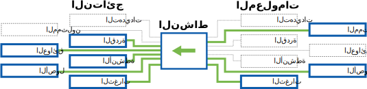

### أسئلة إرشاديّة

* ما هي أجهزة العمل والأجهزة الشخصية التي يستخدمها الموظفون لإنجاز أعمالهم، أو تخزين الملفات المرتبطة بالعمل ، أو المشاركة في اتصالات العمل؟
* ما هي الخدمات التنظيمية والخارجية/الشخصية التي يستخدمها الموظفون لإنجاز عملهم، أو تخزين الملفات المرتبطة بالعمل، أو المشاركة في اتصالات العمل؟
* كيف يجري الموظفون اتصالاتهم الداخلية والخارجية ؟ وماهي الأدوات التي يستخدمونها؟
* ماهي الممارسات الأمنية الرسمية/غير الرسمية التي يستخدمها المشاركين في تحديد المخاطر؟
* من يمتلك حق الوصول المادي وإلى ماذا؟ من يمتلك حق الوصول المادي وإلى ماذا؟
* متى تكون الأجهزة غير مراقبة من الموظفين الموثوقين ؟
* كيف يمكن للخصوم الوصول؟ (الدخول القسري، السرقة، الهندسة الاجتماعية، الاستيلاء)
* هل هناك إجراءات تخفيف إذا فقدت الأجهزة أو تم أخذها من قبل الخصوم؟ (على سبيل المثال: محركات الأقراص المشفرة والنسخ الاحتياطية خارج الموقع؟)

### أساليب المعالجة

* **الوصول ماديّاً للأجهزة:** قم بجولة في أرجاء المكتب وابحث عن أجهزة تمّ تسجيل الدخول إليها بدون وجود مستخدمين لها، خوادم، ومقابس الشبكة، أو أي كلمات مرور مكتوبة على ورق، وقم بتسجيل مدى صعوبة قيام أي زائر أو مقتحم بالحصول على معلومات حساسة  بعد ساعات العمل. أطلب من الموظفين اعتبار الأمن المادي للموقع على أرض الواقع.
* **القيام بإجراء فحص يدوي للأجهزة"** تفحص وتسجيل المعلومات المتعلقة بمستخدمي الأجهزة (سواء ذات علاقة بالعمل أو شخصية) بهدف الأمان (وجود كلمات مرور، مستويات التحديثات، مزايا المستخدمين، تشفير محركات التخزين، المنافذ أو الخدمات الجارية، قدرات مضاد الفيروسات).
* **إستطلاع المستخدمين حول كلمات المرور:** أطلب من الموظفين أخذ إستطلاع المستخدمين حول كلمات المرور لكل الأجهزة المستخدمة في العمل. [^password_survey]^,^[^password-security].
* **يوم من أيام الحياة:** أطلب من الموظفين إعلامك "بيوم معتاد في حياتهم" لترى نوعية الأجهزة التي يستخدمونها، كيف يستخدمونها، وما نوع البيانات التي عليهم التعامل معها لأداء عملهم.

### المخرجات

* قائمة بأصول المنظمة ومن ينتمي إليها
* ملاحظات قياس التحكم في الوصول للمكتب الموثق والغير موثق
* قائمة بالبرامج التي تعمل على أجهزة الموظفين وتاريخ أخر تحديث
* قائمة بالثغرات المعروفة، والبرمجيات الخبيثة القابلة للتحديد، والتي قد يتعرّض لها المكتب
* قائمة بالبرمجيات الخبيثة التي تم العثور عليها بعد تشغيل برنامج مضاد للفيروسات محدث على أجهزة المكتب (إذا تم تثبيت برنامج مضاد للفيروسات أثناء فحص الأجهزة).
* قائمة بالخوادم الغير آمنة، ووحدات التشغيل، والأقراص الخارجية، وأي موارد إلكترونية غير آمنة.
* ملاحظات حول تدابير الأمان المتبعة لكل الأنظمة الإلكترونية.
* كلمات السر المكتوبة.

### الأمن التشغيلي

  * تعامل مع المعلومات المجمعة/المدروسة بقمة السرية والحساسية. أي ملاحظات مكتوبة يجب تدميرها بعد الإستخدام. والملاحظات الإلكترونية يجب أن تتماشى مع معايير SAFETAG.

### التحضير

#### المهارات الأساسية

* تجربة إدارة الأنظمة الأساسية لأنظمة التشغيل الشائعة

### الموارد

  * *إرشادات* ["Guidelines on Firewalls and Firewall Policy"](http://csrc.nist.gov/publications/nistpubs/800-41-Rev1/sp800-41-rev1.pdf) (NIST 800-41)

  * *مقاييس:* ["Security Configuration Benchmarks"](http://benchmarks.cisecurity.org/downloads/browse/index.cfm?category=benchmarks) (CIS Security Benchmarks)

  * *مستودع:* ["National Checklist Program Repository - Prose security checklists"](https://web.nvd.nist.gov/view/ncp/repository) (National Vulnerability Database)

  * *إرشاد أمني:* ["Operating Systems Security Guidance"](https://www.nsa.gov/ia/mitigation_guidance/security_configuration_guides/operating_systems.shtml) (NSA)

 * *استخدامات ويندوز* ["HardenTools"](https://github.com/securitywithoutborders/hardentools) (Security Without Borders)

#### الأمن في كلمات السر

  * *دليل:* ["How to Teach Humans to Remember Really Complex Passwords"](http://www.wired.com/2014/07/how-to-teach-humans-to-remember-really-complex-passwords/) (Wired)

  * *دليل:* ["Security on Passwords and User Awareness"](https://www.hashtagsecurity.com/security-on-passwords-and-user-awareness) (HashTag Security)

  * *فيديو:* ["What’s wrong with your pa$$w0rd?"](http://www.ted.com/talks/lorrie_faith_cranor_what_s_wrong_with_your_pa_w0rd?language=en) (TED)

  * *مقال:* ["Password Security: Why the horse battery staple is not correct"](https://diogomonica.com/posts/password-security-why-the-horse-battery-staple-is-not-correct/) (Diogo Mónica)

  * *المنظمة:* ["Passwords Research"](http://cups.cs.cmu.edu/passwords.html) (The CyLab Usable Privacy and Security Laboratory (CUPS))

   * *دليل:* ["Hacker Lexicon: What Is Password Hashing?"](https://www.wired.com/2016/06/hacker-lexicon-password-hashing) (Wired)

   * *دليل:* ["7 Password Experts on How to Lock Down Your Online Security"](https://www.wired.com/2016/05/password-tips-experts/) (Wired)

#### فصل الصلاحيات عبر الأنظمة التشغيلية

* تحديد الصلاحيات التي تستخدمها الخدمات وكيف
* تحديد إن كان إسم المستخدم المدير admin أو root
* تحديد إن كان المستخدمين يسجلون دخولهم ويثبتون البرامج كمدراء

#### تفحّص الجدران النارية عبر الأنظمة التشغيلية

  * *قائمة مرجعية:* ["Firewall Configuration Checklist."](https://www.netspi.com/Portals/0/docs/Blog_Documents/EH_Firewalls/Firewall_Audit_Checklist_Short_v1.pdf) (NetSPI)

#### تحديد نسخ البرامج

#### تشفير الأجهزة عبر الأنظمة (OS)

* تحديد ما إذا كان جهاز يستخدم التشفير بسحب النظام التشغيلي
* توفّر التشفير بسحب النظام التشغيلي
* أدلّة تشغير

#### تحديثات مضادات الفيروسات

#### تحديد الخدمات الفريدة/المستخدمة لمرّة واحدة

  * *دليل:* ["Physical Penetration Test"](http://www.pentest-standard.org/index.php/Pre-engagement#Physical_Penetration_Test) (About The Penetration Testing Execution Standard)

  * *قائمة مرجعية:* ["Check list: Office Security"](frontlinedefenders.org/files/workbook_eng.pdf#page=80) (Frontline Defenders)

  * *دليل استخدام:* [Planning, improving and checking security in offices and homes](http://www.peacebrigades.org/fileadmin/user_files/groups/uk/files/Publications/Frontline_Manual_pdf.pdf#page=83)

  * *دليل:* ["Physical Security Assessment - pg. 122"](http://www.isecom.org/research/osstmm.html) (OSTTM)

  * *دليل:* ["Workbook on Security: Practical Steps for Human Rights Defender at Risk"](https://www.frontlinedefenders.org/en/resource-publication/workbook-security-practical-steps-human-rights-defenders-risk) (Frontline Defenders)

  * *دليل:* ["Protect your Information from Physical Threats"](https://securityinabox.org/en/guide/physical) (Frontline Defenders)

  * *نموذج سياسة:* [Information Security
Policy Templates](https://www.sans.org/security-resources/policies) (SANS)

### الأنشطة
\newpage
<!-- User Device Assessment -->

---
Authors:
- SAFETAG
Info_provided:
- unknown
Info_required:
- unknown
---

## تقييم جهاز المستخدم

### ملخص

يساعد هذا المحتوى المدقق على تقييم أمان الأجهزة الفردية على الشبكة. يتكون هذا المحتوى من المقابلات والفحوصات والتفتيش على الأجهزة.

### غرض

الأجهزة المخترقة لديها القدرة على تقويض أي محاولة تنظيمية أخرى لحماية المعلومات. فمعرفة ما إذا كانت الأجهزة تتلقى تحديثات للبرامج الأساسية والأمنية، وما هي الحماية الأساسية ضد الوصول غير المصرح به ، ضرورية لتصميم استراتيجية لجعل المضيف أكثر أمناً.

### مجرى المعلومات

### أسئلة إرشاديّة

* ما هي أجهزة العمل والأجهزة الشخصية التي يستخدمها الموظفون لإنجاز أعمالهم، أو تخزين الملفات المرتبطة بالعمل، أو المشاركة في اتصالات العمل؟
* ما هي الخدمات التنظيمية والخارجية/الشخصية التي يستخدمها الموظفون لإنجاز عملهم، أو تخزين الملفات المرتبطة بالعمل، أو المشاركة في اتصالات العمل؟
* ما هي العمليات التنظيمية التي يشارك فيها الموظفون والأدوات وقنوات الاتصال المستخدمة في هذه العملية؟
* ماهي الممارسات الأمنية الرسمية/غير الرسمية التي يستخدمها المشاركين في تحديد المخاطر؟

### أساليب المعالجة

* **فحص يدوي لأجهزة المقابلة أو التدقيق:** فحص وتسجيل المعلومات على أجهزة المستخدم (سواء الخاصة بالعمل أو الأجهزة الشخصية) لاعتبارات أمنية مثل (مستويات التصحيح، امتيازات المستخدم، تشفير محرك الأقراص، تشغيل المنافذ/الخدمات، قدرات مكافحة الفيروسات)
* **استطلاع المستخدمين حول كلمات المرور:** أطلب من الموظفين أخذ إستطلاع المستخدمين حول كلمات المرور لكل الأجهزة المستخدمة في العمل. [^password_survey]^,^[^password-security].
* **يوم في حياة:** أطلب من الموظفين إعلامك "بيوم معتاد في حياتهم" لترى نوعية الأجهزة التي يستخدمونها، كيف يستخدمونها، وما نوع البيانات التي عليهم التعامل معها لأداء عملهم.

\newpage
<!-- Vulnerability Analysis -->

---
Authors:
- SAFETAG
Info_provided:
- unknown
Info_required:
- unknown
---

## فحص وتحليل الثغرات

### ملخص
في هذا المكون  يعمل المدقق على اكتشاف عيوب محتملة في أجهزة الشركة وخدماتها وتصميمات التطبيقات والشبكات، وذلك عن طريق اختبارها ومقارنتها بمجموعة متنوعة من الموارد على الانترنت أو خارجه (قواعد بيانات الثغرات، توصيات البائعين، وتحقيقات المدقق) لتحديد نقاط الضعف المعروفة. يجب أن يتم تحليل الثغرات الأساسية جنباً إلى جنب مع الأنشطة الأخرى حتى يمكن جمع الأدلة من الشبكة. مع ذلك، يمكن إجراء بحث أكثر تعمقًا حول عمليات محددة تم اكتشافها بعد التدقيق في الموقع، للاستفادة بشكل كامل من الوقت القصير الذي يتواجد فيه المدقق في الموقع.

### غرض

ليس غريبا أن تدير منظمة غير حكومية لحقوق الإنسان وبدون سيوله مالية، البنية التحتية الحيوية للمعدات المتاحة بنفسها. قد تقوم منظمة ذات موارد أفضل بحشد خدماتها الحيوية في مركز معلومات بعيد، أو تستعين بمصادر خارجية للبنية التحتية لتقنية المعلومات من مزودي الخدمات السحابية مثل Google Apps و/أو الخدمات المخصصة (Dropbox، و Yahoo! mail، و Wordpress، وما إلى ذلك). بغض النظر، من النادر أن تجد شخص مختص بتحديث واصلاح الانظمة بعد اطلاق الثغرات، أم متخص للنظر في الخدمات من منظور أمني --وليس عملي.  

### مجرى المعلومات

### أسئلة إرشاديّة

* ما هو مستوى الإثبات الذي تحتاج إلى تحديده لتوضيح أهمية (أو لا أهمية) وجود ثغرة للمنظمة؟
* ماالذي تراه المنظمة وقسم تقنية المعلومات مناسباً فيما يخص الوقت الكافي للحصول على المعلومات التي تريدها من فريق قسم تقنية المعلومات؟

### أساليب المعالجة

* **فحص الثغرات** تقوم أداة فحص الثغرات الأمنية بتشغيل مواقع الويب والخوادم المواجهة للخارج وخوادم الإنترانت الأساسية.
* **استكشاف قواعد بيانات الثغرات:** البحث في قواعد بيانات الثغرات عن المخاطر المحتملة للنظام والبرامج المستخدمة في الخوادم، اجهزة المستخدمين والخدمات المقدمة عبر الانترنت.
* **فحص ملفات ضبط  الخدمة:** فحص الثغرات في ملفات الضبط  باستخدام ارشادات "التصلب"، أو "الأخطاء الشائعة" الموجودة على الإنترنت.

\newpage
<!-- Data Assessment (assets) -->

---
Authors:
- SAFETAG
Info_provided:
- unknown
Info_required:
- unknown
---

## تقييم البيانات

### ملخص

هذا المكون يمكّن المدقق من معرفة البيانات الدقيقة الموجودة لدى المؤسسة، وما مكان تخزينها، وكيفية نقلها.

### غرض

غالبًا ما يتم تخزين الملفات الحساسة عبر أجهزة متعددة بمستويات مختلفة من الأمان. يسمح تقييم البيانات للمدقق بتقديم توصية لحلول تخزين  تناسب تحليل المخاطر التي تواجه المنظمة واحتياجات سير عملها. ورغما عن تواجد  نظرة ثاقبة للمدقق بناءً على  "الوصول إلى وتخطيط الشبكة"، فإن التفاهم بين الموظفين والاتفاق على ما يشكل بيانات حساسة سوف يدعم التغيير المؤسساتي في وقت لاحق.

سيكون بمقدور الخصم الذي يحصل على جهاز كمبيوتر محمول أو جهاز عمل أو محرك أقراص احتياطي قراءة معلومات حساسة أو تعديلها، حتى إذا قام الموظف بتعيين كلمة مرور قوية للحساب. وينطبق هذا على التهديدات التي تنطوي على الفقدان والسرقة والمصادرة ، ولكن في سيناريوهات "نقاط التفتيش" قد لا يتمكنون من الوصول إليها إلا لبضع دقائق. علاوة على ذلك ، في حالة السطو أو اقتحام المكتب ، يمكن للخصم الحصول على جميع المعلومات الحساسة على أجهزة المنظمة، وربما حتى التي لم يتم كشفها.

### مجرى المعلومات

 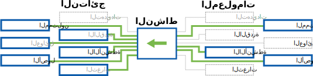

### أسئلة إرشاديّة

* ما هي أهم مجموعات البيانات المتوفرة؟ هل هناك نسخ احتياطية؟
* ماهي أهم مجموعات البيانات لحفظ الخصوصية؟
* كيف تحدد المنظمة من يكون له حق الوصول للبيانات حالياً ؟
* هل هناك أي شخص لديه حق الوصول إلى البيانات في الوقت الحالي ، ومن لاينبغي له ذلك؟
* هل يتفق الموظفون على ماهية البيانات الحساسة؟
* ما هي البيانات التي يحتاجها كل موظف الوصول إليها لكي يتمكن من القيام بعمله؟

### أساليب المعالجة

* **نشاط رسم خرائط البيانات:** اطلب من الموظفين تحديد موقع هذه البيانات حاليًا (ما هي الأجهزة/المواقع المادية)، ومن لديه إمكانية الوصول (المادي، وتسجيل الدخول، والأذونات) إليها، ومن الذين يحتاجون إلى إمكانية الوصول إليها لإنجاز أعمال المنظمة.
*  **نشاط مخاطر البيانات المفقودة والتي تم العثور عليها:** قد يكون هناك تأثير في حالة فقدان بيانات مختلفة داخل المنظمة، وإذا ما تمكن الخصوم من الوصول إلى تلك البيانات.
* **نشاط البيانات الخاصة:** من خلال هذا النشاط قم بإرشاد الموظفين بعمل قائمة موحدة للبيانات الخاصة بالمنظمة [^personal_information_to_keep_private]

إذا لم يكن من الممكن إجراء هذه الأنشطة بشكل شخصي، فيمكن إجراءها عن بُعد من خلال تطبيق أحد أساليب التيسير عن بُعد الموضحة في التذييل [تيسير عن بعد](#appendix-remote-facilitation).

### المخرجات

  * خريطة فهم الموظفين للبيانات التنظيمية المهمة:
      * ما هي هذه البيانات ؟
      * أين تخزن ؟
      * من لديه حق الوصول ؟
      * من هو الذي يحتاج للوصول إليها؟

\newpage
<!-- Physical Assessment -->

---
Authors:
- SAFETAG
Info_provided:
- unknown
Info_required:
- unknown
---

## التقييم المادي

### ملخص

تركز المنهجية الخاصة بأمن المنظمات على كيفية التخفيف من المخاطر التي تحدث بسبب ترتيب الأصول الرقمية في العالم المادي - ما مدى أمان الأجهزة في مكتب المنظمة، وكيف وإلى أين يسافر الموظفون مع الأجهزة الخاصة بالمنظمة، وما إذا كان الموظفون يعملون خارج المكتب (على سبيل المثال في مكاتب عن بُعد، في منازلهم ، أثناء السفر، أو في المقاهي). علاوة على ذلك، هل يتم الوصول إلى المعلومات الخاصة بالمنظمة من الأجهزة الشخصية، وكيف يتم تأمين هذه الأجهزة؟

### غرض

في حين أنّ SAFETAG يركز على أمن البيانات، لا يمكن تجاهل طبيعة الأجهزة المادية، محركات الأقراص الاحتياطية، الخوادم، وحتى الشبكات السلكية.

بالنسبة للعديد من المنظمات، تعتبر التهديدات الرقمية التي تعتمد على الوصول المادي أقل احتمالًا. لدرجة أن العديد من المختصين في مجال الأمن يقرون أنه لا يوجد دفاع مناسب ضد مهاجم مع وصول مادي إلى الأجهزة الحساسة. في حين أن هنالك بعض الحقيقة فيما ينصحون، لكن هذه النصيحة لا تكون مفيدة لمنظمات المجتمع المدني التي تعمل في نطاق صغير أو وسائل الإعلام المستقلة. إن المخاطر التي تواجهها منظمات المناصرة والمنظمات الإعلامية أكثر تنوعاً، وقد تؤدي تكلفة المعلومات المفقودة إلى شل قدرتها عن العمل تماماً.

وبناءا على التهديدات المحددة لكل منظمة، ينبغي على المدقق أن يضع في اعتباره التحديات الناجمة عن تهريب البيانات مرة واحدة، بالإضافة إلى اعتبار الطرق المحتملة التي يمكن للخصم استخدامها للوصول الكلي أو الجزئي للمؤسسة أو لأجهزتها وبالتالي اختراقها عن بعد، أو التسبب بالضرر للمنظمة من خلال التدمير المباشر للبيانات.

### مجرى المعلومات

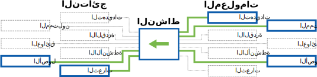

### أسئلة إرشاديّة

* من لدية حق الوصول المادي وإلى ماذا؟ متى تكون الأجهزة غير مراقبة من قِبل الموظفين الموثوقين؟
* من لدية حق الوصول المستقل لمساحة المكتب؟
* كيف يمكن للخصوم الوصول؟ (الدخول القسري ، السرقة ، الهندسة الاجتماعية ، الاستيلاء)
* كيف يتم استخدام الأجهزة اليوميّة وتخزينها -- أين تكون عندما يعود الموظفون إلى منازلهم؟
* أين تكون الخوادم ومكونات الشبكة التي تستضيف وتدير أصول المنظمة؟ هل توجد مقابس شبكة نشطة وغير مستخدمة ، هل هي في الأماكن العامة، هل هي في أماكن لا يلاحظها الناس إذا كان هناك شيء موصل بتلك المقابس؟
* كيف يتم الوصول وتخزين البيانات خارج المكاتب ومساحات العمل الرئيسية للمنظمة؟
* هل يسافر الموظفون مع معلومات المنظمة ؟
* كيف يتم إدارة النسخ الإحتياطية؟ وأين يتم تخزينها ؟

### أساليب المعالجة

* **الوصول المادي إلى الشبكة المحلية و WiFi والخوادم:** قم بجولة في المكتب وابحث عن أجهزة الشبكة والخوادم ومقابس الشبكة المكشوفة، وقم بتوثيق مدى صعوبة زيارة أحد الزائرين أو اقتحام احدهم بعد ساعات العمل للولوج الى الأنظمة الحساسة. حدد مدى الشبكة اللاسلكية ومدى سهولة معرفة أنها متصلة بالمنظمة.
* **تعيين نقاط الضعف المادي المحتملة مع تأثيرات الأمن الرقمي:** توثيق نقاط الضعف المحتملة لأمن المعلومات في المنظمة استنادًا إلى الجوانب المادية - على سبيل المثال، الأجهزة غير المشفرة التي يمكن سرقتها أو كلمات المرور المكتوبة أو حتى البيانات الوصفية للشبكة اللاسلكية.
* **يوم في حياة:** أطلب من الموظفين إعلامك "بيوم معتاد في حياتهم" لترى ما الأجهزة التي يستخدمونها، كيف يستخدمونها، وما البيانات المتوفرة لديهم ليتفاعلوا معها عند أداء عملهم.

\newpage
<!-- Risk Modeling -->

---
Authors:
- SAFETAG
Info_provided:
- unknown
Info_required:
- unknown
---

## تخطيط العمليات ونمذجة المخاطر

### ملخص
 من خلال سلسلة من الأنشطة، يسمح هذا الجزء للمدقق بقيادة موظفي المؤسسة في تعريف العمليات المحوريّة التي تمكّن المنظمة من القيام بعملها، ومن ثمّ ترتيبها من حيث الأولويّة. ستبين هذه الأنشطة أيضاً العواقب التي قد تنجم عن تعطيل هذه العمليات، أو تعرضها لممثّل أو عامل خبيث. في النتيجة، سيقوم الموظفين بإنشاء جدول مخاطر، ليكوّن قاعدة لتوصيات المدقق.

### غرض

وضع المؤسسة المضيفة في قلب عملية تقييم المخاطر يسمح للمدقق بسرد المخاطر والتوصيات من وجهة نظرهم. وكلما زاد تبني الموظفين للعملية، كلما أصبحوا أكثر استعدادا للتعامل مع المخاطر عند إنتهاء التدقيق. [^social_engineering_important_all] من خلال إشراك أكبر عدد من الموظفين، يقدم المدقق كذلك إطارا مرجعيا للموظفين لتفحص مسببات القلق المستقبلية بعد رحيله. سيتم استخدام الممارسات الأمنية الحالية الرسمية/الغير رسمية، والتي تم تسجيلها أثناء العملية، في إزالة العوائق المؤسساتية والنفسية-الاجتماعية التي تقف أمام تبني ممارسات جديدة.

### تدفق المعلومات
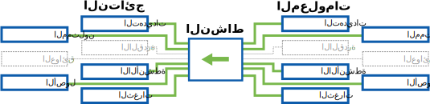

### أسئلة إرشاديّة

* ماهي أنشطة المنظمة الهامة؟
* ماهي التهديدات التي تواجه المنظمة، وبرامجها، وشركائها، والمستفيدين منها ؟
* ما مدى تأثير هذه التهديدات إن وقعت؟
* من هم الخصوم (أفراد أو جماعات) الذين قد يحاولوا تنفيذ التهديدات؟
* هل هؤلاء الخصوم قادرون على تنفيذ تلك التهديدات؟

### أساليب المعالجة

* تمارين تخطيط  العلميات و/أو البيانات
* مقابلات فردية مع الموظفين لاستكمال الأنشطة الجماعية الأخرى.
* تحديد المخاطر إستناداً إلى تخطيط البيانات والعمليات
* مجموعة كلاسيكية [نشاط تحليل الخطر](http://frontlinedefenders.org/files/workbook_eng.pdf#page=9)

* ملاحظة: * ستتطلب عملية نمذجة المخاطر أسلوباً مختلطًا من التمارين، وسيختلف الترتيب الذي تحدده لكل مكون وفقًا للمنظمة.

إذا لم يكن من الممكن إجراء هذه الأنشطة بشكل شخصي، فيمكنك إجراءها عن بُعد من خلال تطبيق أحد أساليب التيسير عن بُعد الموضحة في ملحق  [تيسير عن بعد](#appendix-remote-facilitation).

### المخرجات

  * خرائط العمليات الحيوية.
  * قائمة الأصول الخاصة بالمنظمة

\newpage
<!-- Advanced Threat Response -->

---
Authors:
- SAFETAG
Info_provided:
- unknown
Info_required:
- unknown
---

## الإستجابة للتهديدات المتقدمة

### ملخص
يسمح هذا الجزء للمدقق بتعريف، وفرز، وتحليل السلوكيات المثيرة للريبة على جهاز أو في شبكة. بناء على التحليل، قد يحتاج المدقق لمزيد من التحقيق بحثا عن الإصابة ببرمجيات الخبيثة، والقيام بتحليل مزدوج لمعرفة إن كان خبيثاً أم لا، وتقديم توصية لخطوات علاجية عاجلة.

### غرض
العثور على تصرفات، أو عمليات، أو أنشطة مرور مثيرة للشبهة أثناء تدقيق SAFETAG هو أمر اعتيادي جداً. على ممارسي SAFETAG أن ينتبهوا دائماً  للأنشطة المريبة عند تطبيقهم لطرق وأنشطة SAFETAG، بداية من التفاعلات والنقاشات مع الموظفين، ووصولا إلى التقييم اليدوي للأجهزة وتحليلات الحركة المرورية.

### تدفق المعلومات
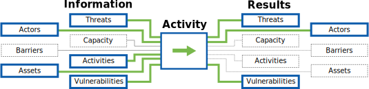

### أسئلة إرشاديّة

* هل تشك المنظمة في أن لديها بالفعل برمجيات خبيثة؟ إذا كان الأمر كذلك ، ما هي الأدلة التي تدعم ذلك؟
* هل تلقى الموظفون اتصالات مريبة، بما فيها إيميلات أو رسائل متعدّدة الوسائط؟
* استنادًا إلى سياق البحث وأنشطة المنظمة، ما مدى احتمال الهجمات المستهدفة؟
* كم من الوقت يجب تخصيصه لتحليل أكثر اكتمالاً أثناء التدقيق نفسه، وما العوامل الأخرى التي تغير في ذلك؟
* ما هي الآثار المترتبة على البرمجيات الخبيثة المستهدِفه للمنظمة ، وعملية التقييم الحالية؟
* ما هي أنواع البرمجيات الخبيثة التي تؤدي إلى اتباع نهج الاستجابة للحوادث؟

### أساليب المعالجة
**نظراً لضيق الوقت المحدد، يجب على المدقق التركيز على تحديد الأنشطة المشبوهة وفرزها بسرعة**. العديد من هذه ستكون نتائج إيجابية خاطئة ذات صلة ببرامج أخرى غير خبيثة تجعل الجهاز "يعمل بشكل غريب"، أو سببها أنواع أخرى من البرمجيات الخبيثة الأقل خطورة (وغير مستهدِفه للمنظمة بذاتها) مثل برمجيات الإعلانات أو الفدية.

عندما لا يمكن إستبعاد الخطر، فإن جمع الأدلة، وبدء البحث والتحليل الأساسي، وتقييم المخاطر وتأثيرها على أولويات المنظمة سيساعد في اتخاذ إجراءات إضافية بحسب أهميّتها. يفضل تأجيل التحليل الثنائي لما بعد التقييم، وخلال مراحل التقرير والمتابعة. إذا تمّت تسوية موارد مهمة، فإن على المدقق تنسيق إجراءات علاجية عاجلة مع مختصين آخرين في تقنية المعلومات.

تنظيم الوقت هو أمر أساسي عند التعامل مع إصابة محتملة ببرمجيات خبيثة، وأنواع شبيهة من الهجمات المتطورة. عند إتباع هذه الطريقة، على المدقق أن يسأل نفسه دائما ما إذا كان يجب الإستمرار بهذه العملية، أم الإنتهاء من جوانب أخرى من خطة التدقيق. في نهاية عملية التدقيق، إذا لم يكن المدقق على دراية بمقدرة تحمل المؤسسة للمخاطر، وقدرتها الحالية، والممارسات/العمليات/السياسات والأصول المعلوماتية القائمة، فإن ذلك سيقلل من مقدرة المدقق على تقديم تقرير ذو أولوية، وعلى فهم سياق النشاطات الخبيثة المحتملة التي تم اكتشافها.

* **تقييم مقدرات الخصوم** - يجب أن يكون ذلك من مخرجات أعمال البحث السياقي التقني. هل هناك أي تهديدات متقدمة ومتكرّرة يجب أخذها بعين الاعتبار؟ كيف تعمل هذه التهديدات؟ هل هناك أي إشارات إلى تسوية يجب ترقبها؟
* **تحليل أحداث/أنشطة محددة مشكوك بها** إن كان لدى لمؤسسة شكوك محددة أو دليل على هجوم مستهدف للمنظمة، بإمكان المدقق التركيز على مقارنة هذه الهجمات بأي هجمات معروفة، أو الإشارة إليها لإجراء المزيد من البحث لاحقاً.
* **البحث عن آثار لوقوع تسوية وتصيد التهديدات** إذا كانت المؤسسة تشك في حدوث إختراق لها، ولكن ليس بإمكانها تحديد جهاز أو عملية أو بريد إلكتروني معين، فإن المدقق يستغل التقنيات التي تسمح له بالتحقيق في الأمر.
* **جمع الأدلة للمزيد من التحليل** إذا تم تحديد أنشطة مشكوك بها، فإن المدقق يجمع الأدلة ويحللها أو يشاركها مع المختصين. هذه العملية تستهلك الوقت وجمع الأدلة بشكل عام هي عملية في غاية الخطورة، فكن حذرا عند القيام بهذه الأنشطة.
* **التحليل بعمق** إذا تم إكتشاف وجود برمجيات خبيثة، ولكن لم يتم تحديدها، فإن المزيد من التحليلات تكون ضرورية. قد يتسبب ذلك في تغير نطاق التقييم، و/أو أسلوب الاستجابة للحوادث.

\newpage
<!-- Threat Assessment -->

---
Authors:
- SAFETAG
Info_provided:
- unknown
Info_required:
- unknown
---

## تقييم التهديد

### ملخص

يستخدم هذا الجزء العديد من الأنشطة لتحديد أنواع المخترقين المحتملة، وجمع معلومات خلفية عن قدرتهم على تهديد المؤسسة. يشمل ذلك معرفة تاريخ مخترق محدد في القيام بتهديدات معينة، وإمكانية نفيذ هذا التهديد حاليا. بالإضافة لدليل يثبت أن هذا التهديد ينوي تسخير موارد ضد الهدف.

### غرض

التحقق من فرضيات كل من المؤسسة والمدقق من خلال البحث في التهديدات الحالية، سيؤكد أنّ عمل المدقق مبني على تقييمات دقيقة للظروف التي تواجهها المؤسسة، وعلى أنهم يقومون باتخاذ اعتبارات مدروسة فيما يتعلّق بالأمن التشغيلي للمنظمة. كلما ازداد انخراط الموظفين في العملية، كلما قدْموا فرصة لاكتشاف مشهد التهديدات، وكلما زاد تفاعلهم في التعامل مع الأخطار التي تمّ تحديدها بعد الانتهاء من التدقيق. إن إنخراط المدقق مع أكبر عدد ممكن من الموظفين، يزوّدهم بإطار لاستكتشاف عمليات تحديد التهديدات بعد رحيل المدقق.

### مجرى المعلومات

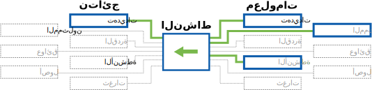

### أسئلة إرشاديّة

* من هم الخصوم المحتملين للمنظمة؟
* هل ممثلي التهديدات هؤلاء لديهم تاريخ من الهجمات؟ ضد من ؟
* ما هي أنواع المنظمات التي استهدفوها؟
* هل يملك ممثّل التهديد الوسائل التي يمكن أن يستغلها لشن التهديدات على أكثر من جهة، أم أنه سيضطر لتحديد الأولويات في أهدافه؟ هل المؤسسة هدف ذو أولوية؟
* هل لديهم الرغبة والقدرة على شن هجوم؟

### أساليب المعالجة

* **البحث في التهديات مفتوحة المصدر:** حدد الخصوم والتهديدات المحتملة باستخدام التقارير والأخبار وقواعد البيانات المتاحة للعامة.
* **تخطيط التهديدات:** تسهيل نشاطات جماعية يقوم فيها الموظفون بتحديد الخصوم المحتملين، والتهديدات التي قاموا/ أو باستطاعتهم القيام بتسخيرها ضد المجموعة.

### المخرجات

  * جدول-التهديد  يقود تطويره المستضيف، بما في ذلك ما يلي:
    * **الخصوم** (ممثلي التهديد ) مع القدرات والرغبات
    * **تأثيرات** الهجمات ضد ** العمليات الحرجة ** ، مرتبة حسب شدّتها
    * **احتمالية ** كل منهما (على أساس الخصوم)
  * آخر تهديدات الأمن السيبراني العام
  * حدد الممارسات الأمنية الرسمية/غير الرسمية التي يستخدمها المشاركين لمعالجة المخاطر.

\newpage
<!-- Responsive Support -->

---
Authors:
- SAFETAG
Info_provided:
- unknown
Info_required:
- unknown
---

## دعم الاستجابة

### ملخص

يساعد المدقق بأي إجراءات فورية مطلوبة (تدريب موضعي، تصليح أدوات، استشارة حول المشاريع القادمة) -- وقد يشمل ذلك التعامل مع الثغرات التي تسبّبت في  الإستجابة لحادثة ما.

### غرض

تستخدم نشاطات وتدريبات التدقيق في زيادة وكالة المنظمة في البحث عن والتصدي إلى التحديات الأمنية التي تواجهها، كما تمكنها من استلام وحفظ تقرير التدقيق بشكل آمن.

### تدفق المعلومات

### أسئلة إرشاديّة

* هل هناك أي ثغرات حرجة، أو أنشطة علاجية  تحتاج المنظمة إلى فهمها بطريقة أعمق يجب أن تعطى وزنها في التقرير؟
* كيف يمكنك إعداد الموظفين والإدارة لجوانب عملية التدقيق التي قد تؤدي إلى العزلة أو احباط العملية؟
* ما مدى استعدادية المؤسسة، واحتمالية نجاحها في التفاعل مع تكنولوجيا الأمن؟ ما العوامل التي ستعقّد، أو تعيق، من الاستخدام الآمن والفعّال؟
* هل الدعم الذي تريدون تقديمه (حل المشاكل، التصليحات، التحديثات، تدريب، الخ.) جوهري لأمن المؤسسة؟ إن كانت الإجابة لا، هل بإلامكام تقديم هذا الدعم دون التأثير على التدقيق؟
* هل سيكون لديك القدرة على دعم البرامج أو الأجهزة التي قدمتها أثناء تقديم الدعم؟

### أساليب المعالجة

* **التدريب الموجّه:** يمكن تقديم أجزاء تعليمية تغطي أساسيات الإمن الرقمي، و ترضي توقعات الفريق، وتشجع المجموعة المستهدفة على إدخال ممارسات الأمن الرقمي في حياتهم اليومية.
* **الدعم الموجه:** بإمكان المدقق تقديم دعم بسيط وموجه بسيط للتطوير التقني/المنهجي حيث تتقاطع الخبرة مع وقت التدقيق.

\newpage
<!-- Debrief -->

---
Authors:
- SAFETAG
Info_provided:
- unknown
Info_required:
- unknown
---

## استخلاص

### ملخص

يشمل هذا الجزء إرسال ملخّص للمستجدات مع نقاط التواصل الرئيسية، وتخفيف الضغط من خلال التفاعل مع الأفراد والجماعات، والتخطيط لمتابعات مستقبلية مع المضيف والأفراد المعنيين.

### غرض

SAFETAG هى إطار تدقيق مصمم لربط منظمات المجتمع المدني الصغيرة، ومؤسسات الإعلام المستقلة، بالخدمات الأمنية التي يحتاجون إليها. وأكثر من ذلك، هو مصمم لتقديم التدقيقات التي تزيد من وكالة أي منظمة في التصدي لتحدياتها الأمنية بشكل إيجابي ومستقل. يمكن أن تكون الفرصة الأخيرة للمدقق ليتعامل مع الموظفين وجها لوجه، عند تشكيل وجهة نظرهم تجاه التدقيق.

هذا الموجز يضمن للمدقق بأنّ المؤسسة المضيفة وموظفيها على استعداد للبدء بمعالجة أمنهم الرقمي بعد رحيله. سيضمن المدقق أن المؤسسة المضيفة ستعتبر التدقيق كدليل ليس إدانة، من خلال تقديم بعض النتائج الفورية للمؤسسة المضيفة ولموظفيها، بالإضافة إلى تقديم التدريب أو الاستشارة الأمنية في جزء "دعم الاستجابة".

### تدفق المعلومات
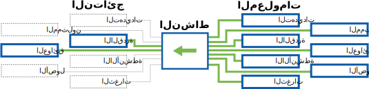

### أسئلة إرشاديّة

* هل لدى المنظمة الإمكانية للقيام بتغييرات؟
* هل لدى العاملين الرئيسين في المنظمة فهم عام للنتائج الأوّليّة؟
* هل تعي المنظمة الخطوات القادمة في عملية التدقيق ؟

### أساليب المعالجة

  * ناقش الخطوات التالية ونقاط التواصل في المستقبل للمضيف.
  * توفير عناية نفسية-اجتماعية وإعادة طرح عند الحاجة
  * بدء المتابعة مع المستضيف (التنظيمي والفردي).

\newpage
<!-- Follow Up -->

---
Authors:
- SAFETAG
Info_provided:
- unknown
Info_required:
- unknown
---

## متابعة

### ملخص
يمكن هذا الجزء المدقق من شرح تقريره، والحصول على تعليقات عنه، وتقييم نجاح العملية مع الوقت، من خلال علاقة مستمرة مع المؤسسة المضيفة.

يشمل هذا الجزء الإجتماع الأخير مع المضيف، والمتابعة معه بعد بضعة أشهر للتأكد مما إذا كان بحاجة للمزيد من الدعم، أو كان على إستعداد لمشاركة خبرته في العمل مع أي من الموارد التي تم التوصية بها، أو أي موارد جديدة تمّ تحديدها.

### غرض

يمكن أن تكون المتابعة أداة قيّمة لتشجيع أي منظمة على مواصلة عملية الأمن الرقمي. ولكن، يجب أن تكون المتابعة مرغوبة من قبل المنظمة، وأن يكون المدقق قادراً عليها. على هذا النحو، يجب أن تكون المتابعة تطفليّة بالحد الأدنى على وقت كل من المدقق والمضيف.

### تدفق المعلومات
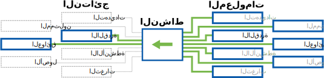

### أسئلة إرشاديّة

* ماهي العوائق التي تواجه المنظمة في تنفيذ خطة تخفيف المخاطر الموصى بها ؟
* هل هناك مصادر جديدة يمكن للمدقق توفيرها لدعم التدقيق الأصلي؟
* ما الذي يمكنك القيام به لجعل متابعتك مفهومة كدعم إضافي بدلاً من فهمها كتقييم لنجاحهم؟

### أساليب المعالجة

* **استطلاع آراء الموظفين:** تلقي آراء الموظفين بشأن تنفيذ عملية التدقيق.
* **إجتماع متابعة التقرير:** يجب عليك إجراء اتصال متابعة لمناقشة التقرير.
* **التعارف:** تقديم  موارد معروفة للمنظمة بحسب الحاجة.
* **متابعة طويلة المدى:** الاتصال بالمضيف بعد بضعة أشهر للتحقق من التقدم، والحصول على ردود فعل طويلة المدى، والتواصل مع أي موارد جديدة.

# كتابة التقارير

\newpage
<!-- Recommendation Development -->

---
Authors:
- SAFETAG
Info_provided:
- unknown
Info_required:
- unknown
---

## تطوير التوصيات

### ملخص

في هذا الجزء، يحدّد المدقق نقاط قوى وضعف المؤسسة (الخبرة، الشؤون المالية، الإستعدادية للتعليم، وقت الموظفين، إلخ) عند تبني ممارسات جديدة في الأمن رقمي، والأمن المادي. ويوثّق الإجراءات التي يمكن للمؤسسة اتخاذها للتعامل مع الثغرات التي تم العثور عليها أثناء التدقيق، ومدى صعوبة القيام بهذه الإجراءات، وكذلك الموارد التي يمكن أن يستفيد المضيف منها عند التعامل مع هذه الإجراءات. يمكن لهذه الموارد أن تشمل، دون أن تنحصر على، الدعم التقني المحلّي ومنظمات الاستجابة للحوادث، والمدربين، والإرشادات/الموارد التي يمكن استخدامها لدعم بناء مهارتهم.

### غرض

يحتاج المضيف أن يكون قادراً على اتخاذ إجراءات من بعد التدقيق. يجب أن تفتح التوصيات، التي يقدمها المدقق للتعامل مع الثغرات، المجال للمؤسسة للتعامل معها على المدى القصير، والمدى البعيد بطريقة أكثر شمولية. ستسمح  معرفة نقاط قوى وضعف المؤسسة للمدقق بتقديم توصيات موضوعة خصّيصا للمؤسسة، مما سيجعل المؤسسة أكثر استعدادا للأخذ بها. بهذا، ستكون هناك فرصة لمدقّق SAFETAG أن يمثل دور وسيط موثوق ما بين منظمات المجتمع المدني، ومنظمات  تدريب الأمن الرقمي، أو الدعم الفني، أوالمساعدة القانونية، أو الاستجابة للحوادث.

### أسئلة إرشاديّة

* ما هي نقاط القوة للمؤسسة (الخبرة، الشؤون المالية، القابلية للتعلّم، وقت الموظفين، إلخ) والتي يمكن أن تستفيد منها المنظمة عند المشاركة في التبني/التغيير التكنولوجي؟
* ما هى نقاط ضعف المؤسسة (الخبرة، الشؤون المالية،  القابلية للتعلّم، وقت الموظفين، إلخ) التي يجب أخذها بالإعتبار عند المشاركة في التبني/التغيير التكنولوجي؟
* ما هي العوائق التنظيمية أمام التبني ؟
* هل التوصيات التي تم تقديمها مرتبطة بالتدقيق الأمني بشكل مباشر؟ وإن لم يكن كذلك، هل ستدعم هذه التوصيات المنظمة في تنفيذ مهامها الأمنية، أم أنها ستشتت انتباهها عن هذه المهام؟

### أساليب المعالجة

* **تحديد وشرح المخاوف التي لم تتم معالجتها:** كتابة شروحات عن الأسباب وراء عدم معالجة أي خصوم أو تهديدات بعد اعتبار قدرات المنظمة الحالية.
* **تحديد التوصيات:** تحديد الإجراءات الممكنة للتعامل مع كل ثغرة.
* **تحديد الموارد المفيدة:** تحديد الموارد التي بإستطاعة المنظمة استغلالها لتنفيذ التوصيات المحددة.

\newpage
<!-- Roadmap Development -->

---
Authors:
- SAFETAG
Info_provided:
- unknown
Info_required:
- unknown
---

## تطوير خارطة الطريق

### ملخص

يشمل هذا الجزء على قيام المدقق بترتيب توصياته بناءً على قدرات المنظمة والتهديدات التي تواجهها. على المدقق أن يعطى أولويات للثغرات، ويقوم بوزن تكاليف تنفيذ التوصيات، ومن ثم يقوم بإنشاء خريطة طريق تمكّن المنظمة من إتخاذ قرارات مبنية على معرفة حول خطواتهم التالية.

### غرض

التزاماً باهتمام SAFETAG في بناء وكالة المنظّمة، ودعمها في تبني ممارسات أكثر أمنا، إن الترتيب الدقيق للثغرات من حيث الأولوية، بالغ في الأهمية حتى لا تبدو نتائج المدقق صعبة المنال. يجب أن تكون المنظمة قادرة على وزن طرقها المحتملة من حيث الوقت الضائع بسبب أنشطة البرنامج، وتكاليف التصدي للتهديد، والمخاطر التي لم يتم التطرق لها. وضع خريطة طريق يعطي المضيف الأدوات التي تساعده في اتخاذ هذه القرارات، وتبين له الطريق الموصى به والذي سيعود عليه بمكاسب فورية لحماية نفسه. الممارسات الأمنية الرسمية/الغير رسمية التي تم تسجيلها خلال هذه العملية، سيتم استخدامها لإلغاء الحواجز المؤسساتية، والنفسية-الإجتماعية، التي تقف في طريق تبني ممارسات جديدة.

### أسئلة إرشاديّة

* قارن الموارد المطلوبة بالقدرات التي تمّ تحديدها في نشاطات نماذج الأخطار و الأبحاث السياقية التي أنهيتها.
* بناءا على تقييم قدرات المنظمة، قم ببناء قائمة، تبني على نقاط قوة المنظمة، هدفها شق طريق إلى الأمام،  يحتوي على  نتائج يمكن تحقيقها، ويحافظ على مسؤولية ووكالة المؤسسة، ويخطو بها نحو نتائج طويلة الأمد تحقق لها ربحاً كبيرا.

### أساليب المعالجة

* **تطوير جدول الأخطار:** قم بإنشاء جدول يوضح كل نقطة ضعف تم العثور عليها، مع احتمالية وقوعها ومدى تأثيرها.
* **تطوير مصفوفة التنفيذ:** إنشاء "مصفوفة تنفيذ"، ترتّب كل تهديد من حيث كم هو مستعجل بالتوازن مع صعوبة التصدي له، مع أخد قدرة المنظمة على تنفيذ التوصيات بعين الاعتبار.
* **تطوير خارطة طريق:** تحديد الثغرات الحرجة، مع توصيات واقعية تناسب قصص التهديدات التي رواها الموظفين خلال التدقيق، وذلك لخلق خارطة طريق تعالج التهديدات التي تواجهها المنظمة.
* **توثيق النجاحات المُحقّقة:** وضع التوصيات على خط زمني يشمل ممارسات المؤسسة القائمة، وذلك لتوضيح أنّ عملية التصحيح هي استمرارية لممارسات المنظمة المضيفة، سواء ممارسات الأمن الرسمية أو الغير رسمية. [shostack_anchoring^]

\newpage
<!-- Reporting Creation -->

---
Authors:
- SAFETAG
Info_provided:
- unknown
Info_required:
- unknown
---

## توليد التقرير

### ملخص

يتضمن هذا الجزء قيام المدقق بتجميع كل ملاحظاته وتوصياته في مجموعة شاملة من المستندات التي تبين حالة الأمان الحالية، والعملية التي توصل من خلالها المدقق لهذا التقييم، وكذلك التوصيات التي سترشد تقدّم المنظمة المستضيفة للوصول إلى أهدافها الأمنية.

### غرض

بعد رحيل المدققين، يسمح هذا التقرير لهم باستمرار الحوار مع المؤسسة (وإن كان حواراً جامداً) حتى وإن لم تتواصل المنظمة من طرفها مع المدقق مرة أخرى. إذا كُتب هذا التقرير بعناية، بإمكانه أن يمثل أداة حث وتوجيه للمؤسسة للتولى زمام أمورها. هذا التقرير موجه لعدة متلقين سيحتاجون لإستخدامه بطرق مختلفة.يمثل التقرير، بالنسبة للمدقق والمؤسسة، توثيقاً للعمل الذي قام به المدققون. أمّا بالنسبة للمؤسسة، فسيرشدها  إلى ربط نقاط الضعف مع المخاطر الفعلية، كما سيمثل نداءا لإحداث التغيير، وهو دليل لاحتياجات المنظمة أمام جهات التمويل. بالنسبة للأفراد الذين تعيّنهم المؤسسة لدعم أمنها الرقمي، فإن التقرير يمثل خارطة طريق تنفيذية، وقائمة مهام للتكنولوجيين والمدربين القادمين في المستقبل، والمدفوع لهم لإيصال المنظمة المضيفة لأهداف ذاتها – كما أنه قائمة مرجعية لإثبات أن الأخطار تم معالجتها.

### أسئلة إرشاديّة

* هل التوصية التي معك تتناسب مع أي قصص سمعتها من الموظفين؟

### أساليب المعالجة

* **الأطراف المستثمِرة المستهدفة: ** أثناء عملية التدقيق، يجب تحديد الأطراف التي ستؤثر في عملية معالجة الثغرات (مثل الممولين، والمقاولين الخارجيين، والشركاء) والعمل مع المنظمة لتحديد محتويات التقرير التي تستهدف تلك الأطراف.
* **رسوم بيانية توضيحية:** خلق رسوم بيانية وصور توضيحية لخارطة الطريق، ومنشأ المخاطر والتنفيذ، والعمليات الحرجة.
* **ترجمة الملف:** قم بكتابة أجزاء سيتم مشاركتها مع الأطراف المستثمرة (الجهات الممولة، الدعم التقني، المدربين) لدعم الأهداف المؤسساتية المتعلقة بهذه الأطراف.

\newpage

# الهوامش

<!-- Load Footnotes -->

<!-- Notes -->

[^external_funding_and_reporting]:Usually when working with an external funder an engagement report, free of sensitive data about the host organization, will be created for submission the funder. The contents of this report should be clearly outlined and agreed to during the assessment plan stage.

<!-- Penetration/Security/Risk Testing Standards / Guides -->

[^NIST_SP_800-115]:[NIST SP 800-115, Technical Guide to Information Security Testing and Assessment](http://csrc.nist.gov/publications/nistpubs/800-115/SP800-115.pdf)

[^pen_testing_systematic]:[Penetration Testing - A Systematic Approach](http://www.infosecwriters.com/text_resources/pdf/PenTest_MSaindane.pdf)

[^NIST_SP_800-115_planning]:[NIST SP 800-115, Technical Guide to Information Security Testing and Assessment - Planning Methodology](http://csrc.nist.gov/publications/nistpubs/800-115/SP800-115.pdf#page=13)

[^NIST_SP_800-115_assessment_plan]:[NIST SP 800-115, Technical Guide to Information Security Testing and Assessment](http://csrc.nist.gov/publications/nistpubs/800-115/SP800-115.pdf#page=51)

[^NIST_SP_800-115-Section_7.1]:[NIST SP 800-115, Technical Guide to Information Security Testing and Assessment. Section 7.1 Coordination](http://csrc.nist.gov/publications/nistpubs/800-115/SP800-115.pdf#page=55)

[^NIST_SP_800-115_targeting]:[NIST SP 800-115, Technical Guide to Information Security Testing and Assessment](http://csrc.nist.gov/publications/nistpubs/800-115/SP800-115.pdf#page=40)

[^NIST_SP_800-115-travel_prep]:["Traveling teams should maintain a flyaway kit that includes systems, images, additional tools, cables, projectors, and other equipment that a team may need when performing testing at other locations."](http://csrc.nist.gov/publications/nistpubs/800-115/SP800-115.pdf#page=50)

[^pets_pre-engagement_location]:[Determining Audit Location - The Penetration Testing Execution Standard: Pre-Engagement Guidelines](http://www.pentest-standard.org/index.php/Pre-engagement#Locations)

[^pets_emergency_contact_info]:[Emergency Contact and Incidents - The Penetration Testing Execution Standard: Pre-Engagement Guidelines](http://www.pentest-standard.org/index.php/Pre-engagement#Emergency_Contact_Information)

[^interaction_security_risk_management]:[Security Risk Management: NGO Approach - InterAction Security Unit](https://www.scribd.com/doc/156488867/Srm)

[^workbook_on_security]:[Workbook on Security: Practical Steps for Human Rights Defenders at Risk](http://frontlinedefenders.org/files/workbook_eng.pdf)

[^OSSTMM_wireless_security_testing]:[Open Source Security Testing Methodology Manual (OSSTMM) p. 140.](http://www.isecom.org/research/osstmm.html)

<!-- Threat Modeling -->

[^shostack_anchoring]: See: "Threat Modeling: Designing for Security" by Adam Shostack, p. 298.

[^NIST_SP_800_115_soc_eng_hostile]:["Individual targeting can lead to embarrassment for those individuals if testers successfully elicit information or gain access. It is important that the results of social engineering testing are used to improve the security of the organization and not to single out individuals."](http://csrc.nist.gov/publications/nistpubs/800-115/SP800-115.pdf)

[^GPR_8_Likelihood]:["Likelihood: Chapter 2.7 p. 47 - Operational Security Management in Violent Environments"](http://www.odihpn.org/download/gpr_8_revised2pdf#page=38)

[^GPR_8_impacts]:["Impacts: Chapter 2.7 p. 46 - Operational Security Management in Violent Environments"](http://www.odihpn.org/download/gpr_8_revised2pdf#page=38)

<!-- Facilitation -->

[^psych_sec_training]:[The Psychological Underpinnings of Security Training - Craig Higson-Smith](https://level-up.cc/before-an-event/psychosocial-underpinnings-of-security-training/)

[^event_planning_input]:[Event Planning Inputs - Level-Up](https://www.level-up.cc/before-an-event/planning-your-training-event/)

[^integratedsecurity_prep_tips]:[Integrated Security Facilitator Preparation Tips](http://integratedsecuritymanual.org/sites/default/files/integratedsecurity_themanual_1.pdf#page=25)

[^integrated_security_manual]:[Integrated security: The Manual](http://integratedsecuritymanual.org/download-this-manual)

<!-- Censorship Measurement -->

[^herdict_explore]:[Herdict "At-A-Glance" web-blockage dashboard](http://herdict.org/explore/indephth)

<!-- ONI -->

[^ONI_country]:[Open Network Initiative - Country Reports](https://opennet.net/research/profiles)

[^ONI_regional]:[Open Network Inititiative - Regional Overviews](https://opennet.net/research/regions)

[^alkasir]:[A Cyber-Censorship Map automatically plotted based on the data collected from the database that is updated through usage patterns of alkasir software.](https://alkasir.com/map)

[^transparency]:[Who publishes Transparency Reports?](http://jameslosey.com/post/98162645081/who-publishes-transparency-reports-here-is-an)

[^alexa]:[The top 500 sites in each country or territory.](http://www.alexa.com/topsites/countries)

<!-- Country Infrastructure info -->

[^cia_factbook]:[CIA fact-book](https://www.cia.gov/library/publications/the-world-factbook/)

[^cia_factbook_internet-users]:[CIA fact-book country comparison of number of users within a country that access the Internet](https://www.cia.gov/library/publications/the-world-factbook/fields/2153.html)

[^cia_factbook_broadcast-media]:[CIA fact-book country comparison of the approximate number of public and private TV and radio stations in a country](https://www.cia.gov/library/publications/the-world-factbook/fields/2213.html)

[^cia_factbook_telephone-system]:[CIA fact-book country comparison of the telephone system with details on the domestic and international components.](https://www.cia.gov/library/publications/the-world-factbook/fields/2124.html)

[^WTICT_indicators]:[World Telecommunication/ICT Indicators database 2014](http://www.itu.int/en/ITU-D/Statistics/Pages/publications/wtid.aspx)

<!-- Media / Speech Freedom Threats -->

[^threatened_voices]:[Threatened Voices: Tracking suppression of online free speech.](http://threatened.globalvoicesonline.org/)

[^media_sustainability_index]:[IREX’s Media Sustainability Index (MSI) provides in-depth analyses of the conditions for independent media in 80 countries across the world.](http://www.irex.org/project/media-sustainability-index-msi)

[^freedom_on_the_net]:[Freedom House's "Freedom on the Net" index, assessing the degree of internet and digital media freedom around the world.](http://www.freedomhouse.org/report-types/freedom-net)

[^freedom_of_the_press]:[Freedom House's "Freedom of the Press" index assess' global media freedom.](http://www.freedomhouse.org/report-types/freedom-press)

[^article_19_by_country]:[ARTICLE 19 freedom of expression and freedom of information news by region.](http://www.article19.org/pages/en/where-we-work.html)

[^OSF_digital_media]:[Open Society Foundation - Mapping digital media](http://www.opensocietyfoundations.org/projects/mapping-digital-media)

[^press_freedom_index]:[Press Freedom Index (RSF)](https://en.rsf.org/press-freedom-index.html)

[^press_freedom_index_methodology]:[Press Freedom Index Methodology (RSF)](http://rsf.org/index2014/data/2014_wpfi_methodology.pdf)

<!-- Human Rights and Governance-->

[^freedom_in_the_world]:[Freedom House's "Freedom in the World" index is the standard-setting comparative assessment of global political rights and civil liberties.](http://www.freedomhouse.org/report-types/freedom-world)

[^corruptions_perception_index]:[Corruption  Perception  Index](http://www.transparency.org/cpi2013/results/)

[^Amnesty_regional_news]:[Amnesty International regional news on human rights](https://www.amnesty.org/en/countries/)

[^HRW_regional_work]:[Human Rights Watch - Browse by Region](http://www.hrw.org/regions)

<!-- Surveillance and Censorship -->

[^pi_country_reports]:[Privacy International's in-depth country reports and submissions to the United Nations.](https://privacyinternational.org/type-resource/state-privacy)

[^surveillance_whos_who]:[Surveillance Who's Who exposes the government agencies that attended ISS World surveillance trade shows between 2006 and 2011.](https://www.privacyinternational.org/resources/surveillance-whos-who)

[^ISC_country_reports]:[The ISC Project completes evaluations of information security threats in a broad range of countries. The resulting comprehensive written assessments describe each country’s digital security situation through consideration of four main categories: online surveillance, online attacks, online censorship, and user profile/access.](https://iscproject.org/country-assessments/)

<!-- Security Risks -->

[^EISF_Alerts]:[يوزع EISF فحوصات وملخصات متكرّرة للمشاكل ذات العلاقة بإدارة مخاطر أمن القطاع الإنساني.](http://www.eisf.eu/alerts/)

[^PETS_legal_considerations]:[" Some activities common in penetration tests may violate local laws. For this reason, it is advised to check the legality of common pentest tasks in the location where the work is to be performed."](http://www.pentest-standard.org/index.php/Pre-engagement#Legal_Considerations)

[^PTES_testing]:[Vulnerability Analysis - The Penetration Testing Execution Standard](http://www.pentest-standard.org/index.php/Vulnerability_Analysis)

[^NIST_800_14_user_issues]:[NIST SP 800-14, Generally Accepted Principles and Practices for Securing Information Technology Systems](http://csrc.nist.gov/publications/nistpubs/800-14/800-14.pdf#page=30)

[^NIST_exploit_confirm]:["While vulnerability scanners check only for the possible existence of a vulnerability, the attack phase of a penetration test exploits the vulne rability to confirm its existence."](http://csrc.nist.gov/publications/nistpubs/800-115/SP800-115.pdf#page=38)

[^shostack_finding_threats]: See: "Threat Modeling: Designing for Security" by Adam Shostack, p. 125.

[^shostack_addressing_threats]: See: "Threat Modeling: Designing for Security" by Adam Shostack, p. 167.

[^shostack]: "Threat Modeling: Designing for Security" by Adam Shostack

[^shostack_flow]: See: "Threat Modeling: Designing for Security" by Adam Shostack, p. 408.

[^shostack_reports]: See: "Threat Modeling: Designing for Security" by Adam Shostack, p. 401.

[^secure_reporting]:"When a pilot lands an airliner, their job isn’t over. They still have to navigate the myriad of taxiways and park at the gate safely. The same is true of you and your pen test reports, just because its finished doesn't mean you can switch off entirely. You still have to get the report out to the client, and you have to do so securely. Electronic distribution using public key cryptography is probably the best option, but not always possible. If symmetric encryption is to be used, a strong key should be used and must be transmitted out of band. Under no circumstances should a report be transmitted unencrypted. It all sounds like common sense, but all too often people fall down at the final hurdle." - [The Art of Writing Penetration Test Reports](http://resources.infosecinstitute.com/writing-penetration-testing-reports/)

[^stares_and_snide_comments]:"I once performed a social engineering test, the results of which were less than ideal for the client. The enraged CEO shared the report with the whole organization, as a way of raising awareness of social engineering attacks. This was made more interesting, when I visited that same company a few weeks later to deliver some security awareness training. During my introduction, I explained that my company did security testing and was responsible for the social engineering test a few weeks back. This was greeted with angry stares and snide comments about how I’d gotten them all into trouble. My response was, as always, “better to give me your passwords than a genuine bad guy”." - [The Art of Writing Penetration Test Reports](http://resources.infosecinstitute.com/writing-penetration-testing-reports/)

[^NIST_pen_test_danger]:"Penetration testing also poses a high risk to the organization’s networks and systems because it uses real exploits and attacks against production systems and data. Because of its high cost and potential impact, penetration testing of an organization’s network and systems on an annual basis may be sufficient. Also, penetration testing can be designed to stop when the tester reaches a point when an additional action will cause damage." - [NIST SP 800-115, Technical Guide to Information Security Testing and Assessment](http://csrc.nist.gov/publications/nistpubs/800-115/SP800-115.pdf#page=40)

[^PETS_third_parties]:[Dealing with third parties - The Penetration Testing Execution Standard](http://www.pentest-standard.org/index.php/Pre-engagement#Dealing_with_Third_Parties)

[^PETS_separate_permissions]:["In addition, some service providers require advance notice and/or separate permission prior to testing their systems. For example, Amazon has an online request form that must be completed, and the request must be approved before scanning any hosts on their cloud. If this is required, it should be part of the document."](http://www.pentest-standard.org/index.php/Pre-engagement#Permission_to_Test)

[^PETS_emergency_contact]:["Obviously, being able to get in touch with the customer or target organization in an emergency is vital."](http://www.pentest-standard.org/index.php/Pre-engagement#Emergency_Contact_Information)

[^PETS_host_and_ip]:["Before starting a penetration test, all targets must be identified. "](http://www.pentest-standard.org/index.php/Pre-engagement#Specify_IP_Ranges_and_Domains)

[^PETS_logical_intel]:[Accumulating information about partners, clients, and competitors - The Penetration Testing Execution Standard](http://www.pentest-standard.org/index.php/Intelligence_Gathering#Logical)

[^NIST_incident_repose_plan]:["يجب أن تقدم خطة التقييم إرشادات محددة حول معالجة الاحداث في حال تسبب المقيمون في، أو كشفهم عن، حادثة أثناء عملية التقييم. يجب أن يعرّف هذا الجزء من الخطة مصطح حادثة، ويقدم إرشادات لتحديد أنّ حادثة وقعت أم لم تقع. يجب أيضا أن تحدد الخطة طرق تواصل أساسية وبديلة مع المقيمين...خطة التقييم  يجب أن تقدم تعليمات واضحة عما يفترض أن يفعله المقيمون في هذه الحالات."](http://csrc.nist.gov/publications/nistpubs/800-115/SP800-115.pdf#page=52)

[^PETS_permission_to_test]:["One of the most important documents which need to be obtained for a penetration test is the Permission to Test document."](http://www.pentest-standard.org/index.php/Pre-engagement#Permission_to_Test)

[^PETS_evidence_handling]:["When handling evidence of a test and the differing stages of the report it is incredibly important to take extreme care with the data. Always use encryption and sanitize your test machine between tests."](http://www.pentest-standard.org/index.php/Pre-engagement#Evidence_Handling)

[^org_vuln_analysis]:["Vulnerability Assessment: Training module for NGOs operating in Conflict Zones and High-Crime Areas"](https://www.eisf.eu/wp-content/uploads/2014/09/0603-Dworken-undated-Vulnerability-assesment-training-module.pdf)

[^cryptolaw]:["A survey of existing and proposed laws and regulations on cryptography - systems used for protecting information against unauthorized access."](http://www.cryptolaw.org/) (The Crypto Law Survey)

<!-- Malware and Threat reports -->

[^staying_abreast_of_tech_and_threats]:["Assessors need to remain abreast of new technology and the latest means by which an adversary may attack that technology. They should periodically refresh their knowledge base, reassess their methodology-updating techniques as appropriate, and update their tool kits."](http://csrc.nist.gov/publications/nistpubs/800-115/SP800-115.pdf#page=47)

[^symantec_annual_threat_report]:[The Internet Annual Security Threat Report provides an overview and analysis of the year in global threat activity.](http://www.symantec.com/security_response/publications/threatreport.jsp)

[^symantec_monthly_threat_report]:[The monthly intelligence report, provides the latest analysis of cyber security threats, trends, and insights from the Symantec intelligence team concerning malware, spam, and other potentially harmful business risks.](http://www.symantec.com/security_response/publications/monthlythreatreport.jsp)

[^mandiant_threat_report]:[Mandiant’s annual threat report, reveals key insights, statistics and case studies illustrating how the tools and tactics of advanced persistent threat (APT) actors have evolved over the last year. (REQUIRES EMAIL ADDRESS)](https://www.mandiant.com/resources/mandiant-reports/)

[^mcafee_threat_center]:[McAfee Labs Threat Center includes their Quarterly Threats Report, Blog, and Threat Library.](http://www.mcafee.com/us/threat-center.aspx)

[^fireeye_reports]:[FireEye provides complimentary reports on threats and trends in cyber security. (REQUIRES EMAIL ADDRESS)](http://www.fireeye.com/info-center/)

[^verizon_data_breach_report]:[Verizon Data Breach Investigative Report (REQUIRES EMAIL ADDRESS)](http://www.verizonenterprise.com/DBIR/)

[^internet_storm_center]:[SANS: Internet Storm Center](https://isc.sans.edu//)

[^mcafee_threat_trends]:[McAfee Threat Trends Papers](https://www.mcafee.com/us/security-awareness/threat-trends.aspx)

[^us-cert_current_activity]:[US-CERT Current Activity web page is a regularly updated summary of the most frequent, high-impact types of security incidents currently being reported](https://www.us-cert.gov/ncas/current-activity/)

[^us-cert_bulletins]:[US-CERT Bulletins provide weekly summaries of new vulnerabilities.](https://www.us-cert.gov/ncas/bulletins/)

[^citi_lab_exec_recon]:[Communities @ Risk: Targeted Digital Threats Against Civil Society - Execurtive Summary](https://targetedthreats.net/media/1-ExecutiveSummary.pdf#page=21)

[^social_engineering_important_all]:["CSOs should gradually build a culture in which all staff, regardless of technical background, feel some responsibility for their own digital hygiene. While staff need not become technical experts, CSOs should attempt to raise the awareness of every staff member, from executive directors to interns - groups are only as strong as their weakest link—so that they can spot issues, reduce vulnerabilities, know where to go for further help, and educate others."](https://targetedthreats.net/media/1-ExecutiveSummary.pdf#page=30)

[^informed_staff_decisions]:["Of course, there is no way to anticipate and warn against every form of digital threat; new technologies and new threats emerge constantly, outpacing security awareness. In such an environment, it is important for CSOs to develop a framework for critical thinking and informed decision-making by their staff about digital threats, not tethered to any specific application, device, attack vector, or situation."](https://targetedthreats.net/media/1-ExecutiveSummary.pdf#page=30)

[^secuna_country_reports]:["Secunia Country Reports"](https://secunia.com/resources/countryreports/)

<!-- Security Advisories -->

[^Microsoft_Security_Bulletin]:[Microsoft Security Bulletin](https://technet.microsoft.com/en-us/security/bulletin)

[^ind_univ_external_advisories]:["In-Depth Reading, Vendor Information, & External Advisories"](https://protect.iu.edu/cybersecurity/indepth)

[^OSS_Security_advisories]:["Security-Related Vendor Information"](http://oss-security.openwall.org/wiki/vendors)

[^CERT_CC_Advisories]:["CERT/CC Advisories"](https://www.cert.org/historical/advisories/)

[^CERT_vuln_notes]:["Vulnerability Notes Database"](http://www.kb.cert.org/vuls)

[^security_tracker]:["Security Tracker"](http://securitytracker.com/topics/topics.html)

[^mozilla_vulns]:["Known Vulnerabilities in Mozilla Products"](https://www.mozilla.org/security/known-vulnerabilities/)

[^packetstorm_news]:["Packet Storm News"](http://packetstormsecurity.com/files/)

<!-- Technical Training & Guides -->

[^security_tube]:["Comprehensive, Hands-on, Practical and Affordable infosec training."](http://www.securitytube.net)

[^recon-ng_data_flow]:[The flow of information through the Recon-ng  framework. (See: "Data Flow" section)](http://www.lanmaster53.com/2014/05/recon-ng-update)

[^recon-ng_API_keys]:[Acquiring API Keys](https://bitbucket.org/LaNMaSteR53/recon-ng/wiki/Usage%20Guide#!acquiring-api-keys)
[^security_in_a_box_physical]:[How to protect your information from physical threats - Security in-a-box](https://securityinabox.org/chapter-2)

[^speak_safe_keeping_data_safe]:[الحفاظ على أمان بياناتك - Surveillance Self-Defense](https://ssd.eff.org/en/module/keeping-your-data-safe)

<!-- Tech adoption and usability -->

[^email_adoption_for_paranoid]:["Everyone except computer support staff said
encrypting all e-mail messages was unnecessary. In fact, several mentioned encrypting all messages was for paranoid people rather than pragmatic ones."](https://cups.cs.cmu.edu/soups/2005/2005posters/10-gaw.pdf)

<!-- Sections -->

[^auditor_trainee_tool_resource_list]:[انظر إلى قائمة المدقق لمراجع المتدرّبين](#auditor-trainee-tool-resource-list)

[^social_engineering_toolkit_resources]:[قائمة مصادر أدوات المدقق - الهندسة الاجتماعية](#social-engineering-toolkit)

[^password_dictionary_resources]:[قائمة مصادر أدوات المدقق - قاموس خلق كلمات السر](#password-dictionary-creation)

[^social_engineering_section]:[قائمة مصادر أدوات المدقق - الهندسة الاجتماعية](#social-engineering-toolkit)

[^latest_version_of_tools]:[انظر إلى قائمة المدقق لمراجع المتدرّبين](#auditor-trainee-tool-resource-list)

[^vulnerability_analysis]:[انظر: تحليل الثغرات](#vulnerability-analysis)

[^roadmap_development]:[انظر: تطوير خارطة الطريق](#roadmap-development)

[^password-security]:[تأمين كلمة السر](#password-security)

[^network-access]:[الوصول الى الشبكة](#network-access)

[^privilege-separation-across-os]:[فصل الصلاحيات على جميع الأنظمة التشغيلية](#privilege-separation-across-os)

[^examining-firewalls-across-os]:[اختبار الجدار الناري عبر OS](#examining-firewalls-across-os)

[^identifying-software-versions]:[تحديد إصدارات البرامج](#identifying-software-versions)

[^anti-virus-updates]:[تحديثات مكافح الفيروسات](#anti-virus-updates)

[^automated-vulnerability-assessment-tools]:[أدوات التقييم الأوتوماتيكي للثغرات](#automated-vulnerability-assessment-tools)

[^identifying-lockout-thresholds]:[تحديد عتبات الإغلاق](#identifying-lockout-thresholds)

[^identifying-oddone-off-services]:[تحديد الخدمات الفردية/المستخدمة لمرة واحدة ](#identifying-oddone-off-services)

[^device_encryption_by_os]:[تشفير الجهاز عن طريق نوع النظام التشغيلي](#device-encryption-by-os)

<!-- Appendices -->

[^travel_kit_appendix]:[APPENDIX A - Auditor travel kit checklist](#appendix-a)

[^personal_information_to_keep_private]:[APPENDIX B - Personal Information to Keep Private](#appendix-b)

[^password_survey]:[APPENDIX C - Password Survey](#appendix-c)

[^auditor_consent_template]:[APPENDIX D - Auditor Consent Template.](#appendix-d)

[^pre-mortum]:["Pre-Mortum Strategy" - Sources of Power: How People Make Decisions - p.71](http://books.google.com/books?id=nn1kGwL4hRgC&lpg=PP1&pg=PA71#v=onepage&q&f=false)
<!-- Interview -->

[^scope_questions]:["Questionnaires - The Penetration Testing Execution Standard"](http://www.pentest-standard.org/index.php/Pre-engagement#Questionnaires)

[^HCD_toolkit]:["IDEO Human-Centered Design Toolkit"](http://www.ideo.com/work/human-centered-design-toolkit)

[^Techscape_indicators]:["TechScape Indicators - the engine room"](https://www.theengineroom.org/projects/techscape/tsindicators/)

[^BUM_questions]:["Questions for Business Unit Managers - The Penetration Testing Execution Standard"](http://www.pentest-standard.org/index.php/Pre-engagement#Questions_for_Business_Unit_Managers)

[^SA_Questions]:["أسئلة لمديري النظم"](http://www.pentest-standard.org/index.php/Pre-engagement#Questions_for_Systems_Administrators)

<!-- Update Footnotes for overview -->
<!-- Overwrite any footnotes that are not found in the overview -->

[^password-security]:The "password security: guides and manuals" resources list can be found in the SAFETAG "full guide."

[^identifying-oddone-off-services]:The "Identifying Odd/One-Off Services" resource list can be found in the SAFETAG "full guide."

[^travel_kit_appendix]:The auditor travel kit checklist can be found in the SAFETAG "full guide."

[^personal_information_to_keep_private]: The "personal information to keep private" handout can be found in the SAFETAG "full guide."

[^password_survey]:The password Survey can be found in the SAFETAG "full guide."

[^auditor_consent_template]:The auditor consent template can be found in the SAFETAG "full guide."

<!-- Load Default Images -->
