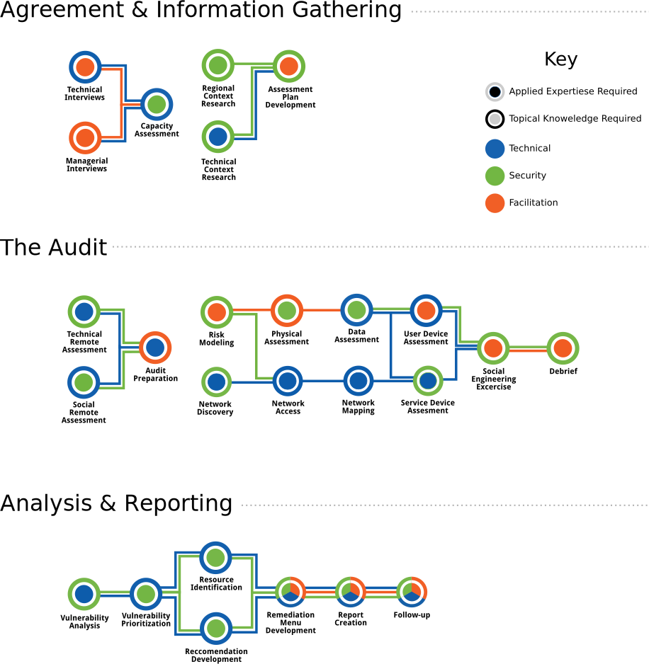

### Input 

Intro to SAFETAG

  * What is SAFETAG
  * why audits?
  * What SAFETAG isn’t:
    * Pen testing
    * Digital Security Training
    * Hands-on fixing (why?)

Risk Assessments, vulnerability assessments, and pentesting: an overview

  * The core of the audit (risk modeling)
  * Traditional Vulnerability Assessments
  * Traditional Risk assessments
  * Using pentesting
    * The perils of pen testing
    * The possibilities of pen testing

Overview of Framework and process

  * The Scope of a SAFETAG Audit
  * How the components merge into each other

\

Goals 

  * We are trying to find the best leverage points to build a risk assessment out of the “top” vulnerabilities identified for a quick impactful audit.
  * This creates strong by in and deeper understanding of how technology interacts with their security needs

Responsibilities

Auditors have access to a wealth of sensitive information and unusual access to organizational leadership. In addition to operational security, auditors and the organizations they work with have important responsibilities to each other.

...to the Organization

  * outcomes
  * report
  * on-going conversation
  * connection to resources
  * Creating the ability to run their own risk assessments style activities when thinking of new activities
able to ask the right questions

...of Internews for auditors

  * Respecting privacy: we won’t share org risk data with funder
  * support for you when you are doing audits (financial and communication)

...of the Auditors 

  * Customizing to fit an organization’s needs and your skills
  * Currently represents the complete path, not the only path.
  * Things can be dropped or customized, in fact they should
  * Select the right tools for the job
  * provide feedback to the SAFETAG community about process (for project and funder)

