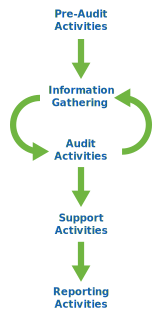

## Overview

SAFETAG is a combination of traditional risk assessment, capacity building, and 

SAFETAG uses a customized combination of selected assessment activities derived from standards in the security auditing world and best-practices for working with small scale at-risk organizations to provide organization driven risk assessment and mitigation consultation. SAFETAG auditors lead an organizational risk modeling process that helps staff and leadership take an institutional lens on their digital security problems, conduct a targeted digital security audit to expose vulnerabilities that impact the vital processes and assets identified, and provide post-audit reporting and follow up that helps the organization and staff identify the training and technical support that they need to address needs identified in the audit, and in the future.

The SAFETAG audit consists of information gathering and audit activities. The audit process in very cyclical. Newly identified threats, vulnerabilities, capabilities, and barriers impact activities that have and have yet to be run. This means that the process is actually not linear at all. It is a iterative process that eventually leads to a point where the auditor is confident they have identified the critical and low hanging fruit.

