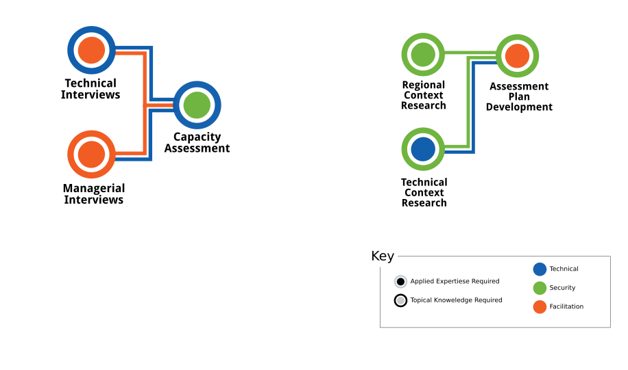
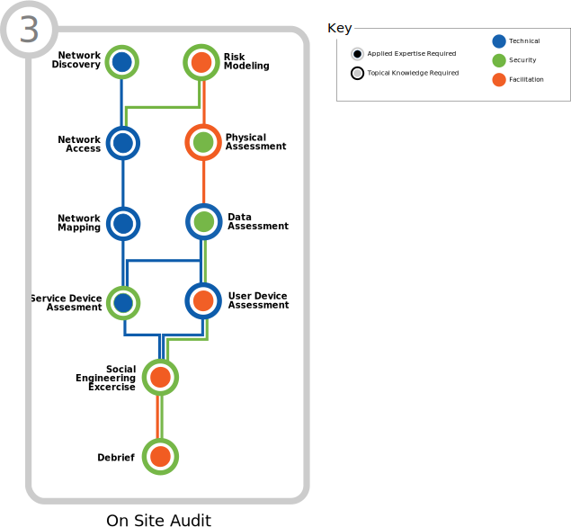
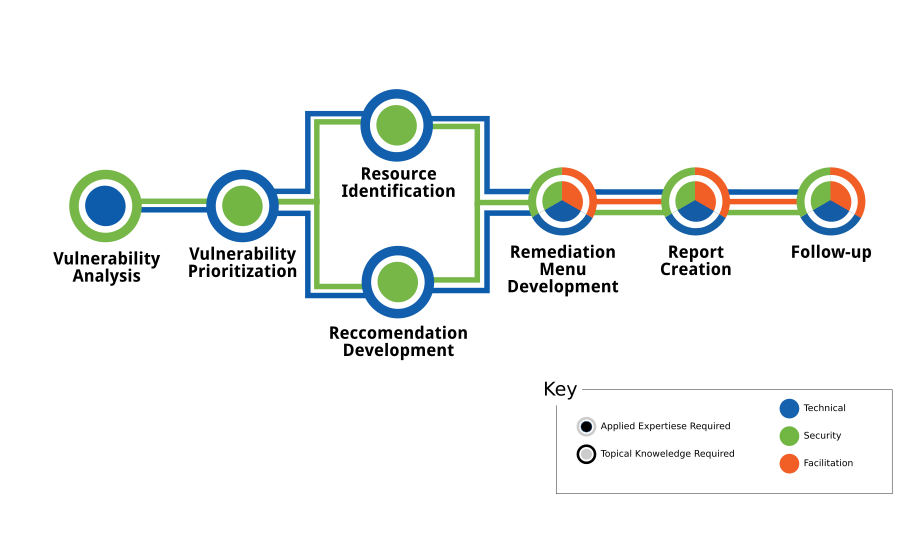

<!-- License -->

!INCLUDE "content/license.md"

\newpage

<!-- Introduction -->

# Introduction

!INCLUDE "content/guides/introduction.md"

\newpage

<!-- Overview -->

## The SAFETAG Process

!INCLUDE "content/guides/overview.md"

\

\newpage

# PART ONE: Agreement and Information Gathering

\

\newpage
<!-- Operational Security -->

!INCLUDE "content/operational_security.guide.md"

\newpage
<!-- Interviews -->

!INCLUDE "content/interviews.guide.md"

\newpage
<!-- Capacity Assessment -->

!INCLUDE "content/capacity_assessment.guide.md"

\newpage
<!-- Contextual Research -->

!INCLUDE "content/context_research.guide.md"

\newpage
<!-- Assessment Plan Development -->

!INCLUDE "content/assessment_plan.guide.md"

\newpage

# PART TWO: The Audit

\

\newpage
<!-- Remote Assessment -->

!INCLUDE "content/remote_assessment.guide.md"

\newpage
<!-- Audit Preparation -->

!INCLUDE "content/preparation.guide.md"

\newpage
<!-- Risk Modeling -->

!INCLUDE "content/risk_modeling.guide.md"

\newpage
<!-- Network Discovery -->

!INCLUDE "content/network_discovery.guide.md"

\newpage
<!-- Network Access -->

!INCLUDE "content/network_access.guide.md"

\newpage
<!-- Network Mapping -->

!INCLUDE "content/network_mapping.guide.md"

\newpage
<!-- Vulnerability Scanning !INCLUDE "content/vulnerability_scanning.md" -->

\newpage
<!-- Physical Aspects of Digital Security -->

!INCLUDE "content/vulnerability_scanning.guide.md"

\newpage
<!-- Data Assessment -->

!INCLUDE "content/data_assessment.guide.md"

\newpage
<!-- Device Assessment -->

!INCLUDE "content/device_assessment.guide.md"

\newpage
<!-- Physical Aspects of Digital Security -->

!INCLUDE "content/physical_assessment.guide.md"

\newpage
<!-- Social Engineering Exercise -->

!INCLUDE "content/social_engineering_exercise.guide.md"

\newpage
<!-- Debrief -->

!INCLUDE "content/debrief.guide.md"

\newpage

# PART THREE: Analysis and Reporting

\

\newpage
<!-- Vulnerability Analysis -->

!INCLUDE "content/vulnerability_analysis.guide.md"

\newpage
<!-- Vulnerability Prioritization -->

!INCLUDE "content/vulnerability_prioritization.guide.md"

\newpage
<!-- Recommendation Development -->

!INCLUDE "content/recommendation_development.guide.md"

\newpage
<!-- Resource Identification -->

!INCLUDE "content/resource_identification.guide.md"

\newpage
<!-- Roadmap Development -->

!INCLUDE "content/roadmap_development.guide.md"

\newpage
<!-- Report Creation -->

!INCLUDE "content/report_creation.guide.md"

\newpage
<!-- Follow Up -->

!INCLUDE "content/follow_up.guide.md"

\newpage
<!-- APPENDIX A - Auditor travel Kit Checklist-->

# APPENDIX A

!INCLUDE "content/guides/preparation/examples/travel_kit_checklist.md"

# APPENDIX B

!INCLUDE "content/guides/data_assessment/examples/personal_info_to_keep_private.md"

# APPENDIX C

!INCLUDE "content/guides/device_assessment/examples/password_survey.md"

# APPENDIX D

!INCLUDE "templates/audit/auditor_consent_template.md"

<!-- Load Default Images -->
!INCLUDE "theme/image_defaults.md"

<!-- Load Footnotes -->
!INCLUDE "content/references/footnotes.md"

