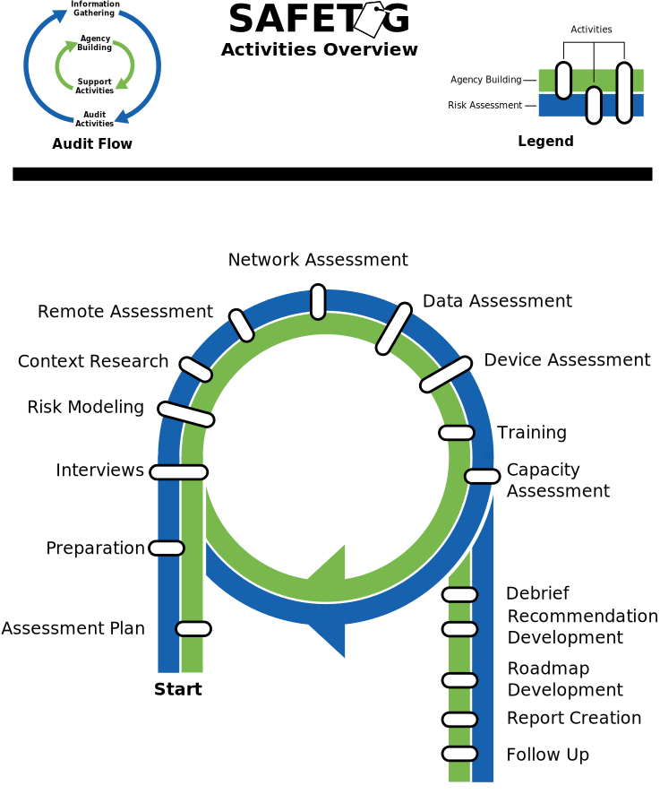

<!-- License -->

!INCLUDE "content/license.md"

\newpage

<!-- Introduction -->

# Introduction

!INCLUDE "content/guides/introduction.md"

\newpage

!INCLUDE "content/guides/disclaimer.md"

\newpage

!INCLUDE "content/guides/how_to_read_this_guide.overview.md"

\newpage

<!-- Overview -->

!INCLUDE "content/guides/overview.md"

\newpage

# The Life-cycle of an Audit

The SAFETAG audit consists of information gathering and audit activities. The audit process in very cyclical. Newly identified threats, vulnerabilities, capabilities, and barriers impact activities that have and have yet to be run. At the same time the auditor, through conversations, training, and group activities is actively building the organizations agency and addressing time-sensitive or critical threats that are possible within the time frame. This iterative process eventually leads to a point where the auditor is confident they have identified the critical and low hanging fruit, and is confident the organization is capable of moving forward with their recommendations. 

\newpage
<!-- Risk Modeling -->

!INCLUDE "content/guides/risk_assessment.overview.md"

\newpage
<!-- Agency Building -->

!INCLUDE "content/guides/agency_building.overview.md"

\newpage
<!-- Operational Security -->

!INCLUDE "content/operational_security.overview.md"

# Pre-Audit Activities

\newpage
<!-- Assessment Plan Development -->

!INCLUDE "content/assessment_plan.overview.md"

\newpage
<!-- Audit Preparation -->

!INCLUDE "content/preparation.overview.md"

# Audit Activities

\newpage
<!-- Interviews -->

!INCLUDE "content/interviews.overview.md"

\newpage
<!-- Risk Modeling -->

!INCLUDE "content/risk_modeling.overview.md"

\newpage
<!-- Contextual Research -->

!INCLUDE "content/context_research.overview.md"

\newpage
<!-- Remote Assessment -->

!INCLUDE "content/remote_assessment.overview.md"

\newpage
<!-- Network Assessment -->

!INCLUDE "content/network_assessment.overview.md"

\newpage
<!-- Vulnerability Scanning !INCLUDE "content/vulnerability_scanning.md" -->

\newpage
<!-- Data Assessment -->

!INCLUDE "content/data_assessment.overview.md"

\newpage
<!-- Device Assessment -->

!INCLUDE "content/device_assessment.overview.md"

# Support Activities

\newpage
<!-- Targeted Training -->
!INCLUDE "content/training.overview.md"

<!-- Physical Aspects of Digital Security -->
!INCLUDE "content/physical_assessment.overview.md"

\newpage
<!-- Debrief -->

!INCLUDE "content/debrief.overview.md"

\newpage
<!-- Follow Up -->

!INCLUDE "content/follow_up.overview.md"

# Reporting Activities

\newpage
<!-- Risk Assessment -->

!INCLUDE "content/risk_assessment.overview.md"

\newpage
<!-- Capacity Assessment -->

!INCLUDE "content/capacity_assessment.overview.md"

\newpage
<!-- Recommendation Development -->

!INCLUDE "content/recommendation_development.overview.md"

\newpage
<!-- Prioritization & Roadmap Development -->

!INCLUDE "content/roadmap_development.overview.md"

\newpage
<!-- Report Creation -->

!INCLUDE "content/report_creation.overview.md"

\newpage

<!-- Load Default Images -->
!INCLUDE "theme/image_defaults.md"

<!-- Load Footnotes -->
!INCLUDE "content/references/footnotes.md"

<!-- Update Footnotes for overview -->
!INCLUDE "content/references/footnotes.overview.md"
