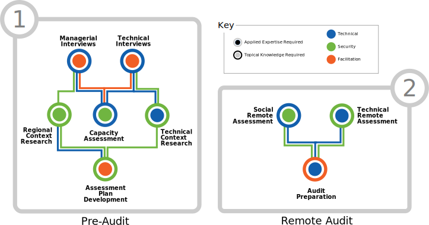
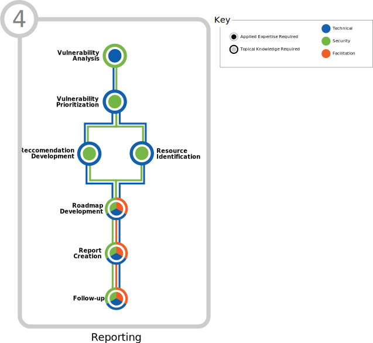

\newpage

<!-- License -->

!INCLUDE "document_matter/license.md"

\newpage

<!-- Introduction -->

!INCLUDE "document_matter/introduction.md"

\newpage

<!-- Overview -->

!INCLUDE "document_matter/safetag_core_intro.md"

!INCLUDE "document_matter/audit_lifecycle.md"

<!--  -->

\newpage

# About the SAFETAG Curricula

### The ADIDS Process
!INCLUDE "document_matter/overview.adids.md"

\newpage

<!-- Overview -->

!INCLUDE "adids/before_the_training.adids.md"

!INCLUDE "adids/introduction.adids.md"

\newpage

<!-- SAFETAG Auditor Profile -->

!INCLUDE "adids/introduction/auditor_profile.md"

\newpage

<!-- Operational Security -->

!INCLUDE "adids/operational_security.adids.md"

\newpage

<!-- The SAFETAG Repository -->

!INCLUDE "adids/safetag_repo.adids.md"

\newpage

# PART ONE: Agreement and Information Gathering

<!---->

\newpage
<!-- Interviews -->
<!-- Capacity Assessment -->

!INCLUDE "adids/interviews.adids.md"

\newpage
<!-- Contextual Research -->

!INCLUDE "adids/context_research.adids.md"

\newpage
<!-- Assessment Plan Development -->

!INCLUDE "adids/assessment_plan.adids.md"

\newpage
<!-- Remote Assessment -->

!INCLUDE "adids/reconnaissance.adids.md"

\newpage
<!-- Audit Preparation  -->

!INCLUDE "adids/preparation.adids.md"

\newpage

# PART TWO: The Audit

<!--\ -->

\newpage
<!-- Risk Modeling -->

!INCLUDE "adids/risk_modeling.adids.md"

\newpage

<!-- Network Discovery -->

!INCLUDE "adids/network_discovery.adids.md"

\newpage

<!-- Network Mapping -->

!INCLUDE "adids/network_mapping.adids.md"

\newpage

<!-- Network Access -->

!INCLUDE "adids/network_access.adids.md"

\newpage

<!-- Vulnerability Scanning

!INCLUDE "adids/vulnerability_scanning.adids.md" -->

\newpage

<!-- Physical -->

!INCLUDE "adids/physical_assessment.adids.md"

\newpage
<!-- Data Assessment -->

!INCLUDE "adids/data_assessment.adids.md"

\newpage
<!-- Device Assessment -->

!INCLUDE "adids/device_assessment.adids.md"

\newpage

\newpage
<!-- Debrief -->

!INCLUDE "adids/debrief.adids.md"

\newpage

# PART THREE: Analysis and Reporting

<!-- \ -->

\newpage
<!-- Vulnerability Prioritization -->

!INCLUDE "adids/vulnerability_prioritization.adids.md"

\newpage

<!-- Recommendation, Resources, and Roadmap Development -->

!INCLUDE "adids/roadmap_development.adids.md"

\newpage
<!-- Report Creation -->

!INCLUDE "adids/report_creation.adids.md"

<!-- \newpage Follow Up (Included in reporting for ADIDS) !INCLUDE "follow_up.adids.md" \newpage -->

# Post - Training Mentorship

<!-- SAFETAG Training Follow up -->

!INCLUDE "adids/training_followup.adids.md"

<!-- Load Default Images -->
!INCLUDE "styles/image_defaults.md"

<!-- Load Footnotes
Footnotes

!INCLUDE "references/footnotes.md"
-->
\newpage
<!-- APPENDIX A - Sample Org-->

# APPENDIX A : Sample Organization

!INCLUDE "adids/sample_org/safetag-sample-org.md"
