<!-- License -->

## Licencia

Los recursos de SAFETAG están disponibles bajo licencia Creative Commons Attribution-ShareAlike 3.0 Unported (CC BY-SA 3.0)

El marco de trabajo y lista de comprobación pueden ser usados y compartidos para propósitos educacionales, no comerciales o sin fines de lucro, dando crédito a Internews. Los usuarios tienen la libertad de modificar y distribuir el contenido bajo las condiciones listadas en la licencia.

El marco de trabajo y lista de comprobación de auditoría tienen como propósito actuar como referencia, y los autores deslindan toda responsabilidad por la seguridad de las personas que los usen en cualquier capacidad, tanto personal como profesional.

### Créditos por contenido de otras licencias

  * Los componentes Entrevista y Evaluación de Capacidad están basados profusamente en el proyecto TechScape (https://www.theengineroom.org/projects/techscape/) de The Engine Room. Ellos han [hecho su contenido disponible] (https://www.theengineroom.org/attribution-policy/) bajo la Licencia de Atribución Creative Commons 3.0 (https://creativecommons.org/licenses/by/3.0/us/).
  * La Actividad de Evaluación de Datos fue tomada del [Proyecto Level Up](https://level-up.cc), y está disponible bajo licencia [Creative Commons Attribution-Share Alike Unported 3.0](https://creativecommons.org/licenses/by-sa/3.0/). Los créditos de esta actividad corresponden a Pablo, Daniel O’Clunaigh, Ali Ravi, and Samir Nassar.

### Uso de "SAFETAG"

SAFETAG es por sí mismo un sistema y plantilla para auditorías organizacionales. Como tal, las auditorías efectuadas mediante el uso o adaptación de materiales de SAFETAG pueden ser referidas como "adaptando la metodología SAFETAG" o "basadas en el sistema de SAFETAG", o enunciaciones similares, pero NO pueden ser llamadas "auditorías SAFETAG".

Con esto no se intenta implicar que una auditoría utilizando cualquiera o todos los materiales de SAFETAG necesita referirse a SAFETAG en forma alguna.

Esta política de uso no afecta la distribución de materiales de SAFETAG, cubierta en la declaración de licencia más arriba.

\newpage

<!-- Introduction -->

## Introducción

El Sistema de Auditorías de Seguridad y Plantilla de Evaluación para Grupos de Defensoría (SAFETAG, por sus siglas en inglés) es un sistema de auditorías profesionales que adapta metodologías tradicionales de pruebas de penetración y evaluación de riesgo en forma relevante para pequeñas organizaciones de derechos humanos, sin fines de lucro, basadas u operando en el mundo en desarrollo, teniendo en cuenta las restricciones de capacidad y amenazas particulares enfrentadas por esta comunidad.

SAFETAG usa actividades de evaluación derivadas de estándares en el mundo de auditorías de seguridad y desarrolla mejores prácticas para trabajar con pequeñas organizaciones en riesgo, para proveer consultoría en evaluación y mitigación de riesgos, impulsadas desde dichas organizaciones. Los auditores SAFETAG conducen un proceso de modelado del riesgo organizacional que ayuda al personal y la dirección a tomar un foco institucional sobre sus problemas de seguridad digital, efectúan una auditoría de seguridad digital apuntada a exponer vulnerabilidades que impactan los procesos vitales y recursos identificados, y proveen reportes posteriores a la auditoría y para su seguimiento que ayudan a la organización y su personal a identificar el entrenamiento y soporte técnico que necesitan para abordar las necesidades identificadas en la auditoría y en el futuro.

info@safetag.org | https://safetag.org

\newpage

<!-- Audit Lifecyce -->

## La Esencia del Sistema de Auditoría SAFETAG

La auditoría SAFETAG consiste tanto de múltiples recolecciones de información y pasos de confirmación así como de ejercicios de investigación y desarrollo de capacidad con el personal, organizados en una colección de objetivos, cada uno de los cuales respalda las metas esenciales de SAFETAG, creando una evaluación del riesgo y al mismo tiempo construyendo la capacidad de la organización.

Estos objetivos proveen un conjunto de actividades y formas de abordar la recopilación y verificación de información en métodos tanto técnicos como interactivos/sociales, la evaluación y desarrollo de la capacidad y el suministro de ejercicios dirigidos con instrucciones detalladas para muchos de estos.

Estos no pretenden ser una "lista de comprobación" o incluso un conjunto prescrito de acciones -- de hecho, los auditores experimentados se desviarán notoriamente de muchas de las actividades específicas. Estas proveen solamente un "conjunto mínimo" de actividades enfocadas.

De hecho, muchos objetivos y sus ejercicios específicos se superponen o pueden ser hechos en conjunto -- entrevistas in situ con el personal pueden coincidir con la evaluación de sus dispositivos mientras se mantienen los ojos abiertos a cuestiones de seguridad física. Los ejercicios de evaluación de datos pueden proveer suficiente información de manera que otras reuniones con el personal sean innecesarias.

## El Ciclo de Vida de una Auditoría

El proceso de auditoría es muy cíclico. Las amenazas, vulnerabilidades, capacidades y barreras identificadas recientemente impactan las actividades que han sido ejecutadas, y las que todavía han de serlo. Al mismo tiempo el auditor, a través de conversaciones, entrenamiento y actividades grupales, está construyendo activamente la operatividad de la organización y abordando amenazas críticas o urgentes, que son posibles dentro del plazo. Este proceso iterativo eventualmente conduce a un punto en el cual el auditor tiene la confianza que se han identificado las acciones críticas de mayor consenso y facilidad de inmediata implementación, y la organización es capaz de seguir adelante con sus recomendaciones.

Cada objetivo requiere cierta base de información, y produce más información que es incorporada en este proceso cíclico. Cada objetivo tiene un "mapa" del flujo de datos que este mismo y sus actividades específicas proveen, basado en el siguiente:

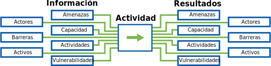

Aunque se definirán más completamente en las secciones Evaluación de Riesgo y Construcción de Operatividad, damos aquí una breve introducción de los componentes del flujo de datos:

* **Actores** Actores son las personas conectadas a una organización, incluyendo el personal, miembros de la comisión directiva, contratistas y socios. Los actores pueden también incluir voluntarios, miembros de una comunidad más amplia ejerciendo las mismas prácticas e incluso miembros de la familia. También incluye potenciales adversarios de la organización, tales como grupos competidores.
* **Actividades** Actividades son las acciones y procesos de una organización. Mientras que la mayoría del trabajo de las ONG está concentrado en conceptos basados en una misión, las actividades también incluyen aspectos tales como la liquidación de sueldos.
* **Capacidad** Indicadores de capacidad incluyen las habilidades del personal y la amplia variedad de recursos con los que una organización puede contar para implementar un cambio.
* **Barreras** Las barreras son desafíos específicos que una organización enfrenta que pueden limitar o bloquear su capacidad.
* **Recursos** Los recursos son más fácilmente conceptualizados como sistemas informáticos - ordenadores portátiles y servidores, pero también incluyen los datos almacenados en ellos como servicios de almacenamiento remoto de archivos, sitios web alojados, correo Web y más. Unidades fuera de línea, unidades USB e incluso impresiones en papel de información relevante o delicada también pueden ser incluidos.
* **Vulnerabilidades** Las vulnerabilidades son defectos o atributos específicos de un recurso susceptible de ataque.
* **Amenazas** Una amenaza es un ataque u ocurrencia posible y específica que puede dañar a la organización. Si un balde con trapos aceitados es una vulnerabilidad, un fuego es la amenaza - y sus mitigaciones serían las reglas en contra de dejar trapos aceitados expuestos, como así también matafuegos, detectores de humo, políticas para copias de seguridad remota y planeamiento de evacuación.

Para hacer SAFETAG abordable, se presenta aquí una plantilla de evaluación esencial que vincula una serie de objetivos específicos, cada uno de los cuales tiene una variedad de actividades enlazadas, que contribuyen al avance de las metas y sus necesidades de información requerida. Auditores experimentados probablemente encontrarán sus propias formas de abordar esto, y el proyecto SAFETAG da la bienvenida a tales contribuciones.

\newpage
<!-- Risk Modeling -->

## Evaluación y Análisis de Riesgo

Funcionalmente, SAFETAG es un sistema de evaluación de riesgo digital. La evaluación de riesgo es una forma sistemática de abordar la identificación y determinación de los riesgos asociados con peligros y las actividades humanas. SAFETAG enfoca su abordaje en los riesgos de seguridad digital. Una auditoría SAFETAG trabajará para recopilar los siguientes tipos de información con el fin de evaluar los riesgos que una organización enfrenta.

Riesgo es la evaluación actualizada de la posibilidad que eventos dañinos tienen de ocurrir. El riesgo es evaluado al comparar las amenazas que un actor enfrenta con sus vulnerabilidades, y su capacidad de responder o mitigar amenazas emergentes.

La evaluación SAFETAG conlleva la recopilación de suficiente información para identificar y determinar los diversos riesgos que una organización y sus actores relacionados enfrentan, de manera que puedan llevar a cabo acciones estratégicas.

### Análisis de Programa

El análisis de programa identifica los objetivos prioritarios de la organización y determina sus capacidades. Este proceso expone las actividades, actores y capacidades de una organización.

#### Actividades

**Definición:** Las prácticas e interacciones que la organización ejecuta con el fin de lograr sus objetivos.

**Ejemplo:** Esto incluye cualquier actividad que la organización ejecuta para lograr sus objetivos y aquellas que le permiten funcionar (publicación, pago, colecta de fondos, difusión, entrevista.)

* ¿Cuál es el principal propósito de la organización?
* ¿Cuáles son los procesos en los que la organización toma parte para ejecutar su trabajo?

#### Actores

**Definición:** El personal, voluntarios, socios, beneficiarios, donantes y adversarios asociados con la organización.

**Ejemplo:** El personal esencial de la organización, los voluntarios, personal de mantenimiento, limpieza, seguridad u otras posiciones no críticas, las organizaciones asociadas, los individuos y grupos a los que la organización presta servicios, grupos de individuos desorganizados que se oponen a los objetivos organizacionales, agentes y organizaciones gubernamentales y no gubernamentales de alto poder que se oponen a los objetivos de la organización.

* ¿Con qué personal cuenta la organización?
* ¿Hay personal voluntario, de mantenimiento, limpieza, seguridad o en otras posiciones no críticas que tenga acceso a la oficina?
* ¿A quiénes presta servicio la organización?
* ¿La organización tiene algún socio?
* ¿Quiénes son los beneficiarios de la organización?

<why is it important to identify the partners, benificiaries, etc. instead of just focusing on the organization?>

### Análisis de Vulnerabilidad

Entender la exposición de la organización a amenazas, puntos de debilidad y las maneras en las que la misma puede ser afectada.

#### Vulnerabilidad

**Definición:** Un atributo o característica que hace que una entidad, recurso, sistema o red sea susceptible a una dada amenaza.

**Ejemplo:** Esto puede incluir oficinas, hardware de construcción defectuosa o falto de mantenimiento, software, como así también políticas o prácticas relativas a la seguridad que faltan, son ignoradas o pobres en su concepción.

### Análisis de amenazas

Análisis de amenazas es el proceso para identificar posibles atacantes y la recopilación de información de trasfondo acerca de la capacidad de estos atacantes de amenazar a la organización. La base de esta información es un **historial** de amenazas potenciales de llevar a cabo amenazas específicas, su **capacidad** de ejecutar esas amenazas en la actualidad, y prueba de que la amenaza tiene la **intención** de explotar recursos en contra del objetivo.

#### Amenaza

**Definición:** Una amenaza es un posible ataque o incidente que tiene el potencial de dañar la vida, información, operaciones, el medio ambiente y/o la propiedad.

**Ejemplo:** El rango de las amenazas varía desde *fuego*  o *inundación*, a *malware dirigido*, *hostigamiento físico* o *ataques de phishing*.

#### Historial de Amenazas

**Definición:** Qué tipos de amenazas ha usado el atacante históricamente. Y qué tipo de actores han sido el objetivo de esas amenazas.

**Ejemplo:**

* ¿Qué historial de ataques tiene el actor de la amenaza?
* ¿Qué técnicas han usado? ¿Han apuntado a vulnerabilidades que la organización tiene en la actualidad?
* ¿Han apuntado a similares organizaciones?
* ¿Qué es conocido acerca de los tipos de amenazas usados por un actor de amenazas para atacar organizaciones similares?

#### Capacidad de Amenaza

**Definición:** Los medios que tiene el atacante para ejecutar amenazas en contra de la organización.

**Ejemplo:** Esto incluye, pero no está limitado a, habilidad técnica, apoyo financiero, número de horas-hombre y poder legal.

* ¿El actor de la amenaza tiene los medios para explotar una vulnerabilidad que la organización tiene en la actualidad?
* ¿El actor de la amenaza tiene los medios para ejecutar un amplio abanico de amenazas en contra de todas las organizaciones similares, o tendrá que priorizar sus objetivos?

#### Intención de la Amenaza

**Definición:** El nivel de deseo del atacante de ejecutar amenazas en contra de la organización.

**Ejemplo:** Intenciones pueden ser metas o resultados que el adversario busca, consecuencias que el adversario busca evitar y cuán enfáticamente busca lograr esos resultados y/o evitar esas consecuencias.

* ¿El actor de la amenaza tiene en la actualidad el deseo de conducir un ataque en contra de este tipo de organización?
* ¿La organización es un objetivo prioritario para el actor de la amenaza?

\newpage
<!-- Agency Building -->

## Construcción de Operatividad

SAFETAG difiere de muchas de las herramientas de evaluación de riesgo porque apunta a desarrollar la capacidad del anfitrión y su personal de manera que sean capaces de encarar los riesgos que el auditor ha identificado. SAFETAG está diseñado para proveer actividades y entrenamiento durante la auditoría que incrementan la operatividad de la organización para buscar y enfrentar desafíos a la seguridad dentro de la misma. Para hacer esto, un auditor debe recopilar información que le permita identificar áreas organizacionales de fortaleza y debilidad (pericia, finanzas, voluntad de aprender, horas de dedicación del personal, etc.)

Un refrán común entre auditores, desarrolladores de software y otros especialistas en este sector, es que la seguridad digital no es acerca de la tecnología; es acerca de la gente. Esto es innegablemente cierto, e incluso los módulos SAFETAG previos -- a pesar de su más directa fijación en tecnología -- reconocen esta percepción enfatizando los roles educacionales y persuasivos que juega el reporte de resultados.

#### Capacidad

**Definición:** La combinación de fortalezas, atributos y recursos disponibles dentro de la organización que pueden ser utilizados para reducir el impacto o probabilidad de amenazas.

**Ejemplo:** Esto incluye, pero no está limitado a, habilidad técnica, apoyo financiero, número de horas-hombre del personal y la dirección, relaciones y poder legal.

#### Barreras

**Definición:** La combinación de debilidades, supuestos, reglamentos, prácticas sociales o culturales, y obligaciones que se interponen a que una organización implemente una práctica efectiva de seguridad digital.

**Ejemplo:** Pueden incluirse falta de financiamiento, falta de autoridad dentro de una organización para hacer obligatorias las prácticas del personal, resistencia al cambio, elevada rotación del personal o analfabetismo digital.

\newpage
<!-- Operational Security -->

## Seguridad Operacional

"*También sé conciente que los grupos locales pueden no ser capaces de medir precisamente la seguridad de sus comunicaciones contigo. Algunas veces subestimarán la probabilidad de riesgo - en otro momento, pueden sobreestimarlo desproporcionadamente. De cualquier manera, los entrenadores necesitan explorar estas cuestiones cuidadosa y respetuosamente, con una forma de encarar del tipo "no hagas daño", que respete las necesidades reportadas, contexto, y experiencias de tu contacto local y potenciales aprendices.*" - _Needs Assessment: Level-Up_ [^event_planning_input]

### Resumen

A continuación, se encuentran los lineamientos base de seguridad operacional para una auditoría SAFETAG. Los lineamientos de seguridad operacional específicos de la actividad están autocontenidos en la misma.

### Propósito

Una auditoría descubre una variedad de información delicada acerca de una organización. Para algunas poblaciones en riesgo, el mero acto de efectuar una auditoría de seguridad digital puede incrementar sus chances de ser atacadas activamente por un adversario. La fundación del proceso SAFETAG es la meta de incrementar la seguridad de la organización anfitriona, la de su personal, y la del auditor. Es vital que un auditor sopese el posible riesgo sobre la organización o sí mismo en que una auditoría pudiera incurrir, contra los posibles resultados de la misma.

### Enfoques

  * Almacenamiento de datos y seguridad en tránsito
    * Mantener TODOS los datos relacionados con la evaluación seguros y compartimentados, desde las entrevistas y notas de investigación hasta las conclusiones de la auditoría y el reporte de resultados. Los auditores debieran notar dónde ciertas herramientas (tales como OpenVAS o recon-ng) almacenan sus datos internos. Hablando prácticamente, volúmenes LUKS o VeraCrypt son útiles, seguros y portables. El auditor debiera modificar su forma de encarar el almacenamiento de datos basado en información de amenazas tanto de su investigación contextual como de los aportes en progreso.
    * Considerar qué opciones de almacenamiento seguro necesitará tener provistas la organización para almacenar el reporte final y documentos de conclusiones.
    * Considerar si los datos en bruto pudieran estar en riesgo durante el tránsito posterior a la auditoría y planear mitigaciones con anterioridad al viaje (p.ej. completando el reporte in situ o subiéndolo a un servidor remoto seguro y borrando en forma segura todos los datos localmente.)
    * Remitirse al acuerdo establecido con la organización.

  * Seguridad en las Comunicaciones
    * Conducir todas las comunicaciones con el cliente sobre canales al menos mínimamente seguros, donde la comunicación es cifrada en tránsito en todo momento. Considerar riesgos a la organización y el(los) auditor(es) si la organización está activamente comprometida.
    * Se deberían usar niveles de seguridad más elevados con cifrado punto a punto garantizado (tales como Signal, PGP, VeraCrypt o peerio/minilock) para archivar y transferir documentos.
    * Puede que sean requeridos entrenamiento y soporte para asegurar que la organización es capaz de recibir tales comunicaciones confiable y seguramente.

  * Borrado de Datos
    * Cuando los datos de evaluación hayan de ser destruidos (por el auditor u organización) asegúrese de que sean seguidos los procesos seguros de borrado.

### Recursos

* *Estándar*: [NIST SP 800-115, Guía Técnica para Prueba y Evaluación de Seguridad Informática](http://nvlpubs.nist.gov/nistpubs/Legacy/SP/nistspecialpublication800-115.pdf) (Sección 7.4)
* *Estándar*: [Estándares Pentest para seguridad de datos](http://www.pentest-standard.org/index.php/Pre-engagement#PGP_and_Other_Alternatives)
* *Guía*: [Defensa Propia contra la Vigilancia](https://ssd.eff.org/en/index) (guías multiplataforma para comunicaciones seguras con WhatsApp, Signal, PGP, y OTR)
* *Guía*: [Seguridad en un ordenador: Almacenamiento Seguro de Archivos](https://securityinabox.org/en/guide/secure-file-storage/)
* *Guía*: [Botiquín Digital de Primeros Auxilios: Comunicaciones Seguras](https://rarenet.github.io/DFAK/en/SecureCommunication/)

# Métodos

\newpage
<!-- Audit Prep-->

---
Autores:
- SAFETAG
Info_provided:
- desconocido
Info_required:
- desconocido
---

## Preparación

### Resumen
Este componente consiste de actividades para la preparación del viaje que son necesarias para asegurar que los componentes técnicos y de facilitación de la auditoría son capaces de ser conducidos efectivamente, dentro del plazo in situ y en coordinación con la organización.

### Propósito
Una auditoría SAFETAG tiene un plazo corto. La preparación es vital para asegurar que el tiempo en el sitio no sea gastado negociando sobre el alcance de la auditoría, actualizando los sistemas de los auditores, buscando hardware faltante o refrescándose uno mismo con el sistema SAFETAG. Con ese fin, las negociaciones con la organización anfitriona ayudan a revelar si la organización tiene la capacidad de embarcarse en la auditoría y responder a sus conclusiones.

### Preguntas Orientadoras

* ¿La organización tiene una práctica de seguridad digital existente, o intentó implementarla en el pasado?
* ¿Cuál es el procedimiento para manejo de incidentes en el evento que el auditor cause o descubra un incidente durante el curso de la evaluación?
* ¿Cuáles son, tanto para el auditor como la organización, los riesgos legales, físicos o sociales asociados con la conducción de la auditoría o el filtrado de los resultados de la misma? [^PETS_legal_considerations]
* ¿La situación de seguridad de la ubicación u organización requiere planeamiento adicional? ¿Sus herramientas informáticas están actualizadas y funcionando como se espera?

### Enfoques

* **Crear un Plan de Evaluación:** Tener una reunión "de alcance" que delimite el nivel de acceso que un auditor tendrá, qué está fuera de los límites, y el proceso para modificar el alcance de la auditoría cuando surja nueva información. [^PETS_legal_considerations]^,^[^PETS_separate_permissions]
* **Negociar un Acuerdo de Confidencialidad:** Negociar un acuerdo con la organización que delinee cómo un auditor protegerá la privacidad de la organización y los resultados de la auditoría.
* **Establecer un Contacto de Emergencia:** Establecer un procedimiento de manejo de incidentes y un contacto de emergencia en caso de que el auditor cause o descubra un incidente durante el curso de la evaluación. [^NIST_SP_800-115-Section_7.1]^,^[^PETS_emergency_contact]
* **Realizar la Investigación** (Ver [Context Research](#context-research)) para identificar potenciales adversarios y sus capacidades, y explorar las últimas tendencias en ciberseguridad y el tópico en cuestión, para determinar el riesgo del proceso de auditoría en sí mismo.
* **Prepararse para el Viaje:** Comprobar las necesidades logísticas del viaje -- visa, carta de invitación, boletos de viaje y reservaciones de hotel. Tenga en cuenta que algunas visas pueden requerir un esfuerzo significativo, lo cual implica que el auditor esté sin pasaporte mientras estén siendo procesadas.
* **Preparar los Sistemas:** Actualizar y probar sus sistemas y herramientas audiovisuales y de auditoría[^latest_version_of_tools], preparar dispositivos de almacenamiento y sistemas para reflejar la seguridad operacional requerida y asegurar que tiene adaptadores para fuentes eléctricas, cables y sus adaptadores relevantes, discos USB, tarjetas inalámbricas externas y cualquier otro equipamiento necesario para las pruebas. [^travel_kit_appendix]^,^[^NIST_SP_800-115-travel_prep]

\newpage
<!-- Audit Scoping-->

---
Autores:
- SAFETAG
Info_provided:
- desconocido
Info_required:
- desconocido
---

## Investigación Contextual

### Resumen

Este componente le permite al auditor identificar el contexto regional y tecnológico relevante necesario para proveer una auditoría SAFETAG segura e informada. Éste consiste de la investigación de escritorio que es recopilada y analizada por el auditor, como así también aportes del componente Entrevista.

### Propósito

El análisis del contexto es la fundación de una gestión de riesgos efectiva. Tanto las organizaciones en riesgo como los auditores desarrollarán supuestos basados en sus experiencias. Es importante que una auditoría esté basada en información que sea actualizada y precisa.

La comprobación de los supuestos, tanto de la organización como del auditor, mediante la investigación del contexto regional y tecnológico actual, asegurará que un auditor esté basando su trabajo en evaluaciones precisas de las condiciones que la organización enfrenta y que esté haciendo consideraciones operacionales de seguridad informadas.

### El Flujo de Información

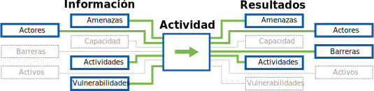

### Preguntas Orientadoras

* ¿Qué barreras infraestructurales existen en la región?
* ¿Cuáles son las amenazas digitales no dirigidas más importantes en esta región?
* ¿Cuáles son las amenazas digitales dirigidas más importantes que enfrentan las organizaciones que hacen este trabajo en esta(e) región/país?
* ¿Hay ramificaciones legales para la seguridad digital en ese país? (ej. legalidad del cifrado, herramientas de anonimato, etc.)
* ¿Alguna organización o individuo ha hecho amenazas específicas, o ha tenido una intención o mentalidad demostrada de atacar a la organización o entidades similares?

### Enfoques

* INVESTIGACIÓN: Buscar información de trasfondo que le ayudará a entender mejor las amenazas potenciales y el contexto general para la organización y el proceso de auditoría.
\newpage

---
Autores:
- SAFETAG
Info_provided:
- desconocido
Info_required:
- desconocido
---

## Evaluación de Capacidad

### Resumen

En este componente, el auditor interactúa con el personal a través de entrevistas y conversaciones para identificar las fortalezas y debilidades de la organización (pericia, finanzas, voluntad de aprender, horas de dedicación del personal, etc.) para adoptar nuevas prácticas de seguridad digital y física. El auditor usa esta información para modificar consecuentemente el alcance de la auditoría y sus recomendaciones.

### Propósito

Conocer las fortalezas y debilidades de una organización le permite al auditor proveer recomendaciones a medida, las cuales aumentan la probabilidad de que la organización intente y logre implementarlas. El auditor usará esta evaluación al prepararse tanto para la auditoría en sí misma como para valorar la dificultad de una recomendación. Esta información provee también un punto de partida para entender el uso y entendimiento actuales de tecnología, seguridad digital y entorno de amenaza de la organización, como así también revela elementos de su flujo de trabajo, infraestructura e incluso vulnerabilidades que de otra manera podrían haber sido pasadas por alto.

### El Flujo de Información

### Preguntas Orientadoras

 * ¿Cuál es la habilidad de la organización para adoptar nuevas tecnologías o prácticas?
 * ¿Qué recursos disponibles tiene la organización?
 * ¿Cómo es el entorno dentro del cual trabaja la organización? ¿Qué barreras, actores de amenazas y otros aspectos influyen sobre su trabajo?
 * ¿Hay algunas consideraciones específicas para la auditoría que requerirían modificar enfoque general, las herramientas, los pasos de preparación o los plazos?

### Enfoques

 * Conducir entrevistas previas a la auditoría con personal directivo y técnico clave para identificar áreas organizacionales de fortaleza y debilidad (pericia, finanzas, horas de dedicación del personal, etc.)
 * Tener conversaciones informales con el personal durante el curso de la auditoría para recopilar más “anécdotas” sobre su capacidad e historia de adopción de tecnología.
 * Generar una lista de comprobación fácil de seguir para la autoevaluación de su capacidad, la cual pueda ser usada y modificada continuamente por la organización en el transcurso del tiempo.

### Resultados

  * Habilidad de la organización para:
    * Adoptar nueva tecnología
    * Aprender de otros
  * Recursos de la organización (financieros, de tiempo, aceptación, pericia...) disponibles para la adopción de tecnología
 * La disponibilidad y calidad de la infraestructura electrónica y de comunicaciones.
 * Amenazas contra la seguridad física y digital de la organización y su personal y problemas de seguridad anteriores detectados por la organización y sus socios.
 * Inquietudes de seguridad prioritarios.
 * Hardware y software tecnológico en uso para proteger la seguridad física y digital de las organizaciones y su personal.
 * Uso pasado, actual o deseado de sitios Web, blogs, redes sociales y otras herramientas y plataformas basadas en la Web para conducir actividades de difusión, gestionar información, abogar por o participar con grupos específicos.
 * Uso pasado, actual o deseado de telefonía móvil y software y hardware relacionados para actividades tales como gestión de SMS y recopilación de datos.

\newpage
<!-- Recon-->

---
Autores:
- SAFETAG
Info_provided:
- desconocido
Info_required:
- desconocido
---

## Reconocimiento

### Resumen

La metodología de evaluación remota se enfoca en la observación directa de una organización y su infraestructura, consistiendo en el reconocimiento pasivo de fuentes de datos disponibles públicamente ("Inteligencia de Fuente Abierta"). Esto permite al auditor identificar recursos públicamente disponibles (tales como sitios web, extranets, servidores de correo electrónico, pero también información de redes sociales) conectados a la organización, y recopilar información en forma remota acerca de esos recursos.

### Propósito

Mientras que una gran parte de SAFETAG se enfoca en los desafíos a la seguridad digital dentro y alrededor de la oficina, información disponible no intencionalmente por parte de "fuentes abiertas" puede constituir una amenaza real y merece una atención significativa. Esto también construye el entendimiento del auditor acerca de la presencia digital de la organización y guiará hacia vulnerabilidades específicas a investigar una vez que se encuentre in situ.

### El Flujo de Información

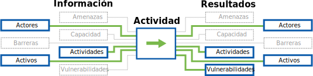

### Preguntas Orientadoras

* Dependiendo de sus necesidades de seguridad, ¿la organización "filtra" alguna información delicada en línea (ubicación, identidades del personal, ubicación de programas)?
* ¿Se pueden identificar socios o beneficiarios a través de los sitios de la organización?
* ¿Cuál es el patrón para las direcciones de correo electrónico del personal?
* ¿Han sido comprometidos en el pasado cualquiera de los servidores, usuarios o cuentas de correo electrónico de la organización?

### Enfoques

* **OSINT manual:** Identificar la disponibilidad de información sobre socio, beneficiario y del proyecto actual en línea usando búsqueda avanzada de Google y webscraping. [^PETS_logical_intel]
* **Recon-NG:** Usar recon-ng para hacer reconocimiento automatizado de fuente abierta basado en la Web.[^recon-ng_data_flow]
* **OSINT Redes Sociales:** Identificar la disponibilidad de información sobre socio, beneficiario y del proyecto actual buscando en las redes sociales información filtrada acerca de la organización.

\newpage

<!-- Network Mapping -->

---
Autores:
- SAFETAG
Info_provided:
- desconocido
Info_required:
- desconocido
---

## Mapeo de Red

### Resumen

Este componente le permite al auditor identificar problemas de seguridad con la red del anfitrión y mapear los dispositivos en la misma, los servicios que están siendo usados por los dichos dispositivos y si hay protecciones existentes.

### Propósito

El mapeo de la red de una organización expone la multitud de dispositivos conectados a la misma -- incluyendo servidores mayormente olvidados -- y provee la línea base para trabajo posterior en la evaluación de dispositivos e investigación de vulnerabilidad.

Este proceso también revela el uso de servicios externos (tales como servicios Google, DropBox, u otros) que sirven -- intencionalmente o no -- como infraestructura de sombra para la organización. En combinación con la investigación de indicadores del ejercicio *Monitoreo de Tráfico Inalámbrico Abierto*, muchos dispositivos pueden ser asociados con usuarios.

### El Flujo de Información

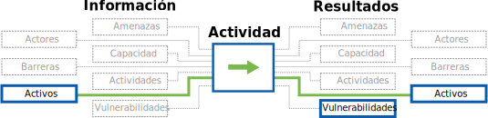

### Preguntas Orientadoras

* ¿Qué sistemas operativos y servicios están siendo alojados o usados por una organización? ¿Hay anfitriones ejecutando sistemas operativos y servicios inusuales, personalizados o desactualizados?
* ¿Hay dispositivos o servicios inesperados/inusuales en la red?
* ¿Cuál es la topología de la red? ¿Cuáles son los routers y módems
gestionándola?
* ¿Qué servicios (ej. DropBox, correo Web, etc.) que no hayan sido mencionados por el personal de la organización están siendo ejecutados en la red?
* ¿A qué recursos de red tiene acceso un atacante una vez que ha ganado acceso a la red interna?

### Enfoques

* **Mapeo de Red:** Mapear anfitriones, servicios y hardware de red mediante escaneo de dispositivos de red.
* **Monitoreo de Tráfico Inalámbrico Abierto:** Monitorear tráfico inalámbrico en busca de intercambio de señales para sincronización, indicadores y direcciones MAC.
* **Mapeo del Rango Inalámbrico:** Mapear el rango de la red inalámbrica de la organización fuera del espacio de oficina.

\newpage
<!-- Organizational Device Assessment -->

---
Autores:
- SAFETAG
Info_provided:
- desconocido
Info_required:
- desconocido
---

## Uso Organizacional de Dispositivos

### Resumen

Este componente le permite al auditor descubrir y evaluar la seguridad de los dispositivos en la red y/o usados en la organización. Este componente consiste de entrevistas, encuestas, mapeo de red e inspección de dispositivos.

### Propósito

Los dispositivos comprometidos tienen la capacidad de minar prácticamente cualquier otro intento organizacional de resguardar la información. El saber si los dispositivos reciben actualizaciones o nuevas versiones de software básico y de seguridad y qué protecciones esenciales existen en contra de acceso no autorizado es vital para diseñar una estrategia que haga al anfitrión más seguro. Debido a que el sistema SAFETAG está enfocado en la seguridad de los datos, también es crucial que el aspecto físico de los dispositivos en los cuales residen estos datos, incluyendo las redes cableadas a través de las cuales son intercambiados, no sea pasado por alto.

### El Flujo de Información
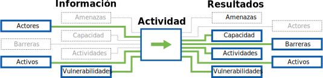su

### Preguntas Orientadoras

* ¿Qué dispositivos de trabajo y personales usa el personal para realizar su trabajo, almacenar archivos relacionados con el mismo o involucrarse en comunicaciones laborales?
* ¿Qué servicios organizacionales y externos/personales usa el personal para realizar su trabajo, almacenar archivos relacionados con el mismo o involucrarse en comunicaciones laborales?
* ¿Cómo se comunica el personal interna y externamente? ¿Qué herramientas usa?
* ¿Cuáles son las prácticas de seguridad informales y formales existentes que los participantes usan para abordar los riesgos?
* ¿Quién tiene acceso físico y a qué? ¿Quién tiene acceso remoto y a qué?
* ¿En qué momento hay dispositivos no monitoreados por personal confiable?
* ¿Cómo podrían ganar acceso los adversarios? (entrada forzada, robo, ingeniería social, incautación)
* ¿Hay procedimientos de mitigación si los dispositivos son perdidos o tomados por adversarios? (ej. discos cifrados, copias de respaldo externas)

### Enfoques

* **Acceso Físico a Dispositivos:** Recorrer la oficina y buscar dispositivos con sesión iniciada sin usuarios, servidores, conectores de red, contraseñas escritas, y documentar qué tan dificultoso sería acceder sistemas delicados para una individuo visitando o ingresando ilícitamente fuera de horario. Hacer que el personal tome un seminario en seguridad física.
* **Conducir una Entrevista/Auditoría Activa de los Dispositivos:** Inspeccionar los dispositivos de los usuarios y registrar información (laboral y personal) por preocupaciones de seguridad (existencia de contraseñas, niveles de actualización, privilegios de usuario, cifrado de discos, puertos/servicios ejecutándose, capacidades antivirus)
* **Encuesta de Contraseña de Usuario:** Hacer que el personal realice la encuesta de uso de contraseña para TODOS los dispositivos usados para trabajar. [^password_survey]^,^[^password-security]
* **Un día en la vida:** Hacer que el personal te explique un típico "día en su vida", mostrándote qué dispositivos usa, cómo los usa y con qué datos tiene que interactuar para realizar su trabajo.

### Resultados

* Lista de todos los recursos en la organización y a quiénes pertenecen.
* Notas sobre medidas de control de acceso indocumentadas y documentadas para la oficina
* Lista de software ejecutándose en dispositivos del personal y fecha de la última actualización.
* Lista de vulnerabilidades conocidas y malware identificable a los que la oficina es vulnerable.
* Lista de malware encontrado al ejecutar antivirus actualizado en ordenadores de la oficina (si el antivirus fue instalado durante la inspección del dispositivo.)
* Lista de servidores no seguros específicos, estaciones de trabajo, discos duros externos y cualesquiera otros recursos digitales.
* Notas sobre las medidas de seguridad existentes para todos los sistemas digitales
* Contraseñas escritas

### Seguridad Operacional

  * Tratar la información descubierta/recopilada con la mayor sensibilidad y seguridad. Las notas físicas debieran ser destruidas inmediatamente luego de usarlas y las digitales debieran ser mantenidas en línea con los estándares SAFETAG generales.

### Preparación

#### Habilidades básicas

* Experiencia básica en administración de sistemas para sistemas operativos comunes

### Recursos

  * *Guidelines:* ["Guidelines on Firewalls and Firewall Policy"](http://csrc.nist.gov/publications/nistpubs/800-41-Rev1/sp800-41-rev1.pdf) (NIST 800-41)

  * *Benchmarks:* ["Security Configuration Benchmarks"](http://benchmarks.cisecurity.org/downloads/browse/index.cfm?category=benchmarks) (CIS Security Benchmarks)

  * *Repository:* ["National Checklist Program Repository - Prose security checklists"](https://web.nvd.nist.gov/view/ncp/repository) (National Vulnerability Database)

  * *Security Guidance:* ["Operating Systems Security Guidance"](https://www.nsa.gov/ia/mitigation_guidance/security_configuration_guides/operating_systems.shtml) (NSA)

 * *Windows Utility:* ["HardenTools"](https://github.com/securitywithoutborders/hardentools) (Security Without Borders)

#### Password Security

  * *Guide:* ["How to Teach Humans to Remember Really Complex Passwords"](http://www.wired.com/2014/07/how-to-teach-humans-to-remember-really-complex-passwords/) (Wired)

  * *Guide:* ["Security on Passwords and User Awareness"](https://www.hashtagsecurity.com/security-on-passwords-and-user-awareness) (HashTag Security)

  * *Video:* ["What’s wrong with your pa$$w0rd?"](http://www.ted.com/talks/lorrie_faith_cranor_what_s_wrong_with_your_pa_w0rd?language=en) (TED)

  * *Article:* ["Password Security: Why the horse battery staple is not correct"](https://diogomonica.com/posts/password-security-why-the-horse-battery-staple-is-not-correct/) (Diogo Mónica)

  * *Organization:* ["Passwords Research"](http://cups.cs.cmu.edu/passwords.html) (The CyLab Usable Privacy and Security Laboratory (CUPS))

   * *Guide:* ["Hacker Lexicon: What Is Password Hashing?"](https://www.wired.com/2016/06/hacker-lexicon-password-hashing) (Wired)

   * *Guide:* ["7 Password Experts on How to Lock Down Your Online Security"](https://www.wired.com/2016/05/password-tips-experts/) (Wired)

#### Privilege Separation Across OS

* identify what privileges services are running as
* identify is the admin user is called admin or root
* Identify if users are logging in and installing software as admin.

#### Examining Firewalls Across OS

  * *Checklist:* ["Firewall Configuration Checklist."](https://www.netspi.com/Portals/0/docs/Blog_Documents/EH_Firewalls/Firewall_Audit_Checklist_Short_v1.pdf) (NetSPI)

#### Identifying Software Versions

#### Device Encryption By OS

* Identifying if a device is using encryption by OS
* Encryption availablility by OS
* Encryption Guides

#### Anti-Virus Updates

#### Identifying Odd/One-Off Services

  * *Guide:* ["Physical Penetration Test"](http://www.pentest-standard.org/index.php/Pre-engagement#Physical_Penetration_Test) (About The Penetration Testing Execution Standard)

  * *Checklist:* ["Check list: Office Security"](frontlinedefenders.org/files/workbook_eng.pdf#page=80) (Frontline Defenders)

  * *Manual:* [Planning, improving and checking security in offices and homes](http://www.peacebrigades.org/fileadmin/user_files/groups/uk/files/Publications/Frontline_Manual_pdf.pdf#page=83)

  * *Guide:* ["Physical Security Assessment - pg. 122"](http://www.isecom.org/research/osstmm.html) (OSTTM)

  * *Guide:* ["Workbook on Security: Practical Steps for Human Rights Defender at Risk"](https://www.frontlinedefenders.org/en/resource-publication/workbook-security-practical-steps-human-rights-defenders-risk) (Frontline Defenders)

  * *Guide:* ["Protect your Information from Physical Threats"](https://securityinabox.org/en/guide/physical) (Frontline Defenders)

  * *Policy Template:* [Information Security
Policy Templates](https://www.sans.org/security-resources/policies) (SANS)

### Actividades
\newpage
<!-- User Device Assessment -->

---
Autores:
- SAFETAG
Info_provided:
- desconocido
Info_required:
- desconocido
---

## >>
## Evaluación de Dispositivos de Usuario

### Resumen

Este componente permite que el auditor evalúe la seguridad de dispositivos individuales en la red. Consiste de entrevistas, encuestas e inspecciones de los dispositivos.

### Propósito

Los dispositivos comprometidos tienen la capacidad de minar prácticamente cualquier otro intento organizacional de resguardar la información. El saber si los dispositivos reciben actualizaciones o nuevas versiones de software básico y de seguridad y qué protecciones esenciales existen en contra de acceso no autorizado es vital para diseñar una estrategia que haga al anfitrión más seguro.

### El Flujo de Información

su

### Preguntas Orientadoras

* ¿Qué dispositivos laborales y personales usa el personal para realizar su trabajo, almacenar archivos relacionados con el mismo o involucrarse en comunicaciones laborales?
* ¿Qué servicios organizacionales y externos/personales usa el personal para realizar su trabajo, almacenar archivos relacionados con el mismo o involucrarse en comunicaciones laborales?
* ¿Cuáles son los procesos organizacionales en los que el personal toma parte y las herramientas y canales de comunicación usados en esos procesos?
* ¿Cuáles son las prácticas de seguridad informales y formales existentes que los participantes usan para evaluar riesgos?

### Enfoques

* **Conducir una Entrevista/Auditoría Activa de los Dispositivos:** Inspeccionar los dispositivos de los usuarios y registrar información (laboral y personal) por preocupaciones de seguridad (niveles de actualización, privilegios de usuario, cifrado de discos, puertos/servicios ejecutándose, capacidades antivirus)
* **Encuesta de Contraseñas de Usuario:** Hacer que el personal realice la encuesta de uso de contraseña para TODOS los dispositivos usados para trabajar. [^password_survey]^,^[^password-security]
* **Un día en la vida:** Haz que el personal te explique un típico "día en su vida", mostrándote qué dispositivos usa, cómo los usa y con qué datos tiene que interactuar para realizar su trabajo.

\newpage
<!-- Vulnerability Analysis -->

---
Autores:
- SAFETAG
Info_provided:
- desconocido
Info_required:
- desconocido
---

## Escaneo y Análisis de Vulnerabilidad

### Resumen
Este componente hace que el auditor descubra posibles imperfecciones en los dispositivos, servicios, diseño de aplicaciones y redes de la organización, al probar y compararlos ante una variedad de recursos en y fuera de línea (bases de datos de vulnerabilidades, avisos de proveedores e investigaciones del auditor), para identificar vulnerabilidades conocidas. El análisis básico de vulnerabilidades debe ser llevado a cabo a la par de otras actividades de manera que la evidencia pueda ser recopilada desde la red; sin embargo, una investigación más profunda en vulnerabilidades específicas descubiertas puede ocurrir luego de la auditoría in situ para aprovechar plenamente del corto tiempo que el auditor tiene en el lugar.

### Propósito

No es inusual que una ONG de derechos humanos desprovista de fondos ejecute infraestructura crítica por sí misma en el equipamiento disponible. Una organización con mejores recursos puede alojar sus servicios críticos en un centro de datos remoto o subcontratar su infraestructura de TI a proveedores en la nube, tales como Google Apps, y/o servicios ad hoc (DropBox, Yahoo! Mail, Wordpress, etc.). En cualquier caso, es raro el tener alguien designado para actualizar y parchar sistemas en la medida en que las vulnerabilidades sean lanzadas, o que mire los servicios desde un punto de vista de seguridad -- en vez de disponibilidad.

### El Flujo de Información
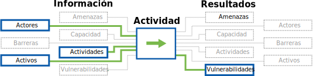

### Preguntas Orientadoras

* ¿Qué nivel de prueba necesita identificar para expresar la importancia de una vulnerabilidad para la organización?
* ¿Qué cantidad de tiempo del personal de TI, la organización y su departamento de TI, pensarían que puedes solicitar para obtener la información que necesitas?

### Enfoques

* **Escaneo de Vulnerabilidad:** Correr escaneos de vulnerabilidad ante sitios web, servidores abiertos al exterior,  servidores clave de intranet.
* **Explorar Bases de Datos de Vulnerabilidades:**  Buscar bases de datos de vulnerabilidades por riesgos potenciales a sistemas y software usado en servidores, dispositivos de usuario y servicios en línea.
* **Examinar Archivos de Configuración de Servicio:** Examinar archivos de configuración por vulnerabilidades, usando guías de "fortalecimiento" o "errores comunes"  encontradas en línea.

\newpage
<!-- Data Assessment (assets) -->

---
Autores:
- SAFETAG
Info_provided:
- desconocido
Info_required:
- desconocido
---

## Evaluación de Datos

### Resumen

Este componente le permite al auditor identificar qué datos delicados existen para la organización, dónde están almacenados y cómo son transferidos.

### Propósito

Archivos delicados son a menudo almacenados a través de múltiples dispositivos con diferentes niveles de seguridad. Una evaluación de los datos le permite al auditor recomendar las soluciones de almacenamiento seguro que mejor se adapten a las necesidades de la organización en evaluación de riesgo y flujo de trabajo. Mientras que el auditor tiene un mayor discernimiento en algo de esto, basado en el trabajo de Acceso y Mapeo de Red, el entendimiento y acuerdo en todos los niveles del personal acerca de qué es lo que constituye 'datos delicados' apoyarán más adelante al cambio organizacional.

Un adversario que obtiene un ordenador portátil, estación de trabajo o disco de respaldo será capaz de leer o modificar información delicada en el dispositivo, aún si ese miembro del personal ha establecido una contraseña fuerte para la cuenta. Esto se aplica a amenazas que involucran pérdida, robo y confiscación, pero también a escenarios de "punto de comprobación" en los cuales puedan tener acceso solamente por unos pocos minutos. Aún más, en el evento de un robo o incursión en la oficina, un adversario podría obtener toda la información delicada en los dispositivos de la organización, posiblemente sin ser detectado.

### El Flujo de Información

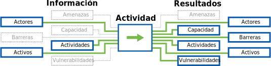

### Preguntas Orientadoras

* ¿Cuáles son los conjuntos de datos más importantes para mantener disponibles? ¿Hay copias de respaldo?
* ¿Cuáles son los conjuntos de datos más importantes para mantener privados?
* ¿Cómo determina en la actualidad la organización quién debiera tener acceso a los datos?
* ¿Hay alguien que actualmente tenga acceso a los datos, quien no debiera?
* ¿El personal está de acuerdo sobre qué constituyen datos delicados?
* ¿Qué datos necesita ser capaz de acceder cada miembro del personal para poder realizar su trabajo?

### Enfoques

* **Actividad de Mapeo de Datos:** Hacer que el personal identifique dónde están esos datos actualmente (qué dispositivos/ubicaciones físicas), quién tiene acceso (físico, inicio de sesión, permisos) y quién necesita tener acceso para conseguir que el trabajo de la organización sea completado.
*  **Actividad de Riesgos de Pérdida y Encuentro de Datos:** Clasificar el nivel de impacto si diferentes datos dentro de la organización fueran perdidos y si, subsecuentemente, adversarios ganaran acceso a esos datos.
* **Actividad de Datos Privados:** Guiar al personal a través de una actividad para que tengan que listar datos privados dentro de la organización [^personal_information_to_keep_private]

Si no fuera posible conducir estas actividades en persona, puede hacerlo remotamente a través de la aplicación de una de las formas de facilitación remota descriptas en el apéndice [Remote Facilitation](#appendix-remote-facilitation).

### Resultados

  * Un mapa del entendimiento del personal de datos organizacionales críticos:
      * cuáles son esos datos,
      * dónde están almacenados,
      * quién tiene acceso,
      * quién necesita acceso,

\newpage
<!-- Physical Assessment -->

---
Autores:
- SAFETAG
Info_provided:
- desconocido
Info_required:
- desconocido
---

## Evaluación Física

### Resumen

La metodología de seguridad organizacional está enfocada en cómo mitigar las amenazas que ocurren debido a la disposición de recursos digitales en el mundo físico -- qué tan seguros son los dispositivos en la oficina de una organización, dónde y cómo viaja el personal con dispositivos organizacionales, y si el personal trabaja fuera de la oficina (ej. en oficinas remotas, en sus hogares, mientras están viajando o en cafés). Además, ¿es la información organizacional accedida desde dispositivos personales?¿Cómo están asegurados esos dispositivos?

### Propósito

Mientras que el sistema SAFETAG está enfocado en la seguridad de datos, los aspectos físicos de dispositivos, discos de respaldo, servidores e incluso redes cableadas, no pueden ser pasados por alto.

Para muchas organizaciones, las amenazas digitales que dependen del acceso físico son consideradas las menos probables. Tal es así, que muchos especialistas de seguridad conceden que no hay una defensa apropiada en contra de un atacante con acceso físico a hardware delicado. Mientras que hay cierta verdad en esto, no es un consejo útil para organizaciones de pequeña escala de la sociedad civil, o empresas mediáticas independientes. Los riesgos que organizaciones mediáticas y de defensoría enfrentan son mucho más variados y el costo de información perdida puede ser seriamente dañino para su habilidad de operar.

Dependiendo de las amenazas específicas para cada organización, el auditor debiera considerar los desafíos no solamente de la extracción encubierta de datos por única vez, sino también de las maneras potenciales en que un adversario pudiera usar acceso físico o proximidad a la organización o sus dispositivos, para ganar acceso remoto permanente, rastrear o causar daño a la misma a través de la destrucción completa de sus datos.

### El Flujo de Información

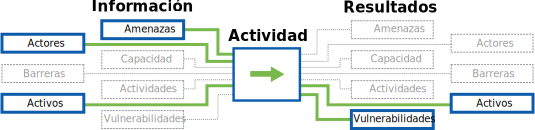

### Preguntas Orientadoras

* ¿Quién tiene acceso físico a qué? ¿En qué momento hay dispositivos no monitoreados por personal confiable?
* ¿Quién tiene acceso independiente al espacio de oficina?
* ¿Cómo podrían ganar acceso los adversarios? (entrada forzada, robo, ingeniería social, incautación)
* ¿Cómo son usados y guardados diariamente los dispositivos -- dónde están cuando los empleados retornan a sus hogares?
* ¿Dónde están los servidores y componentes de red que alojan y gestionan los recursos de la organización? ¿Hay conectores de red activos que no son utilizados, están en espacios públicos o en lugares donde las personas no notarían si hubiera algo enchufado en ellos?
* ¿Cómo son accedidos y almacenados los datos fuera de las principales oficinas/espacios de trabajo de la organización?
* ¿El personal viaja con información organizacional?
* ¿Cómo se gestionan las copias de respaldo? ¿Dónde son almacenadas?

### Enfoques

* **Acceso físico a la LAN, WiFi y Servidores:** Recorrer la oficina y buscar dispositivos de red expuestos, servidores y conectores de red, documentar qué tan dificultoso sería acceder a sistemas delicados para un individuo visitando o ingresando ilícitamente fuera de horario. Determinar el alcance de la red inalámbrica y qué tan fácil es identificarla como conectada a la organización.
* **Mapeo de vulnerabilidades físicas potenciales con impactos en la seguridad digital:**  Documentar potenciales vulnerabilidades para la seguridad informática de la organización basadas en aspectos físicos -- ej. dispositivos no cifrados que pudieran ser robados, contraseñas escritas o incluso metadatos de red inalámbrica.
* **Un día en la vida:** Hacer que el personal le explique un típico "día en su vida", mostrándole qué dispositivos usa, cómo los usa y con qué datos tiene que interactuar para realizar su trabajo.

\newpage
<!-- Risk Modeling -->

---
Autores:
- SAFETAG
Info_provided:
- desconocido
Info_required:
- desconocido
---

## Mapeo de Procesos y Modelado de Riesgo

### Resumen
Este componente le permite al auditor conducir al personal de la organización anfitriona en una serie de actividades para identificar y priorizar los procesos que son críticos para que la organización lleve a cabo su trabajo. Estas actividades también revelarán las consecuencias si esos procesos críticos fueran interrumpidos o expuestos a un actor malicioso. Esto da por resultado que el personal cree una matriz de riesgo que es utilizada como la fundación de las recomendaciones del auditor.

### Propósito

El poner a la organización anfitriona en una posición central al proceso de evaluación de riesgo permite al auditor introducir las amenazas encontradas y sus recomendaciones en la narrativa propia de la organización. Con un mayor sentido de pertenencia al proceso, el personal estará más comprometido en el tratamiento de las amenazas identificadas cuando la auditoría sea completada. [^social_engineering_important_all] Al hacer participar a tanto personal como sea posible, el auditor también está proveyendo un marco de trabajo para que el personal examine futuras preocupaciones cuando se haya ido. Las prácticas informales y formales de seguridad existentes capturadas durante este proceso serán utilizadas para remover barreras organizacionales y psico-sociales para empezar nuevas prácticas.

### El Flujo de Información
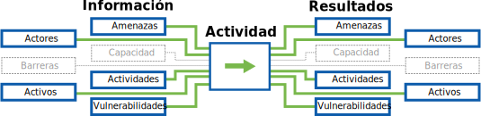

### Preguntas Orientadoras

* ¿Cuáles son las actividades organizacionales críticas?
* ¿Qué amenazas enfrentan la organización, sus programas, socios y beneficiarios?
* ¿Cuál sería el impacto de estas amenazas si fueran a ocurrir?
* ¿Qué adversarios (individuos o grupos) pueden intentar llevar a cabo amenazas?
* ¿Son capaces esos adversarios de llevar a cabo estas amenazas?

### Enfoques

* Ejercicios de proceso y/o mapeo de datos
* Entrevistas individuales con el personal para suplementar otras actividades grupales.
* Identificación de riesgo basada en el proceso o mapeo de datos
* Una clásica [Actividad Grupal de Evaluación de Riesgo](http://frontlinedefenders.org/files/workbook_eng.pdf#page=9).

*Nota:* El modelado de riesgo requerirá una mezcla de las formas de abordar los ejercicios y el orden en el cual identifique cada componente variará dependiendo de la organización.

Si no fuera posible conducir estas actividades en persona, puede hacerlo remotamente a través de la aplicación de una de las formas de facilitación remota descriptas en el apéndice [Remote Facilitation](#appendix-remote-facilitation).

### Resultados

  * Mapas de procesos críticos
  * Una lista de recursos organizacionales.

\newpage
<!-- Advanced Threat Response -->

---
Autores:
- SAFETAG
Info_provided:
- desconocido
Info_required:
- desconocido
---

## Respondiendo a Amenazas Avanzadas

### Resumen
Este componente le permite al auditor ser capaz de identificar, analizar y priorizar en gravedad los comportamientos sospechosos en un dispositivo o red. Dependiendo del análisis, el auditor podría necesitar continuar investigando una infección de malware, analizar un archivo binario y determinar si es malicioso o no y recomendar pasos urgentes de mitigación.

### Propósito
Es muy común encontrar comportamientos, tráfico, procesos sospechosos y otras 'actividades extrañas' durante una auditoría SAFETAG. Los practicantes de SAFETAG siempre deben estar al acecho de actividades sospechosas a medida que apliquen otros métodos SAFETAG y sus actividades, desde interacciones y discusiones con el personal hasta evaluaciones activas de dispositivos y análisis de tráfico.

### El Flujo de Información

### Preguntas Orientadoras

* ¿La organización sospecha que ya tiene malware? Si es así, ¿qué evidencia soporta esto?
* ¿Los miembros del personal han recibido comunicaciones sospechosas, como correos electrónicos o mensajes instantáneos?
* Basándose en la investigación de contexto y las actividades de la organización, ¿qué tan probables son los ataques dirigidos?
* ¿Cuánto tiempo debería ser dedicado a un análisis más completo durante la auditoría en sí misma, y qué otros factores cambian esto?
* ¿Cuáles son las implicaciones del malware dirigido para la organización y para el proceso evaluativo en curso?
* ¿Qué tipos de malware debieran desencadenar un proceso de respuesta al incidente?

### Enfoques
**Debido al limitado intervalo temporal, el auditor debiera enfocarse en identificar actividades sospechosas y priorizar sus impactos rápidamente**. Muchos de estos serán falsos positivos relacionados a otro software benigno causando que la máquina 'actúe en forma extraña', u otros tipos de software malicioso menos serios (y no dirigidos), como adware o ransomware.

Cuando esto no pueda ser descartado, la recopilación de evidencia, ejecución de investigación y análisis básicos y la evaluación del riesgo y su impacto en contra de las prioridades organizacionales ayudarán a priorizar acciones adicionales. El análisis en profundidad de los archivos binarios es mejor que sea pospuesto para el trabajo post-auditoría durante las fases de reporte y seguimiento. Si recursos críticos son comprometidos, puede que el auditor necesite coordinar medidas urgentes de mitigación con otros expertos en TI.

La gestión del tiempo es extremadamente crucial cuando se esté respondiendo a potenciales infecciones por malware y similares amenazas más avanzadas. Si emplea este método, el auditor debería cuestionarse constantemente si continúa este proceso o completa otros aspectos de su plan de auditoría. Al final del proceso de auditoría, el no tener un entendimiento de la tolerancia al riesgo, la capacidad existente, las prácticas/procesos/políticas actuales y recursos informáticos existentes de la organización socavará la habilidad del auditor de proveer un reporte priorizado o entender el contexto alrededor de la actividad potencialmente maliciosa que ha descubierto.

* **Evaluación de la Capacidad del Adversario** - Esta debería ser un resultado del trabajo técnico de investigación de contexto. ¿Hay Amenazas Avanzadas Persistentes que debieran ser tenidas en cuenta? ¿Cómo operan? ¿Hay indicadores de compromiso conocidos para buscar?
* **Analizando Eventos/Actividades Sospechosas Específicas** - Si la organización tiene preocupaciones específicas o evidencia sugiriendo un ataque dirigido, el auditor puede enfocar su atención en correlacionarlos con ataques conocidos o señalarlos para una posterior investigación.
* **Buscando Indicadores de Compromiso y Caza de Amenazas** - Si la organización sospecha que ha sido comprometida, pero no tiene ningún dispositivo/proceso/correo electrónico específico sospechoso, el auditor puede potenciar técnicas para invertir su tiempo inteligentemente en investigar con mayor profundidad.
* **Capturar Evidencia para posterior Análisis** - Si son identificadas actividades sospechosas, el auditor puede querer capturar evidencia para analizar o compartir con profesionales. Esto consume tiempo y la evidencia capturada es de alto riesgo, por lo que debe ser extremadamente cuidadoso al proseguir esto.
* **Análisis en profundidad** - Si es descubierto malware, pero no puede ser identificado, será necesario un análisis posterior. Esto también puede desencadenar un cambio en el alcance de la evaluación y/o un proceso de respuesta al incidente.

\newpage
<!-- Threat Assessment -->

---
Autores:
- SAFETAG
Info_provided:
- desconocido
Info_required:
- desconocido
---

## Evaluación de Amenaza

### Resumen

Este objetivo usa una variedad de actividades para para identificar posibles atacantes y recopila información de trasfondo acerca de la capacidad de esos atacantes de amenazar a la organización. Esto consiste de la identificación del historial de un atacante en particular de llevar a cabo amenazas específicas, su capacidad de ejecutarlas en la actualidad y pruebas de que la amenaza tiene la intención de explotar recursos en contra del objetivo.

### Propósito

Comprobar los supuestos, tanto de la organización como del auditor, por medio de la investigación de amenazas actuales asegurará que un auditor esté basando su trabajo en evaluaciones precisas de las condiciones que la organización enfrenta y que esté haciendo consideraciones de seguridad operacional informadas. Con un mayor sentido de pertenencia del proceso, el personal provee una oportunidad de explorar su entorno de amenazas y se volverá más comprometido con el tratamiento de las amenazas identificadas cuando la auditoría se complete. Al hacer participar a tanto personal como sea posible, el auditor está proveyendo un marco de trabajo para que el personal explore los procesos de identificación de amenazas cuando se haya ido.

### El Flujo de Información

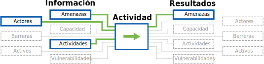

### Preguntas Orientadoras

* ¿Quiénes son los adversarios potenciales para la organización?
* ¿Estos actores de amenazas tienen un historial de ataques? ¿En contra de quienes?
* ¿A qué tipos de organizaciones le han apuntado?
* ¿El actor de la amenaza tiene los medios para explotar un amplio abanico de amenazas en contra o tendrá que priorizar sus objetivos? ¿La organización es un objetivo prioritario de amenaza?
* ¿Tienen el deseo y la habilidad de ejecutar un ataque?

### Enfoques

* **Investigación de Amenazas de Fuente Abierta:** Identificar posibles adversarios y amenazas usando reportes, noticias y bases de datos disponibles públicamente.
* **Mapeo de Amenazas:** Facilitar actividades grupales donde el personal identifique posibles adversarios y las amenazas que han ejercido/pueden ejercer en contra del grupo.

### Resultados

  * Una matriz de amenazas impulsada por el anfitrión incluyendo lo siguiente:
    * **Adversarios** (actores de amenazas) con capacidad y voluntad
    * **Impactos** de ataques en contra de **procesos críticos**, jerarquizados por severidad.
    * **Probabilidad** de cada uno (basado en los adversarios)
  * Las más recientes amenazas generales a la ciberseguridad
  * Identificar prácticas de seguridad informales y formales existentes que los participantes usan para abordar los riesgos.

\newpage
<!-- Responsive Support -->

---
Autores:
- SAFETAG
Info_provided:
- desconocido
Info_required:
- desconocido
---

## Soporte Reactivo

### Resumen

El auditor provee asistencia para cualquier acción inmediata necesitada (entrenamiento puntual, arreglo de herramientas, consultoría en proyectos venideros) -- esto también puede involucrar el tratamiento de vulnerabilidades que desencadenaron una respuesta a un incidente.

### Propósito

Actividades y entrenamiento en el marco de la auditoría son utilizados para expandir la operatividad de la organización para encontrar y tratar desafíos inmediatos a su seguridad, como así también para habilitarla para recibir y almacenar en forma segura el reporte de la auditoría.

### El Flujo de Información
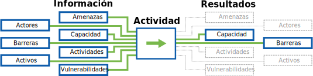

### Preguntas Orientadoras

* ¿Hay algunas vulnerabilidades críticas o actividades de remediación de las cuales la organización necesite un entendimiento más profundo para sopesar apropiadamente en el reporte?
* ¿Cómo puede preparar al personal y la dirección para aspectos del proceso de auditoría que pueden inhibirlo o conducir a la alienación?
* ¿Cuál es el grado de preparación y probabilidad de éxito de la organización en involucrarse con tecnología de seguridad? ¿Qué factores complicarán o inhibirán su incorporación y uso efectivo y seguro?
* ¿El soporte que quiere proveer (resolución de problemas, arreglos, actualizaciones, entrenamiento, etc.) es crítico para la seguridad de la organización? Si no, ¿puedes proveer ese soporte sin quitar tiempo de la auditoría?
* ¿Tendrás la capacidad de brindar soporte a software o hardware que proveíste mientras suministrabas soporte?

### Enfoques

* **Entrenamiento Dirigido:** Componentes educacionales pueden ser introducidos a fin de cubrir las bases de la seguridad digital, satisfacer las expectativas del equipo y motivar al grupo objetivo para incluir prácticas de seguridad digital en sus vidas diarias.
* **Soporte Dirigido:** El auditor puede proveer soporte dirigido y limitado para el desarrollo técnico/de políticas donde haya superposición de conocimientos específicos y los plazos de la auditoría lo permitan.

\newpage
<!-- Debrief -->

---
Autores:
- SAFETAG
Info_provided:
- desconocido
Info_required:
- desconocido
---

## Reporte

### Resumen

Este componente consiste de un breve resumen de los puntos clave de contacto, proveyendo un alivio de las presiones básicas a través de interacciones grupales e individuales y planeando futuros seguimientos con el anfitrión e individuos clave.

### Propósito

SAFETAG es un sistema de auditoría diseñado para que pequeñas organizaciones de la sociedad civil e medio de comunicación independientes se conecten con los servicios de seguridad digital que precisen. Pero más que eso, está diseñado para proveer auditorías que incrementen la operatividad de una organización para la búsqueda y abordaje de desafíos de seguridad de forma independiente. Esta puede ser la última oportunidad de un auditor, en persona, de ganar el apoyo del personal para dar forma a su perspectiva de la auditoría.

El reporte permite al auditor asegurar que deja al anfitrión y su personal listo para empezar a tratar su seguridad digital. Mediante la provisión de algunos resultados inmediatos al anfitrión y su personal, y en combinación con entrenamiento y consultoría de seguridad en la sección Soporte Reactivo, el auditor puede asegurar que el anfitrión vea a la auditoría como una guía en vez de una condena.

### El Flujo de Información

### Preguntas Orientadoras

* ¿La organización actúa con confianza para hacer cambios?
* ¿El personal clave tiene un entendimiento general de las conclusiones iniciales?
* ¿La organización entiende los próximos pasos del proceso de auditoría?

### Enfoques

  * Discutir los próximos pasos y puntos de contacto para el anfitrión en adelante.
  * Proveer atención psicosocial y reformular a medida que sea necesario
  * Iniciar seguimiento con el anfitrión (organizacional e individual).

\newpage
<!-- Follow Up -->

---
Autores:
- SAFETAG
Info_provided:
- desconocido
Info_required:
- desconocido
---

## Seguimiento

### Resumen
Este componente permite a un auditor explicar y obtener una devolución en su reporte como así también evaluar el éxito del proceso en el transcurso del tiempo, a través de una continua relación con el anfitrión.

Este componente consiste de la reunión final con el anfitrión y el seguimiento luego de un periodo de unos pocos meses para ver si necesita asistencia adicional,  tiene la voluntad de compartir su experiencia trabajando con cualquiera de los recursos recomendados o nuevos recursos que sean identificados.

### Propósito

El seguimiento puede ser una herramienta valiosa para incentivar a una organización a continuar su proceso de seguridad digital. Pero, el seguimiento necesita ser deseado por una organización y factible por el auditor. Como tal, el seguimiento debe ser mínimamente intrusivo en los tiempos tanto del auditor como el del anfitrión.

### El Flujo de Información

### Preguntas Orientadoras

* ¿Cuáles son las barreras que la organización enfrentó al implementar el plan de mitigación de riesgo recomendado?
* ¿Hay nuevos recursos que el auditor puede proveer para suplementar la auditoría original?
* ¿Qué puede hacer para que su seguimiento sea percibido como soporte adicional en vez de una evaluación de su éxito?

### Enfoques

* **Encuesta de Devolución del Personal:** Recibir devolución del personal en la ejecución de la auditoría.
* **Reunión para el Reporte de Seguimiento:** Hacer una llamada de seguimiento para discutir el reporte.
* **Haciendo Introducciones:** Introducir la organización a recursos conocidos en la medida de lo necesario.
* **Seguimiento a Largo Plazo:** Contactar al anfitrión después de unos pocos mese para comprobar su progreso, tener retroalimentación de largo plazo y conectarse con cualesquiera recursos nuevos.

# Reporte

\newpage
<!-- Recommendation Development -->

---
Autores:
- SAFETAG
Info_provided:
- desconocido
Info_required:
- desconocido
---

## Desarrollo de Recomendaciones

### Resumen

En este componente, el auditor identifica las fortalezas y debilidades de la organización (pericia, finanzas, voluntad de aprender, horas de dedicación del personal, etc.) para adoptar nuevas prácticas de seguridad digital y física y documenta las posibles medidas que la organización puede tomar para tratar las vulnerabilidades encontradas durante la auditoría, la dificultad de tomar esas medidas y los recursos de los que el anfitrión puede ser capaz de disponer para tratarlas. Los recursos pueden incluir, pero no están limitados a, soporte técnico local y grupos de respuesta a incidentes, sindicatos, lugares para obtener descuentos en software, entrenadores y guías que puede usar para incrementar sus habilidades.

### Propósito

El anfitrión necesita ser capaz de tomar acción luego de una auditoría. Las recomendaciones que un auditor provee para tratar vulnerabilidades deben cubrir un rango que permita a la organización tratarlas tanto en el corto plazo como, con mayor profundidad, en el largo plazo. Conocer las fortalezas y debilidades de una organización permitirá al auditor proveer recomendaciones a medida, la cual tendrá más probabilidades de intentarlas y lograr implementarlas. Al hacer esto, el auditor SAFETAG tiene una oportunidad de actuar como un conducto confiable entre organizaciones de la sociedad civil necesitadas y organizaciones que proveen entrenamiento en seguridad digital, soporte tecnológico, asistencia legal y respuesta a incidentes.

### Preguntas Orientadoras

* ¿Cuáles son las áreas organizacionales de fortaleza (pericia, finanzas, voluntad de aprender, horas de dedicación del personal, etc.) que la organización puede desplegar cuando esté comprometida con la adopción/el cambio de tecnología?
* ¿Cuáles son las áreas organizacionales de debilidad (pericia, finanzas, voluntad de aprender, horas de dedicación del personal, etc.) que necesitan ser tenidas en consideración cuando se tome un compromiso con la adopción/el cambio de tecnología?
* ¿Cuáles son las barreras organizacionales para la adopción?
* ¿Las recomendaciones que está proveyendo están directamente relacionadas con la auditoría de seguridad? Si no, ¿apoyan a la organización en el logro de sus tareas de seguridad o la distraen de hacerlo?

### Enfoque

* **Identificar y Explicar Preocupaciones No Resueltas:** Escribir explicaciones de los 'por qué' para los adversarios y amenazas que el auditor identifique como "intratables" con la capacidad actual de la organización.
* **Identificar Recomendaciones:** Identificar acciones posibles para tratar cada vulnerabilidad.
* **Identificar Recursos Útiles:** Identificar recursos de los que la organización puede disponer para alcanzar las recomendaciones identificadas.

\newpage
<!-- Roadmap Development -->

---
Autores:
- SAFETAG
Info_provided:
- desconocido
Info_required:
- desconocido
---

## Desarrollo de la Hoja de Ruta

### Resumen

Este componente consiste en la clasificación de las recomendaciones propias del auditor en relación a las amenazas a la organización y su capacidad. El auditor prioriza vulnerabilidades, sopesa los costos de implementación de las recomendaciones y luego crea una hoja de ruta viable para que la organización tome sus propias decisiones informadas acerca de los posibles próximos pasos a medida que avanza.

### Propósito

Como parte de la dedicación de SAFETAG a desarrollar la operatividad y apoyar la adopción organizacional de prácticas más seguras, una priorización cuidadosa de las vulnerabilidades es invaluable para evitar que los resultados de la auditoría parezcan abrumadores. Una organización necesita ser capaz de sopesar sus posibles caminos a seguir contra el tiempo perdido en su programa de actividades, el costo de mitigar la amenaza y las otras amenazas que no se están tratando. El mapeo de ruta es utilizado para dar al anfitrión las herramientas para tomar estas decisiones y proveerlo con un camino a seguir recomendado que le permitirá avanzar inmediatamente en su protección. Las prácticas informales y formales existentes detectadas durante este proceso serán usadas para remover barreras organizacionales y psicosociales para empezar nuevas prácticas.

### Preguntas Orientadoras

* Comparar los recursos requeridos contra las capacidades identificadas en las actividades de modelado de riesgo y la investigación contextual que ha completado.
* Basándose en la evaluación de la capacidad organizacional, elaborar un menú que desarrolle las fortalezas organizacionales para crear un camino a seguir que provea resultados alcanzables, mantenga la operatividad y dé pasos hacia resultados dificultosos de largo plazo con elevada recompensa para el anfitrión.

### Enfoque

* **Desarrollo de la Matriz de Riesgo:** Crear una matriz de riesgo que mapee cada vulnerabilidad encontrada con su probabilidad e impacto.
* **Desarrollo de la Matriz de Implementación:** Crear una "matriz de implementación" con la urgencia de la amenaza tratada, balanceada por la dificultad de implementación dada la capacidad organizacional disponible para las recomendaciones.
* **Desarrollo de la Hoja de Ruta:** Identificar vulnerabilidades críticas con recomendaciones alcanzables que se ajusten a las devoluciones recibidas del personal durante la auditoría, para crear una hoja de ruta de con los abordajes de recuperación para el tratamiento de las amenazas enfrentadas por la organización.
* **Documentar los Éxitos:** Ubicar las recomendaciones en una línea cronológica que incluya las prácticas existentes de la organización para mostrar que el proceso de recuperación es una continuación de las prácticas de seguridad informales y formales del anfitrión. [^shostack_anchoring] 

\newpage
<!-- Reporting Creation -->

---
Autores:
- SAFETAG
Info_provided:
- desconocido
Info_required:
- desconocido
---

## Producción del Reporte

### Resumen

Este componente consiste de la recopilación de las notas de la auditoría y recomendaciones en un conjunto integral de documentos que muestre el estado actual de seguridad, el proceso por el cual el auditor llegó a esa evaluación y las recomendaciones que guiarán a la progresión del anfitrión para alcanzar sus objetivos de seguridad.

### Propósito

Una vez que el auditor se ha ido, el reporte es su oportunidad de continuar una conversación (si bien estática) -- aún si la organización nunca vuelve a hablar con el auditor. Si está escrito con cuidado, puede ser una herramienta que fomente la operatividad y guíe la adopción de prácticas. El reporte tiene muchas audiencias que necesitarán usarlo de maneras diferentes. Para el auditor y la organización, actúa como documentación de lo que el auditor logró. Para la organización, será la guía para conectar vulnerabilidades a riesgos reales, un llamado al cambio y prueba de necesidad para los financiadores. Para aquellos a quienes la organización trae para dar soporte a su seguridad digital, provee una hoja de ruta hacia la implementación y una lista de tareas para futuros tecnólogos y entrenadores pagados para llevar al anfitrión a su meta, como así también una lista de comprobación para la validación de las amenazas que han sido tratadas.

### Preguntas Orientadoras

* ¿Las recomendaciones se ajustan a las narrativas que escuchaste del personal?

### Enfoques

* **Apuntar a Partes Interesadas:** Durante la auditoría identificar partes que impactarán el proceso de recuperación de la vulnerabilidad (ej. financiadores, contratistas externos, socios) y trabajar con la organización para apubalizntar componentes del reporte a esas partes.
* ** Visualización de Gráficos:** Crear gráficos y audiovisuales para la hoja de ruta, matriz de riesgo, matriz de implementación y procesos críticos
* **Traducción de Documentos:** Componer secciones que serán compartidas con partes involucradas (financiadores, soporte técnico, entrenadores), para apoyar los propósitos de la organización para esas partes.

\newpage

# Notas al pie

<!-- Load Footnotes -->

<!-- Notes -->

[^external_funding_and_reporting]:Usualmente, cuando se trabaja con un financiador externo, será creado un reporte de acción, libre de datos sensitivos acerca de la organización anfitriona, para ser enviado a dicho financiador. Los contenidos de éste reporte deben ser claramente delineados y acordados durante la etapa de planeamiento de la evaluación.

<!-- Penetration/Security/Risk Testing Standards / Guides -->

[^NIST_SP_800-115]:[NIST SP 800-115, Technical Guide to Information Security Testing and Assessment](http://csrc.nist.gov/publications/nistpubs/800-115/SP800-115.pdf)

[^pen_testing_systematic]:[Penetration Testing - A Systematic Approach](http://www.infosecwriters.com/text_resources/pdf/PenTest_MSaindane.pdf)

[^NIST_SP_800-115_planning]:[NIST SP 800-115, Technical Guide to Information Security Testing and Assessment - Planning Methodology](http://csrc.nist.gov/publications/nistpubs/800-115/SP800-115.pdf#page=13)

[^NIST_SP_800-115_assessment_plan]:[NIST SP 800-115, Technical Guide to Information Security Testing and Assessment](http://csrc.nist.gov/publications/nistpubs/800-115/SP800-115.pdf#page=51)

[^NIST_SP_800-115-Section_7.1]:[NIST SP 800-115, Technical Guide to Information Security Testing and Assessment. Section 7.1 Coordination](http://csrc.nist.gov/publications/nistpubs/800-115/SP800-115.pdf#page=55)

[^NIST_SP_800-115_targeting]:[NIST SP 800-115, Technical Guide to Information Security Testing and Assessment](http://csrc.nist.gov/publications/nistpubs/800-115/SP800-115.pdf#page=40)

[^NIST_SP_800-115-travel_prep]:[*Los grupos viajeros debieran mantener un kit ligero que incluya sistemas, imágenes, herramientas adicionales, cables, proyectores, y otros equipos que un grupo podría necesitar cuando se realicen pruebas en otras ubicaciones.](http://csrc.nist.gov/publications/nistpubs/800-115/SP800-115.pdf#page=50)

[^pets_pre-engagement_location]:[Determining Audit Location - The Penetration Testing Execution Standard: Pre-Engagement Guidelines](http://www.pentest-standard.org/index.php/Pre-engagement#Locations)

[^pets_emergency_contact_info]:[Emergency Contact and Incidents - The Penetration Testing Execution Standard: Pre-Engagement Guidelines](http://www.pentest-standard.org/index.php/Pre-engagement#Emergency_Contact_Information)

[^interaction_security_risk_management]:[Security Risk Management: NGO Approach - InterAction Security Unit](https://www.scribd.com/doc/156488867/Srm)

[^workbook_on_security]:[Workbook on Security: Practical Steps for Human Rights Defenders at Risk](http://frontlinedefenders.org/files/workbook_eng.pdf)

[^OSSTMM_wireless_security_testing]:[Open Source Security Testing Methodology Manual (OSSTMM) p. 140.](http://www.isecom.org/research/osstmm.html)

<!-- Threat Modeling -->

[^shostack_anchoring]: See: "Threat Modeling: Designing for Security" by Adam Shostack, p. 298.

[^NIST_SP_800_115_soc_eng_hostile]:["El apuntar en forma individual puede conducir a la humillación para esos individuos si los ejecutores de las pruebas deducen información o ganan acceso exitosamente. Es importante que los resultados de las pruebas de ingeniería social sean usados para mejorar la seguridad de la organización y no para seleccionar individuos para trato diferencial."](http://csrc.nist.gov/publications/nistpubs/800-115/SP800-115.pdf)

[^GPR_8_Likelihood]:["Likelihood: Chapter 2.7 p. 47 - Operational Security Management in Violent Environments"](http://www.odihpn.org/download/gpr_8_revised2pdf#page=38)

[^GPR_8_impacts]:["Impacts: Chapter 2.7 p. 46 - Operational Security Management in Violent Environments"](http://www.odihpn.org/download/gpr_8_revised2pdf#page=38)

<!-- Facilitation -->

[^psych_sec_training]:[The Psychological Underpinnings of Security Training - Craig Higson-Smith](https://level-up.cc/before-an-event/psychosocial-underpinnings-of-security-training/)

[^event_planning_input]:[Event Planning Inputs - Level-Up](https://www.level-up.cc/before-an-event/planning-your-training-event/)

[^integratedsecurity_prep_tips]:[Integrated Security Facilitator Preparation Tips](http://integratedsecuritymanual.org/sites/default/files/integratedsecurity_themanual_1.pdf#page=25)

[^integrated_security_manual]:[Integrated security: The Manual](http://integratedsecuritymanual.org/download-this-manual)

<!-- Censorship Measurement -->

[^herdict_explore]:[Herdict "At-A-Glance" web-blockage dashboard](http://herdict.org/explore/indephth)

<!-- ONI -->

[^ONI_country]:[Open Network Initiative - Country Reports](https://opennet.net/research/profiles)

[^ONI_regional]:[Open Network Inititiative - Regional Overviews](https://opennet.net/research/regions)

[^alkasir]:[Un mapa de cibercensura automáticamente graficado basado en los datos recopilados de la base de datos actualizada a través del uso de patrones del software alkasir.](https://alkasir.com/map)

[^transparency]:[¿Quién publica Transparency Reports?](http://jameslosey.com/post/98162645081/who-publishes-transparency-reports-here-is-an)

[^alexa]:[Los 500 sitios más importantes en cada país o territorio.](http://www.alexa.com/topsites/countries)

<!-- Country Infrastructure info -->

[^cia_factbook]:[CIA fact-book](https://www.cia.gov/library/publications/the-world-factbook/)

[^cia_factbook_internet-users]:[CIA fact-book country comparison of number of users within a country that access the Internet](https://www.cia.gov/library/publications/the-world-factbook/fields/2153.html)

[^cia_factbook_broadcast-media]:[CIA fact-book country comparison of the approximate number of public and private TV and radio stations in a country](https://www.cia.gov/library/publications/the-world-factbook/fields/2213.html)

[^cia_factbook_telephone-system]:[CIA fact-book country comparison of the telephone system with details on the domestic and international components.](https://www.cia.gov/library/publications/the-world-factbook/fields/2124.html)

[^WTICT_indicators]:[World Telecommunication/ICT Indicators database 2014](http://www.itu.int/en/ITU-D/Statistics/Pages/publications/wtid.aspx)

<!-- Media / Speech Freedom Threats -->

[^threatened_voices]:[Threatened Voices: Tracking suppression of online free speech.](http://threatened.globalvoicesonline.org/)

[^media_sustainability_index]:[IREX’s Media Sustainability Index (MSI) provides in-depth analyses of the conditions for independent media in 80 countries across the world.](http://www.irex.org/project/media-sustainability-index-msi)

[^freedom_on_the_net]:[Freedom House's "Freedom on the Net" index, assessing the degree of internet and digital media freedom around the world.](http://www.freedomhouse.org/report-types/freedom-net)

[^freedom_of_the_press]:[Freedom House's "Freedom of the Press" index assess' global media freedom.](http://www.freedomhouse.org/report-types/freedom-press)

[^article_19_by_country]:[ARTICLE 19 freedom of expression and freedom of information news by region.](http://www.article19.org/pages/en/where-we-work.html)

[^OSF_digital_media]:[Open Society Foundation - Mapping digital media](http://www.opensocietyfoundations.org/projects/mapping-digital-media)

[^press_freedom_index]:[Press Freedom Index (RSF)](https://en.rsf.org/press-freedom-index.html)

[^press_freedom_index_methodology]:[Press Freedom Index Methodology (RSF)](http://rsf.org/index2014/data/2014_wpfi_methodology.pdf)

<!-- Human Rights and Governance-->

[^freedom_in_the_world]:[Freedom House's "Freedom in the World" index is the standard-setting comparative assessment of global political rights and civil liberties.](http://www.freedomhouse.org/report-types/freedom-world)

[^corruptions_perception_index]:[Corruption  Perception  Index](http://www.transparency.org/cpi2013/results/)

[^Amnesty_regional_news]:[Amnesty International regional news on human rights](https://www.amnesty.org/en/countries/)

[^HRW_regional_work]:[Human Rights Watch - Browse by Region](http://www.hrw.org/regions)

<!-- Surveillance and Censorship -->

[^pi_country_reports]:[Privacy International's in-depth country reports and submissions to the United Nations.](https://privacyinternational.org/type-resource/state-privacy)

[^surveillance_whos_who]:[Surveillance Who's Who exposes the government agencies that attended ISS World surveillance trade shows between 2006 and 2011.](https://www.privacyinternational.org/resources/surveillance-whos-who)

[^ISC_country_reports]:[El Proyecto ISC completa evaluaciones de amenazas a la seguridad de la información en un amplio rango de países. Las exhaustivas cuantificaciones por escrito resultantes describen la situación de la seguridad digital de cada país a través de la consideración de cuatro categorías principales: vigilancia, ataques y censura en línea, y perfil de/acceso al usuario.](https://iscproject.org/country-assessments/)

<!-- Security Risks -->

[^EISF_Alerts]:[EISF distributes frequent analysis and summaries of issues relevant to humanitarian security risk management.](http://www.eisf.eu/alerts/)

[^PETS_legal_considerations]:[" Algunas actividades comunes en pruebas de penetración pueden violar leyes locales. Por esta razón, es recomendado comprobar la legalidad tareas comunes de pruebas de penetración en la ubicación donde el trabajo ha de ser realizado."](http://www.pentest-standard.org/index.php/Pre-engagement#Legal_Considerations)

[^PTES_testing]:[Vulnerability Analysis - The Penetration Testing Execution Standard](http://www.pentest-standard.org/index.php/Vulnerability_Analysis)

[^NIST_800_14_user_issues]:[NIST SP 800-14, Generally Accepted Principles and Practices for Securing Information Technology Systems](http://csrc.nist.gov/publications/nistpubs/800-14/800-14.pdf#page=30)

[^NIST_exploit_confirm]:["Mientras que los escáneres de vulnerabilidades comprueban solamente su posible existencia, la fase de ataque de una prueba de penetración explota la vulnerabilidad para confirmarla."](http://csrc.nist.gov/publications/nistpubs/800-115/SP800-115.pdf#page=38)

[^shostack_finding_threats]: See: "Threat Modeling: Designing for Security" by Adam Shostack, p. 125.

[^shostack_addressing_threats]: See: "Threat Modeling: Designing for Security" by Adam Shostack, p. 167.

[^shostack]: "Threat Modeling: Designing for Security" by Adam Shostack

[^shostack_flow]: See: "Threat Modeling: Designing for Security" by Adam Shostack, p. 408.

[^shostack_reports]: See: "Threat Modeling: Designing for Security" by Adam Shostack, p. 401.

[^secure_reporting]:"Cuando un piloto aterriza un avión de línea, su trabajo no está terminado. Aún tiene que navegar la miríada de pistas de rodaje y estacionar con seguridad en la puerta. Lo mismo es cierto de tí y tus reporte de pruebas de penetración, solo porque está terminado no significa que puedes desconectarte por completo. Aún tienes que acercar el reporte al cliente, y tienes que hacerlo en forma segura. La distribución electrónica usando cifrado de clave pública es probablemente la mejor opción, pero no siempre es posible. Si el cifrado simétrico ha de ser usado, una clave robusta debiera ser usada, y debe ser transmitida por medios alternativos. Bajo ninguna circunstancia un reporte debiera ser transmitido sin cifrado. Todo suena como sentido común, pero demasiado frecuentemente las personas caen en el último obstáculo." - [The Art of Writing Penetration Test Reports](http://resources.infosecinstitute.com/writing-penetration-testing-reports/)

[^stares_and_snide_comments]:"Una vez efectué una prueba de ingeniería social, los resultados de la cual fueron menos que ideales para el cliente. El enfurecido CEO compartió el reporte con la totalidad de la organización, como una manera de aumentar la conciencia acerca de los ataques de ingeniería social. Esto se hizo más interesante cuando visité esa misma compañía unas pocas semanas más tarde para realizar algún entrenamiento de concientización en seguridad. Durante mi introducción, expliqué que mi compañía hizo pruebas de seguridad y fue responsable por el ejercicio de ingeniesría social unas semanas atrás. Esto fue saludado con miradas de enojo y comentarios sarcásticos acerca de como los había metido a todos en problemas. Mi respuesta fue, como siempre, 'mejor que me den sus contraseñas y no a un genuino mal tipo'." - [The Art of Writing Penetration Test Reports](http://resources.infosecinstitute.com/writing-penetration-testing-reports/)

[^NIST_pen_test_danger]:"Las pruebas de penetración también constituyen un alto riesgo para las redes y sistemas de la organización, porque usan ataques reales y explotan vulnerabilidades en contra de sistemas y datos de producción. Debido a su elevado costo y potencial impacto, efectuar pruebas de penetración anuales de las redes y sistemas de una organización puede ser suficiente. Además, las pruebas de penetración pueden ser diseñadas para detenerse cuando la persona que las ejecuta llega a un punto en que una acción adicional causará un daño." - [NIST SP 800-115, Technical Guide to Information Security Testing and Assessment](http://csrc.nist.gov/publications/nistpubs/800-115/SP800-115.pdf#page=40)

[^PETS_third_parties]:[Dealing with third parties - The Penetration Testing Execution Standard](http://www.pentest-standard.org/index.php/Pre-engagement#Dealing_with_Third_Parties)

[^PETS_separate_permissions]:["En adición, algunos proveedores de servicio requieren notificación previa y/o permiso separado con antelación a probar sus sistemas. Por ejemplo, Amazon tiene un formulario de solicitud en línea que debe ser completado, y dicha solicitud debe ser aprobada antes de escanear cualquier ordenador anfitrión en su nube. Si ésto es requerido, debiera ser parte del documento."](http://www.pentest-standard.org/index.php/Pre-engagement#Permission_to_Test)

[^PETS_emergency_contact]:["Obviamente, es vital ser capaz de estar en contacto con el cliente o la organización objetivo en una emergencia."](http://www.pentest-standard.org/index.php/Pre-engagement#Emergency_Contact_Information)

[^PETS_host_and_ip]:["Antes de empezar una prueba de penetración, todos los objetivos deben ser identificados."](http://www.pentest-standard.org/index.php/Pre-engagement#Specify_IP_Ranges_and_Domains)

[^PETS_logical_intel]:[Accumulating information about partners, clients, and competitors - The Penetration Testing Execution Standard](http://www.pentest-standard.org/index.php/Intelligence_Gathering#Logical)

[^NIST_incident_repose_plan]:["el plan de evaluación debiera proveer una guía específica en el manejo de incidentes en el evento que los evaluadores causen o descubran un incidente durante el curso de la evaluación. Esta sección del plan debiera definir el término 'incidente' y proveer lineamientos para determinar si un incidente ha ocurrido o no. El plan debiera identificar puntos de contacto específicos, primarios y alternativos, para los evaluadores... El plan de evaluación debiera proveer instrucciones concisas sobre qué acciones debieran tomar los evaluadores en estas situaciones."](http://csrc.nist.gov/publications/nistpubs/800-115/SP800-115.pdf#page=52)

[^PETS_permission_to_test]:["Uno de los documentos más importantes que necesita ser obtenido para una prueba de penetración es el Permiso para Probar."](http://www.pentest-standard.org/index.php/Pre-engagement#Permission_to_Test)

[^PETS_evidence_handling]:["Cuando se maneje evidencia de una prueba y las diferentes etapas del reporte, es increíblemente importante tener extremo cuidado con los datos. Siempre usar cifrado, y eliminar datos sensitivos de tu máquina de prueba en el intervalo de tiempo entre pruebas."](http://www.pentest-standard.org/index.php/Pre-engagement#Evidence_Handling)

[^org_vuln_analysis]:["Vulnerability Assessment: Training module for NGOs operating in Conflict Zones and High-Crime Areas"](https://www.eisf.eu/wp-content/uploads/2014/09/0603-Dworken-undated-Vulnerability-assesment-training-module.pdf)

[^cryptolaw]:["A survey of existing and proposed laws and regulations on cryptography - systems used for protecting information against unauthorized access."](http://www.cryptolaw.org/) (The Crypto Law Survey)

<!-- Malware and Threat reports -->

[^staying_abreast_of_tech_and_threats]:["Los evaluadores necesitan permanecer bien informados acerca de nueva tecnología y los medios más recientes por los cuales un adversario puede atacar esa tecnología. Debieran refrescar periódicamente su base de conocimientos, reevaluar como sea apropiado sus técnicas de actualización de metodología, y actualizar sus kit de herramientas."](http://csrc.nist.gov/publications/nistpubs/800-115/SP800-115.pdf#page=47)

[^symantec_annual_threat_report]:[El Reporte Anual de Amenazas a la Seguridad de Internet provee una introducción y análisis del año en actividad global de amenazas.](http://www.symantec.com/security_response/publications/threatreport.jsp)

[^symantec_monthly_threat_report]:[El reporte mensual de inteligencia provee el análisis más reciente de amenazas de ciberseguridad, tendencias y dilucidaciones por parte del equipo de inteligencia de Symantec concernientes a malware, spam y otros riesgos de negocio potencialmente dañinos.](http://www.symantec.com/security_response/publications/monthlythreatreport.jsp)

[^mandiant_threat_report]:[El reporte anual de amenazas de Mandiant revela dilucidaciones clave, estadísticas y casos de estudio ilustrando cómo las herramientas de actores de amenaza persistente y avanzada (APT) han evolucionado en el último año. (REQUIERE DIRECCIÓN DE CORREO ELECTRÓNICO)](https://www.mandiant.com/resources/mandiant-reports/)

[^mcafee_threat_center]:[McAfee Labs Threat Center includes their Quarterly Threats Report, Blog, and Threat Library.](http://www.mcafee.com/us/threat-center.aspx)

[^fireeye_reports]:[FireEye provee reportrs complementarios en amenazas y tendencias en ciberseguridad. (REQUIERE DIRECCIÓN DE CORREO ELECTRÓNICO)](http://www.fireeye.com/info-center/)

[^verizon_data_breach_report]:[Verizon Data Breach Investigative Report (REQUIRES EMAIL ADDRESS)](http://www.verizonenterprise.com/DBIR/)

[^internet_storm_center]:[SANS: Internet Storm Center](https://isc.sans.edu//)

[^mcafee_threat_trends]:[McAfee Threat Trends Papers](https://www.mcafee.com/us/security-awareness/threat-trends.aspx)

[^us-cert_current_activity]:[La página web US-CERT Current Activity es un sumario regularmente actualizado de los tipos de incidentes de seguridad más frecuentes y de alto impacto que están siendo reportados actualmente](https://www.us-cert.gov/ncas/current-activity/)

[^us-cert_bulletins]:[Los boletines US-CERT proveen sumarios semanales de nuevas vulnerabilidades.](https://www.us-cert.gov/ncas/bulletins/)

[^citi_lab_exec_recon]:[Communities @ Risk: Targeted Digital Threats Against Civil Society - Execurtive Summary](https://targetedthreats.net/media/1-ExecutiveSummary.pdf#page=21)

[^social_engineering_important_all]:["Los CSOs debieran construir gradualmente una cultura en la que todo el personal, independientemente de sus antecedentes técnicos, sienta alguna responsabilidad por su propia higiene digital. Mientras que los miembros del personal no necesitan convertirse en expertos técnicos, los CSOs deberían intentar elevar el nivel de conciencia de todos ellos, desde los directores ejecutivos a los aprendices - los grupos son tan fuertes como su eslabón más débil - de manera que puedan notar cuestiones, reducir vulnerabilidades, saber dónde ir para ayuda ulterior, y educar a otros."](https://targetedthreats.net/media/1-ExecutiveSummary.pdf#page=30)

[^informed_staff_decisions]:["Por supuesto, no hay manera de anticipar y advertir en contra de toda forma de amenaza digital; nuevas tecnologías y amenazas emergen constantemente, yendo más rápido que la conciencia de seguridad. En tal entorno, es importante para los CSOs desarrollar un marco de trabajo para el personal para pensamiento crítico y toma informada de decisiones acerca de amenazas digitales, no conectado a alguna aplicación, dispositivo, vector de ataque, o situación específica."](https://targetedthreats.net/media/1-ExecutiveSummary.pdf#page=30)

[^secuna_country_reports]:["Secunia Country Reports"](https://secunia.com/resources/countryreports/)

<!-- Security Advisories -->

[^Microsoft_Security_Bulletin]:[Microsoft Security Bulletin](https://technet.microsoft.com/en-us/security/bulletin)

[^ind_univ_external_advisories]:["In-Depth Reading, Vendor Information, & External Advisories"](https://protect.iu.edu/cybersecurity/indepth)

[^OSS_Security_advisories]:["Security-Related Vendor Information"](http://oss-security.openwall.org/wiki/vendors)

[^CERT_CC_Advisories]:["CERT/CC Advisories"](https://www.cert.org/historical/advisories/)

[^CERT_vuln_notes]:["Vulnerability Notes Database"](http://www.kb.cert.org/vuls)

[^security_tracker]:["Security Tracker"](http://securitytracker.com/topics/topics.html)

[^mozilla_vulns]:["Known Vulnerabilities in Mozilla Products"](https://www.mozilla.org/security/known-vulnerabilities/)

[^packetstorm_news]:["Packet Storm News"](http://packetstormsecurity.com/files/)

<!-- Technical Training & Guides -->

[^security_tube]:["Comprehensive, Hands-on, Practical and Affordable infosec training."](http://www.securitytube.net)

[^recon-ng_data_flow]:[The flow of information through the Recon-ng  framework. (See: "Data Flow" section)](http://www.lanmaster53.com/2014/05/recon-ng-update)

[^recon-ng_API_keys]:[Acquiring API Keys](https://bitbucket.org/LaNMaSteR53/recon-ng/wiki/Usage%20Guide#!acquiring-api-keys)
[^security_in_a_box_physical]:[How to protect your information from physical threats - Security in-a-box](https://securityinabox.org/chapter-2)

[^speak_safe_keeping_data_safe]:[Manteniendo sus Datos Seguros - Autodefdensa contra vigilancia](https://ssd.eff.org/en/module/keeping-your-data-safe)

<!-- Tech adoption and usability -->

[^email_adoption_for_paranoid]:["Todos, excepto el personal de soporte para ordenadores, dijeron
que cifrar todos los mensajes de correo electrónico era innecesario. De hecho, varios mencionaron que cifrar todos los mensajes era para personas paranoicas en vez de pragmáticas."](https://cups.cs.cmu.edu/soups/2005/2005posters/10-gaw.pdf)

<!-- Sections -->

[^auditor_trainee_tool_resource_list]:[Ver la lista de recursos del auditor en entrenamiento](#auditor-trainee-tool-resource-list)

[^social_engineering_toolkit_resources]:[Lista de Herramientas y Recursos del Auditor - Ingeniería Social](#social-engineering-toolkit)

[^password_dictionary_resources]:[Lista de Herramientas y Recursos del Auditor - Cración de Diccionario de Contraseñas](#password-dictionary-creation)

[^social_engineering_section]:[Lista de Herramientas y Recursos del Auditor - Ingeniería Social](#social-engineering-toolkit)

[^latest_version_of_tools]:[Ver la lista de recursos del auditor en entrenamiento](#auditor-trainee-tool-resource-list)

[^vulnerability_analysis]:[Ver: Análisis de Vulnerabilidad](#vulnerability-analysis)

[^roadmap_development]:[Ver: Desarrollo de la Hoja de Ruta](#roadmap-development)

[^password-security]:[Seguridad de Contraseñas](#password-security)

[^network-access]:[Acceso de Red](#network-access)

[^privilege-separation-across-os]:[Separación de Privilegios en diversos SO](#privilege-separation-across-os)

[^examining-firewalls-across-os]:[Examinando Cortafuegos en diversos SO](#examining-firewalls-across-os)

[^identifying-software-versions]:[Identificando Versiones de Software](#identifying-software-versions)

[^anti-virus-updates]:[Actualizaciones de Antivirus](#anti-virus-updates)

[^automated-vulnerability-assessment-tools]:[Herramientas Automatizadas de Evaluación de la Vulnerabilidad](#automated-vulnerability-assessment-tools)

[^identifying-lockout-thresholds]:[Identificando Umbrales de Falta de Respuesta](#identifying-lockout-thresholds)

[^identifying-oddone-off-services]:[Identificando Servicios Inusuales/Por única vez](#identifying-oddone-off-services)

[^device_encryption_by_os]:[Cifrado de Dispositivo por tipo de SO](#device-encryption-by-os)

<!-- Appendices -->

[^travel_kit_appendix]:[APPENDIX A - Auditor travel kit checklist](#appendix-a)

[^personal_information_to_keep_private]:[APPENDIX B - Personal Information to Keep Private](#appendix-b)

[^password_survey]:[APPENDIX C - Password Survey](#appendix-c)

[^auditor_consent_template]:[APPENDIX D - Auditor Consent Template.](#appendix-d)

[^pre-mortum]:["Pre-Mortum Strategy" - Sources of Power: How People Make Decisions - p.71](http://books.google.com/books?id=nn1kGwL4hRgC&lpg=PP1&pg=PA71#v=onepage&q&f=false)
<!-- Interview -->

[^scope_questions]:["Questionnaires - The Penetration Testing Execution Standard"](http://www.pentest-standard.org/index.php/Pre-engagement#Questionnaires)

[^HCD_toolkit]:["IDEO Human-Centered Design Toolkit"](http://www.ideo.com/work/human-centered-design-toolkit)

[^Techscape_indicators]:["TechScape Indicators - the engine room"](https://www.theengineroom.org/projects/techscape/tsindicators/)

[^BUM_questions]:["Questions for Business Unit Managers - The Penetration Testing Execution Standard"](http://www.pentest-standard.org/index.php/Pre-engagement#Questions_for_Business_Unit_Managers)

[^SA_Questions]:["Questions for Systems Administrators"](http://www.pentest-standard.org/index.php/Pre-engagement#Questions_for_Systems_Administrators)

<!-- Update Footnotes for overview -->
<!-- Overwrite any footnotes that are not found in the overview -->

[^password-security]:The "password security: guides and manuals" resources list can be found in the SAFETAG "full guide."

[^identifying-oddone-off-services]:The "Identifying Odd/One-Off Services" resource list can be found in the SAFETAG "full guide."

[^travel_kit_appendix]:The auditor travel kit checklist can be found in the SAFETAG "full guide."

[^personal_information_to_keep_private]: The "personal information to keep private" handout can be found in the SAFETAG "full guide."

[^password_survey]:The password Survey can be found in the SAFETAG "full guide."

[^auditor_consent_template]:The auditor consent template can be found in the SAFETAG "full guide."

<!-- Load Default Images -->
