<!-- License -->

## License

SAFETAG resources are available under a Creative Commons Attribution-ShareAlike 3.0 Unported (CC BY-SA 3.0) License

The audit framework and checklist may be used and shared for educational, non-commercial, not-for-profit purposes, with attribution to Internews. Users are free to modify and distribute content under conditions listed in the license.

Сам фреймворк и чеклисты предоставлены в ознакомительных целях и фаторы не несут никакой ответственности за безопасность того кто использует их в личных или иных целях.

### Attribution for content from other Licenses

  * Компоненты касающиеся Интервью и Оценки компетенции взяты почти полностью из  [the engine room's] проекта [TechScape] (https://www.theengineroom.org/projects/techscape/).
  * Модули по оценке данных взяты из  [Level Up Project](https://level-up.cc)  и доступны под лицензией [Creative Commons Attribution-Share Alike Unported 3.0 license] (https://creativecommons.org/licenses/by-sa/3.0/).  Авторы Pablo, Daniel O’Clunaigh, Ali Ravi, Samir Nassar

### Использование названия SAFETAG

SAFETAG по своей сути описывает систему проведения аудита. Если аудит выполнен с помощью материалов SAFETAG или их вариаций, такой аудит можно называть сделанным "с использованием методологии SAFETAG", или "на основе материалов SAFETAG", или иным подобным образом. Название "аудит SAFETAG" не допускается.

Это не означает, что аудит, полностью или частично использующий материалы SAFETAG, должен обязательно сопровождаться ссылкой на SAFETAG.

Данная политика не влияет на распространение материалов SAFETAG по условиям лицензии (выше).

\newpage

<!-- Introduction -->

## Введение

SAFETAG — система проведения аудита безопасности для групп гражданских активистов (полностью — Security Auditing Framework and Evaluation Template for Advocacy Groups). Традиционные тесты на проникновение и оценки рисков в SAFETAG профессионально адаптированы для небольших некоммерческих правозащитных организаций, которые работают в развивающихся странах. SAFETAG учитывает ограниченные ресурсы и угрозы, присущие этим группам.

SAFETAG опирается на мировые стандарты и передовые методы аудита безопасности. SAFETAG предоставляет небольшим организациям из группы риска помощь в оценке рисков и консультации по уменьшению ущерба. Аудиторы SAFETAG помогают организации в моделировании рисков. Это помогает сотрудникам и руководству принимать решения по обеспечению цифровой безопасности. Во время целевого аудита цифровой безопасности становятся видны уязвимости, которые могут влиять на жизненно важные процессы и ценности организации. Аудиторский отчет и работа после аудита помогают организации и сотрудникам определить свои текущие и будущие потребности в обучении и технической поддержке.

info@safetag.org | https://safetag.org

\newpage

<!-- Audit Lifecyce -->

## Основы системы аудита SAFETAG

Аудит SAFETAG включает много этапов сбора и проверки информации. Проводятся исследования и работа с сотрудниками по наращиванию ресурсов. Это соответствует задачам, которые в совокупности отвечают главным целям SAFETAG. Осуществляется оценка рисков, растет потенциал организации.

В рамках каждой задачи используются как технические, так и интерактивные/социальные способы сбора и проверки данных, оцениваются риски, уточняются ресурсы. Для многих задач предлагаются упражнения с пошаговыми инструкциями.

Речь не идет об общем перечне рекомендаций или обязательных мер. Опытные аудиторы могут заметно "отклоняться от среднего", чтобы предложить список самых необходимых шагов для конкретной организации.

Многие задачи и соответствующие упражнения пересекаются и могут выполняться одновременно. Например, беседы с сотрудниками на рабочих местах можно совместить с анализом их устройств и обсуждением вопросов физической безопасности. Упражнений по оценке данных может хватить, чтобы не отнимать время у сотрудников.

## Цикличность аудита

Аудит цикличен. Обнаруживаются новые угрозы, уязвимости, ресурсы, препятствия, и они влияют на будущие ответные действия. В то же время аудитор путем разговоров, обучения и групповой работы активно влияет на политику организации. Он помогает разобраться с вероятными срочными и острыми угрозами. Это повторяется снова и снова, пока аудитор не убедится, что организация способна следовать рекомендациям и двигаться дальше.

Каждая задача нуждается в базовых данных. На выходе возникают новые данные, которые попадают в цикл. Для каждой задачи определена карта движения данных.

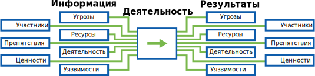

Движение данных более подробно рассматривается в разделах "Оценка риска" и "Наращивание ресурсов организации". Здесь мы представим краткий обзор основных компонентов.

* **Участники** *(actors)* — люди, связанные с организацией, в том числе ее сотрудники, члены правления, внештатные работники и партнеры. К участникам иногда относят волонтеров, представителей более широкого сообщества и даже членов семьи. Участниками можно назвать и потенциальных оппонентов организации, к примеру, конкурентов.
* **Деятельность** *(activities)* — действия организации и процессы внутри нее. Обычно мы говорим о работе НКО в соответствии со своими миссиями, но их деятельность включает и такие "рутинные" задачи, как начисление заработной платы.
* **Ресурсы** *(capacity)* — квалификация сотрудников и вообще возможности, которые есть у организации для совершения перемен к лучшему.
* **Препятствия** *(barriers)* — конкретные проблемы, с которыми сталкивается организация. Преодоление препятствий может потребовать ресурсов и даже парализовать организацию.
* **Ценности** *(assets)* — иногда проще сказать, что это компьютерное оборудование (ноутбуки, серверы и пр.). На самом деле ценности включают в себя данные, хранящиеся на них. Ценностями могут считаться и сервисы, например, удаленные хранилища файлов, веб-сайты, веб-почта и многое другое. В этот список уместно включить внешние жесткие диски,  USB-флешки, даже важную информацию, распечатанную на бумаге.
* **Уязвимости** *(vulnerabilities)* — конкретные недостатки или свойства ценности, подверженной угрозе.
* **Угрозы** *(threats)* — конкретная вероятная атака или событие, которое может нанести вред организации. Если пропитанная бензином тряпка — уязвимость, то пожар — угроза. Правилами безопасности должно быть запрещено бросать тряпки где попало и предписано иметь огнетушители, детекторы дыма и план эвакуации.

Чтобы сделать SAFETAG доступнее, мы предлагаем базовый шаблон аудита. Он объединяет ряд конкретных задач. Каждая из них включает разные взаимосвязанные виды работ, которые способствуют достижению целей. Опытные аудиторы, вероятно, предложат собственные подходы, и проект SAFETAG приветствует это.

\newpage
<!-- Risk Modeling -->

## Оценка и анализ рисков

Функционально SAFETAG представляет собой систему оценки рисков в цифровом мире. Важно не только распознать риск, но и определить, насколько он серьезен. Внимание уделяется рискам, связанных как с внешними угрозами, так и с "человеческим фактором".  SAFETAG посвящен цифровым рискам.

Риск — оценка вероятности возникновения пагубных событий. Риск оценивается путем сравнения угроз, с которыми сталкивается участник, с уязвимостями и ресурсами, необходимыми для ответа на возникающие угрозы и смягчения последствий.

Методика SAFETAG подразумевает сбор достаточного количества данных для выявления и оценки разных рисков, с которыми сталкиваются организация и связанные с ней участники, чтобы они могли принимать стратегические решения.

### Программный анализ

Программный анализ определяет приоритетные задачи организации и ее возможности. Здесь идет речь о деятельности, участниках и ресурсах.

#### Деятельность

**Определение.** Действия и контакты, которые организация использует для достижения своих целей.

**Пример.** Сюда относится и то, что организация делает для достижения своих целей, и то, что позволяет ей работать (публикации, платежи, сбор средств, распространение информации о себе, интервью).

* Какова основная цель организации?
* В каких процессах организация участвует для выполнения своей работы?

#### Участники

**Определение.** Сотрудники, волонтеры, партнеры, бенефициары, доноры и оппоненты, связанные с организацией.

**Пример.** Основные сотрудники организации, волонтеры, технические сотрудники, уборщики, сотрудники службы безопасности, другие второстепенные сотрудники, организации-партнеры, отдельные лица и группы, которым организация оказывает услуги, группы лиц, которые выступают против организации и ее целей, правительственные и неправительственные влиятельные лица и организации, противодействующие целям организации.

* Кто работает в организации?
* Есть ли в организации волонтеры, технические сотрудники, уборщики, охрана или другие второстепенные сотрудники, которые имеют доступ к офису?
* Кому организация оказывает услуги?
* Есть ли у организации партнеры?
* Кто является бенефициарами организации?

<почему важно определить партнеров, бенефициаров и т.д., а не просто сосредоточиться на организации?>

### Анализ уязвимостей

Важно понять, насколько организация подвержена угрозам, каковы ее слабые стороны и возможные точки воздействия на нее.

#### Уязвимости

**Определение.** Свойства объекта, системы или сети, которые делают их неустойчивыми к определенной угрозе.

**Пример.** Дефектное или необслуживаемое оборудование, программы с ошибками или без обновлений; ущербность, невыполнение или отсутствие политик и мер безопасности.

### Анализ угроз

Анализ угроз — выявление возможных злоумышленников и сбор данных об их способности навредить организации. Этот анализ основывается на **истории** реализации конкретных угроз, **способности** злоумышленников реализовать эти угрозы в настоящее время и свидетельствах того, что злоумышленник **намеревается** использовать эти ресурсы против своей цели.

#### Угрозы

**Определение.** Угроза — возможное нападение или событие, которое способно нанести вред жизни, информации, деятельности, рабочей среде и/или имуществу.

**Пример.** Пожар, наводнение, целевое вредоносное ПО, физическое давление, фишинговая атака.

#### История угроз

**Определение.** Угрозы, которые злоумышленник реализовал ранее. Категории участников, на которых были направлены эти угрозы.

**Примеры:**

* Какие угрозы злоумышленник реализовал ранее?
* Как он это делал? Использовал ли злоумышленник уязвимости, которые есть в организации сегодня?
* Он уже атаковал подобные организации ранее или угрожал им?
* Какие типы угроз реализовал злоумышленник при атаках на подобные организации?

#### Способность реализовать угрозу

**Определение.** Ресурсы, которые есть у злоумышленника для реализации угрозы.

**Пример.** Технические знания, финансовые средства, человекочасы, юридические полномочия.

* Есть ли у злоумышленника ресурсы для использования имеющейся уязвимости?
* Есть ли у злоумышленника ресурсы для реализации угрозы сразу против всех подобных организаций, или ему придется расставить приоритеты?

#### Намерение реализовать угрозу

**Определение.** Уровень мотивированности злоумышленника для реализации угрозы в отношении организации.

**Пример.** Следует обратить внимание на цели злоумышленника, результаты, к которым он стремится; последствия, которых он стремится избежать; насколько сильно он хочет достичь этих результатов и/или избежать этих последствий.

* Есть ли у злоумышленника в настоящее время мотивация провести атаку против организации такого типа?
* Является ли организация приоритетной целью для злоумышленника?

\newpage
<!-- Agency Building -->

## Наращивание ресурсов организации

SAFETAG отличается от многих инструментов оценки рисков. SAFETAG ставит задачу наращивать ресурсы организации и ее сотрудников, чтобы они могли реагировать на риски, выявленные аудитором. SAFETAG предназначен для проведения аудитов и обучения, которые расширяют возможности организации в обнаружении и решении внутренних проблем безопасности. Для этого аудитор должен собрать данные, которые позволят ему определить сильные и слабые стороны организации (опыт, финансы, желание учиться, время сотрудников и т.д.)

Среди аудиторов, разработчиков программ и других специалистов в этом секторе распространено мнение, что цифровая безопасность связана не только с технологиями, но и с людьми. Без сомнений, это так. Другие модули SAFETAG, несмотря на их "технологичность", это учитывают. Образовательная, мотивирующая роль аудиторского заключения крайне важна.

#### Ресурсы

**Определение.** Сочетание сильных сторон, черт и возможностей организации, которые можно использовать для снижения ущерба или вероятности угроз.

**Пример.** Технические знания, финансовые средства, время сотрудников и руководства, связи, юридические возможности организации.

#### Препятствия

**Определение.** Совокупность слабых мест, условий, правил, социальных или культурных обычаев и обязательств, которые мешают организации эффективно воплощать в жизнь политику цифровой безопасности.

**Пример.** Недостаток финансирования, нехватка авторитета для передачи опыта сотрудникам организации, их сопротивление переменам, высокая текучесть кадров, цифровая неграмотность.

\newpage
<!-- Operational Security -->

## Безопасность проведения аудита

"*Also be aware that local groups may not be able to accurately gauge the safety of their communications with you. Sometimes they underestimate the likelihood of risk - at other times, they can wildly overestimate the risk. Either way, trainers need to navigate this issues carefully and respectfully with a "do no harm" approach that respects the reported needs, context, and experiences of your local contact and potential trainees.*" - _Needs Assessment: Level-Up_ [^event_planning_input]

### Кратко

Ниже приведены базовые рекомендации по безопасности при проведении аудита SAFETAG. Специфические особенности упомянуты в соответствующих главах.

### Цель

Аудитор имеет дело с конфиденциальными данными об организации. В некоторых группах риска сам факт аудита цифровой безопасности может спровоцировать злоумышленника на атаку. Задача SAFETAG — повышение безопасности принимающей организации, ее сотрудников и самого аудитора. Жизненно важно, чтобы аудитор взвесил возможные риски для организации и для себя.

### Подходы

  * Безопасность данных при хранении и передаче.
    * ВСЕ данные, относящиеся к аудиту, от заметок во время интервью до финального отчета, должны быть распределены по категориям и защищены. Аудиторы должны знать, где инструменты вроде OpenVAS или recon-ng хранят свои внутренние данные. Есть смысл использовать безопасные и портативные решения — шифрование LUKS или VeraCrypt. Аудиторам следует учесть то, что они выяснят об угрозах во время своей работы, а также иную полученную информацию, и адаптировать свою обычную практику хранения данных.
    * Подумайте, как организация сможет обеспечить безопасность хранения финального аудиторского отчета и дополнений.
    * Подумайте, могут ли рабочие записи аудиторов оказаться под угрозой во время поездки аудитора по завершении работы. Продумайте меры по снижению этих рисков. Например, можно постараться завершить отчет на месте или загрузить данные на безопасный удаленный сервер и надежно затереть их на локальных носителях.
    * Обратитесь к соглашению, заключенному с организацией ранее.

  * Безопасность связи.
    * Для всех коммуникаций с клиентом нужно использовать хотя бы минимально защищенные каналы связи с шифрованием данных во время передачи. Если организация явно находится под ударом, подумайте о рисках для нее и для аудиторов.
    * Для передачи файлов и документов следует использовать приложения без сервисов-посредников (например, Signal, PGP, VeraCrypt, Minilock), обеспечивающие более высокий уровень безопасности.
    * Чтобы организация надежно и безопасно получала такие сообщения, могут потребоваться обучение и поддержка.

  * Удаление данных.
    * Аудитор или организация должны удалять материалы аудита надежным способом.

### Материалы

* *(cтандарт)* [NIST SP 800-115, Техническое руководство по тестированию и оценке информационной безопасности](http://nvlpubs.nist.gov/nistpubs/Legacy/SP/nistspecialpublication800-115.pdf) (раздел 7.4) *(англ.)*
* *(cтандарт)* [Стандарты тестов на проникновение для безопасности данных](http://www.pentest-standard.org/index.php/Pre-engagement#PGP_and_Other_Alternatives) *(англ.)*
* *(руководство)* [Самозащита от слежки](https://ssd.eff.org/ru) (руководства по  безопасной связи с помощью WhatsApp, Signal, PGP и OTR для разных платформ)
* *(руководство)* [Безопасность-в-коробке. Как защитить важные компьютерные данные](https://securityinabox.org/ru/guide/secure-file-storage/)
* *(руководство)* [Комплект неотложной цифровой помощи. Защищенные подключения](https://rarenet.github.io/DFAK/ru/)

# Методика

\newpage
<!-- Audit Prep-->

---
Authors:
- SAFETAG
Info_provided:
- unknown
Info_required:
- unknown
---

## Подготовка

### Кратко
В этом разделе описана подготовка, которая требуется для эффективного аудита в оговоренные сроки и в сотрудничестве с организацией.

### Цель
Аудит SAFETAG проводится в сжатые сроки. Хорошая подготовка позволит не тратить лишнее время. Согласовать объем аудита, подготовить аудиторские инструменты, подыскать недостающее оборудование или обновить его для соответствия требованиям SAFETAG — все это лучше делать заранее, а не на месте. Переговоры с принимающей организацией помогают выяснить, сможет ли она пройти аудит и реагировать на его выводы.

### Вопросы по теме

* Есть ли в организации какие-либо правила в отношении цифровой безопасности? Были ли попытки внедрить их в прошлом?
* Есть ли в организации протокол действий при инциденте безопасности (если таковой будет обнаружен или возникнет во время аудита)?
* Каковы могут быть юридические, физические или психологические риски для аудитора и организации, связанные с аудитом или утечкой результатов аудита? [^PETS_legal_considerations]
* Нужно ли уделить дополнительное внимание ситуации с безопасностью места или организации? Вы обновили свои программы? Они работают так, как надо?

### Подход

* **Набросайте план работы.** Проведите "обзорную" встречу, чтобы определить уровень доступа аудитора, закрытые от аудита области, как будет меняться объем аудита при появлении новой информации. [^PETS_legal_considerations]^,^[^PETS_separate_permissions]
* **Обсудите соглашение о конфиденциальности.** В нем будут упомянуты обязательства  аудитора по защите конфиденциальных данных организации и результатов аудита.
* **Контакт для срочной связи.** Определите правила, которым будет следовать аудитор в случае инцидента безопасности, и контакт для экстренной связи на этот случай. [^NIST_SP_800-115-Section_7.1]^,^[^PETS_emergency_contact]
* **Изучите контекст.** Нужно выявить потенциальных злоумышленников и их возможности. Познакомьтесь с трендами в области цифровой безопасности, оцените риск для самого процесса аудита. (См. также [Изучение контекста](#context-research))
* **Подготовка к поездке.** Проверьте все, что нужно для путешествия: визу, письмо-приглашение, авиабилеты, бронь гостиничного номера. Получение некоторых виз может потребовать значительных усилий. Иногда придется остаться без паспорта на время получения визы.
* **Подготовка оборудования.** Обновите и протестируйте свои устройства (операционную систему, антивирус, инструменты аудита) [^latest_version_of_tools]. Обеспечьте защитой свои устройства и системы хранения данных. Убедитесь, что у вас есть все нужные зарядные устройства, кабели и переходники, USB-диски, беспроводное и любое другое оборудование для тестирования, которое проверено и подходит для аудита. [^travel_kit_appendix]^,^[^NIST_SP_800-115-travel_prep]

\newpage
<!-- Audit Scoping-->

---
Authors:
- SAFETAG
Info_provided:
- unknown
Info_required:
- unknown
---

## Изучение контекста

### Кратко

Для безопасного и информированного аудита SAFETAG важно знать региональный и технологический контекст. Аудитор формирует понимание контекста на основе собственной "домашней работы" и данных, полученных из интервью.

### Цель

Анализ контекста — основа эффективного управления рисками. Как организации из группы риска, так и аудиторы отталкиваются от личного опыта. Важно, чтобы в основе аудита лежала актуальная и точная информация.

Организации и аудитору следует сверить свой опыт с текущим региональным и технологическим контекстом. Тогда аудит будет основан на актуальных данных, а его участники смогут принимать информированные решения.

### Движение данных

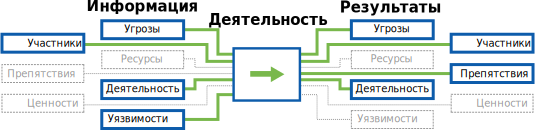

### Вопросы по теме

* Какие инфраструктурные препятствия существуют в регионе?
* Каковы основные ненаправленные цифровые угрозы в этом регионе?
* С какими наиболее серьезными направленными цифровыми угрозами могут столкнуться организации, работающие в этом регионе (в этой стране)?
* Есть ли юридические ограничения использования средств цифровой безопасности в стране? (Насколько законны шифрование, инструменты обеспечения анонимности и т.д.)
* Получала ли организация угрозы от каких-либо частных лиц или групп? Были ли намерения атаковать?

### Подходы

* ИССЛЕДОВАНИЕ. Ищите данные, которые помогут лучше понять потенциальные угрозы и общий контекст для самой организации и для аудита.
\newpage

---
Authors:
- SAFETAG
Info_provided:
- unknown
Info_required:
- unknown
---

## Оценка ресурсов

### Кратко

На этом шаге аудитор общается с сотрудниками (интервью и просто беседы) для определения сильных и слабых сторон организации (опыт, финансы, желание учиться, время сотрудников и т.д.), внедрения новых методов цифровой и физической безопасности. Аудитор использует полученные данные, чтобы корректировать объем аудита и собственно рекомендации.

### Цель

Если аудитор знает о о сильных и слабых сторонах организации, он может дать более подходящие рекомендации, которые скорее будут выполнены. Это знание пригодится аудитору уже на стадии подготовки. Аудитор сможет точнее определить, как организация понимает технологии, проблемы цифровой безопасности, уровень угроз, насколько ей будет сложно выполнить рекомендации аудита. Аудитору станет легче разобраться с особенностями работы организации, инфраструктурой, уязвимостями.

### Движение данных

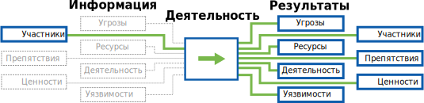

### Вопросы по теме

 * Насколько организация способна внедрять новые технологии и практики?
 * Какие ресурсы для этого есть у организации?
 * В какой среде работает организация? Какие препятствия, источники угроз и другие проблемы влияют на ее работу?
 * Есть ли особые пожелания насчет аудита, которые потребуют изменения общего подхода, инструментов, этапов подготовки или сроков?

### Подходы

 * Проведите предварительные интервью с руководством и техническими сотрудниками, чтобы определить сильные и слабые стороны организации (опыт, финансы, время сотрудников и т.д.)
 * Во время аудита поговорите с сотрудниками неформально, узнайте побольше о ресурсах организации, об истории внедрения технологий.
 * Составьте простой в использовании контрольный список оценки ресурсов, который организация сама сможет использовать и по необходимости изменять.

### Результаты

  * Способность организации:
    * Применять новые технологии.
    * Учиться на чужом опыте.
  * Ресурсы организации (приобретаемые, экспертные, финансы, время и др.), которые можно использовать для внедрения технологий.
 * Доступность и качество коммуникаций и электронной инфраструктуры.
 * Угрозы, связанные с цифровой и физической безопасностью организации и сотрудников. Проблемы безопасности, с которыми организация и ее партнеры сталкивались в прошлом.
 * Приоритетные проблемы безопасности.
 * Оборудование и программы, используемые для обеспечения физической и цифровой безопасности организаций и их сотрудников.
 * Прошлое, текущее или желаемое использование веб-сайтов, блогов, социальных сетей и других веб-инструментов и платформ для обработки данных, защиты интересов или взаимодействия с какими-либо группами.
 * Прошлое, текущее или желаемое использование мобильной связи и связанного с ней  программного и аппаратного обеспечения для таких действий, как обработка SMS и сбор данных.

\newpage
<!-- Recon-->

---
Authors:
- SAFETAG
Info_provided:
- unknown
Info_required:
- unknown
---

## Рекогносцировка

### Кратко

Удаленное изучение организации и ее инфраструктуры. Аудитор изучает общедоступные источники данных, связанные с организацией (веб-сайты, внешние сети, почтовые серверы, данные в социальных сетях).

### Цель

SAFETAG в основном рассматривает проблемы цифровой безопасности в офисе и вокруг него, но информация из открытых источников иногда также может свидетельствовать о реальных угрозах и заслуживать внимания. Кроме того, аудитор способен составить впечатление о степени присутствия организации в сети и значимости тех или иных уязвимостей, с которыми придется поработать "на месте".

### Движение данных

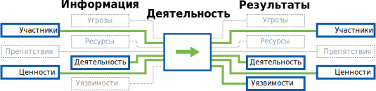

### Вопросы по теме

* С учетом ожиданий организации относительно безопасности, "упускает" ли она какую-либо важную информацию в сеть (местоположение, личности сотрудников?)
* Можете ли вы помощью сайта организации определить ее партнеров и бенефициаров?
* Каков шаблон для адресов электронной почты сотрудников?
* Были ли в прошлом скомпрометированы какие-либо серверы, пользователи или почтовые адреса организации?

### Подходы

* **Ручной поиск.** Определите доступность информации о партнерах, бенефициарах и текущих проектах организации в сети, используя расширенный поиск Google и изучение материалов сайта. [^PETS_logical_intel]
* **Recon-NG.** Используйте систему recon-ng для автоматической веб-разведки по открытым источникам данных. [^recon-ng_data_flow]
* **Поиск в соцсетях.** Определите доступность информации о партнерах, бенефициарах и текущих проектах организации путем поиска в социальных сетях.

\newpage

<!-- Network Mapping -->

---
Authors:
- SAFETAG
Info_provided:
- unknown
Info_required:
- unknown
---

## Создание карты сети организации

### Кратко

На этом этапе аудитор выявляет проблемы безопасности рабочей сети организации. Нужно составить список устройств сети организации, используемых ими служб, всех имеющихся средств защиты.

### Цель

Карта сети отражает все подключенные устройства, в том числе забытые серверы (например, для разработки и тестирования веб-сайтов).  Появляется основа для дальнейшей работы с устройствами, для изучения уязвимостей.

На этом этапе определяются и внешние службы (Google, Dropbox и др.), которые (преднамеренно или нет) формируют "теневую инфраструктуру" организации. Дополнив это изучением беспроводных устройств (см. раздел "Мониторинг открытого беспроводного трафика"), можно связать многие устройства с конкретными пользователями.

### Движение данных

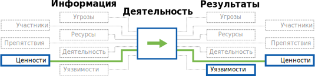

### Вопросы по теме

* Какие операционные системы и службы используются организацией? Имеются ли на каких-либо устройствах необычные, измененные, устаревшие операционные системы?
* Есть ли в сети неожиданные/необычные устройства или сервисы?
* Какова топология сети? Какие роутеры и модемы
работают в сети?
* Какие службы (Dropbox, электронная почта и т.д.), не упомянутые сотрудниками, работают в сети?
* Если злоумышленник проникнет во внутреннюю сеть организации, к каким сетевым ресурсам он получит доступ?

### Подходы

* **Построение карты сети.** Сканируйте сетевые устройства и определите хосты, сервисы и сетевое оборудование.
* **Мониторинг открытого беспроводного трафика.** Требуется для обнаружения подключений, маячков, MAC-адресов.
* **Создание карты диапазона беспроводной сети.** Следует выяснить, насколько беспроводная сеть "видна" за пределами офиса.

\newpage
<!-- Organizational Device Assessment -->

---
Authors:
- SAFETAG
Info_provided:
- unknown
Info_required:
- unknown
---

## Использование устройств организацией

### Кратко

На этом этапе аудитор оценивает безопасность оборудования организации (в том числе сетевых устройств). Потребуются интервью, составление карты сети и проверка устройств.

### Цель

Уязвимые устройства могут стать слабым звеном почти в любом процессе защиты информации. Обновляются ли основные программы? Устанавливаются ли обновления безопасности? Есть ли основные средства защиты от несанкционированного доступа, какие? Ответы на эти вопросы необходимы для разработки плана повышения безопасности устройств. SAFETAG делает акцент на безопасности данных, поэтому важно не упустить из вида физические параметры устройств, на которых эти данные хранятся, включая устройства, объединенные проводными сетями.

### Движение данных
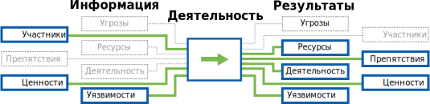

### Вопросы по теме

* Какие рабочие и личные устройства сотрудники используют для работы, хранения рабочих файлов, рабочих коммуникаций?
* Какие организационные и сторонние/личные сервисы сотрудники используют для работы, хранения рабочих файлов, рабочих коммуникаций?
* Как сотрудники общаются между собой и с внешним миром? Какие инструменты они используют?
* Какие (не)формальные меры безопасности принимают сотрудники?
* У кого есть физический доступ к разным объектам аудита? Удаленный доступ?
* Когда устройства не контролируются уполномоченными сотрудниками?
* Как злоумышленники могут получить доступ? (Силовое вторжение, кража, социальная инженерия и др.)
* Предусмотрены ли меры по смягчению последствий в случае потери устройств или их захвата злоумышленниками? (Примеры: шифрование дисков, резервное копирование за пределы офиса?)

### Подходы

* **Физический доступ к устройствам.** Осмотрите офис, обратите внимание на работающие устройства без пользователей, серверы, сетевые разъемы, записанные на бумажке пароли. Оцените, насколько легко злоумышленник в рабочее или нерабочее время сможет получить доступ к важным устройствам.
* **Аудит устройств.** Просмотрите пользовательские устройства (рабочие и личные): насколько обеспечена безопасность? (Пароли, обновления, права пользователей, шифрование диска, открытые порты, работающие службы, антивирусная защита).
* **Вопросы о паролях.** Спросите сотрудников о том, как они используют пароли для ВСЕХ рабочих устройств. [^password_survey]^,^[^password-security]
* **Один день из жизни.** Пусть сотрудники расскажут, как они проводят обычный рабочий день. Попросите их показать, какие устройства они используют и как, с какими данными они имеют дело.

### Результаты

* Список всех ценностей (устройств и сервисов) организации с информацией о владельцах.
* Данные о (не)формальных мерах контроля доступа в офис.
* Список программ на устройствах сотрудников с датами последних обновлений.
* Список обнаруженных уязвимостей и вредоносных программ, которые угрожают офису организации.
* Список вредоносных программ, обнаруженных на офисных компьютерах при запуске обновленного антивируса (если антивирус установлен во время проверки устройства).
* Список незащищенных серверов, рабочих станций, внешних жестких дисков и любых других цифровых устройств.
* Данные о действующих мерах цифровой безопасности.
* Информация о том, записываются ли пароли на бумажках.

### Безопасность в работе аудитора

  * Обращайтесь с полученной информацией максимально осторожно. Записи на физических носителях должны быть уничтожены сразу после использования. Цифровые данные должны быть защищены в соответствии со стандартами SAFETAG.

### Подготовка

#### Основные навыки

* Базовый опыт системного администрирования распространенных операционных систем.

### Материалы

  * *(руководство)* ["Руководство по брандмауэрам и политике брандмауэров"](https://csrc.nist.gov/publications/detail/sp/800-41/rev-1/final) (NIST 800-41)

  * *(тесты)* ["Тесты настроек безопасности"](http://benchmarks.cisecurity.org/downloads/browse/index.cfm?category=benchmarks) (CIS Security Benchmarks)

  * *(сборник)* ["Национальный сборник программных тестов"](https://web.nvd.nist.gov/view/ncp/repository) (National Vulnerability Database)

  * *(руководство)* ["Руководство по безопасности операционных систем"](https://www.nsa.gov/ia/mitigation_guidance/security_configuration_guides/operating_systems.shtml) (NSA)

 * *(программа для Windows)* ["HardenTools"](https://github.com/securitywithoutborders/hardentools) (Security Without Borders)

#### Парольная безопасность

  * *(руководство)* ["Как научить людей запоминать действительно сложные пароли"](http://www.wired.com/2014/07/how-to-teach-humans-to-remember-really-complex-passwords/) (Wired)

  * *(руководство)* ["Надежные пароли и понимание пользователей"](https://www.hashtagsecurity.com/security-on-passwords-and-user-awareness) (HashTag Security)

  * *(видео)* ["Что не так с моим паролем?"](http://www.ted.com/talks/lorrie_faith_cranor_what_s_wrong_with_your_pa_w0rd?language=en) (TED)

  * *(статья)* ["Парольная безопасность: когда популярные схемы не работают"](https://diogomonica.com/posts/password-security-why-the-horse-battery-staple-is-not-correct/) (Diogo Mónica)

  * *(организация)* ["Исследование о паролях"](http://cups.cs.cmu.edu/passwords.html) (The CyLab Usable Privacy and Security Laboratory (CUPS))

   * *(руководство)* ["В копилку хакера: что такое хэширование паролей?"](https://www.wired.com/2016/06/hacker-lexicon-password-hashing) (Wired)

   * *(руководство)* ["Семь экспертов по паролям рассказывают, как обезопасить себя"](https://www.wired.com/2016/05/password-tips-experts/) (Wired)

#### Разделение прав пользователей в разных операционных системах

* выясните, как организована система прав пользователей,
* определите, как называется пользователь с правами администратора: admin или root,
* узнайте, входят ли пользователи с правами администратора, могут ли они устанавливать программы как администратор.

#### Брандмауэры в разных операционных системах

  * *(проверочный тест)* ["Проверка настройки брандмауэра"](https://www.netspi.com/Portals/0/docs/Blog_Documents/EH_Firewalls/Firewall_Audit_Checklist_Short_v1.pdf) (NetSPI)

#### Определение версий программ

#### Шифрование устройств в разных операционных системах

* Определение того, включено ли шифрование на устройстве
* Доступность шифрования
* Руководства по шифрованию

#### Обновления антивирусов

#### Выявление странных и одноразовых сервисов

  * *(руководство)* ["Тест на физическое проникновение"](http://www.pentest-standard.org/index.php/Pre-engagement#Physical_Penetration_Test) *(англ.)*

  * *(проверочный тест)* ["Проверочный тест: безопасность офиса"](https://www.frontlinedefenders.org/en/resource-publication/workbook-security-practical-steps-human-rights-defenders-risk) (Frontline Defenders) *(англ.)*

  * *(руководство)* [Планирование, повышение уровня и проверка безопасности в офисе и дома](http://www.peacebrigades.org/fileadmin/user_files/groups/uk/files/Publications/Frontline_Manual_pdf.pdf#page=83) *(англ.)*

  * *(руководство)* ["Оценка физической безопасности - стр. 122"](http://www.isecom.org/research/osstmm.html) (OSTTM) *(англ.)*

  * *(руководство)* ["Пособие по безопасности: практические шаги для правозащитника из группы риска"](https://www.frontlinedefenders.org/en/resource-publication/workbook-security-practical-steps-human-rights-defenders-risk) (Frontline Defenders) *(англ.)*

  * *(руководство)* ["Как повысить физическую защищенность информации"](https://securityinabox.org/ru/guide/physical) (Frontline Defenders)

  * *(шаблоны политик)* [Шаблоны политик информационной безопасности](https://www.sans.org/security-resources/policies) (SANS) *(англ.)*

### Действия
\newpage
<!-- User Device Assessment -->

---
Authors:
- SAFETAG
Info_provided:
- unknown
Info_required:
- unknown
---

## Анализ устройств пользователей

### Кратко

Аудитор оценивает безопасность отдельных устройств. Он проводит интервью сотрудников и проверку устройств.

### Цель

Уязвимые устройства могут стать слабым звеном почти в любом процессе защиты информации. Обновляются ли основные программы? Устанавливаются ли обновления безопасности? Есть ли основные средства защиты от несанкционированного доступа, какие? Ответы на эти вопросы необходимы для разработки плана повышения безопасности устройств.

### Движение данных

### Вопросы по теме

* Какие рабочие и личные устройства сотрудники используют для работы, хранения рабочих файлов, рабочих коммуникаций?
* Какие организационные и сторонние/личные сервисы сотрудники используют для работы, хранения рабочих файлов, рабочих коммуникаций?
* В каких организационных процессах принимают участие сотрудники? Какие инструменты и каналы связи они используют?
* Какие (не)формальные меры безопасности сотрудники принимают против рисков?

### Подходы

* **Аудит устройств.** Просмотрите пользовательские устройства (рабочие и личные): насколько обеспечена безопасность? (Пароли, обновления, права пользователей, шифрование диска, открытые порты, работающие службы, антивирусная защита).
* **Вопросы о паролях.** Спросите сотрудников о том, как они используют пароли для ВСЕХ рабочих устройств. [^password_survey]^,^[^password-security]
* **Один день из жизни.** Пусть сотрудники расскажут, как они проводят обычный рабочий день. Попросите их показать, какие устройства они используют и как, с какими данными они имеют дело.

\newpage
<!-- Vulnerability Analysis -->

---
Authors:
- SAFETAG
Info_provided:
- unknown
Info_required:
- unknown
---

## Определение и анализ уязвимостей

### Кратко
На этом шаге аудитор определяет возможные уязвимости устройств, сервисов, приложений и сетей организации. Для этого аудитор проводит тестирование и сравнение найденного с разными онлайновыми и офлайновыми ресурсами (базами уязвимостей, рекомендациями поставщиков, данными самого аудита). Базовый анализ уязвимостей лучше проводить вместе с другими действиями по аудиту, чтобы можно было сразу собирать доказательства. Ради эффективного использования времени после завершения основного аудита может быть проведено более глубокое исследование конкретных уязвимостей.

### Цель

Бывает, что правозащитная НКО с нехваткой финансирования пытается самостоятельно наладить критически важную инфраструктуру на имеющемся оборудовании. Если у организации с деньгами получше, она может держать критически важные сервисы в удаленном центре обработки данных или передать ИТ-инфраструктуру сторонним поставщикам облачных услуг, таким как Google Apps, и/или специализированным службам (Dropbox, Yahoo! Mail, Wordpress и т.д.). Несмотря на эти возможности, организации редко назначают специального сотрудника, чтобы тот обновлял системы и исправлял ошибки, или мониторил сервисы с точки зрения безопасности, а не только доступности.

### Движение данных
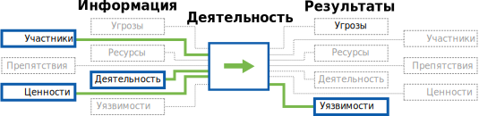

### Вопросы по теме

* Какие доказательств нужно собрать, чтобы обозначить для организации важность уязвимости?
* Если для получения информации нужен местный "айтишник", какое количество его рабочего времени стоит запросить?

### Подходы

* **Сканирование уязвимостей.** Поиск уязвимостей на веб-сайтах, внешних серверах и ключевых серверах внутренней сети.
* **Изучение базы данных уязвимостей.** Поиск в базах уязвимостей потенциальных угроз для аппаратного и программного обеспечения на серверах, пользовательских устройствах и онлайн-сервисах организации.
* **Оценка конфигурационных файлов.** Проверьте файлы конфигураций разных сервисов на уязвимости с помощью руководств по усилению безопасности и поиску распространенных ошибок, которые можно найти в сети.

\newpage
<!-- Data Assessment (assets) -->

---
Authors:
- SAFETAG
Info_provided:
- unknown
Info_required:
- unknown
---

## Оценка данных

### Кратко

Аудитор определяет наиболее важные данные организации, где они хранятся, как передаются.

### Цель

Файлы с важными данными часто хранятся на разных устройствах с разными степенями защиты. Оценив ситуацию, аудитор может рекомендовать варианты защищенного хранения данных, которые наилучшим образом отвечают модели рисков, потребностям и рабочим процессам организации. Аудитор уже имеет частичное представление об этом после анализа сети и составления карты сети, но чем больше сотрудники понимают, что именно считать важными данными, тем вероятнее они станут принимать правильные организационные решения.

Если злоумышленник получит доступ к компьютеру или диску с резервной копией, он сможет прочитать или изменить конфиденциальную информацию на устройстве. Это может произойти, даже если сотрудник установил надежный пароль учетной записи. Мы говорим об угрозах, связанных с потерей, кражей, изъятием устройств, а также о сценариях прохождения человеком "зон риска", когда злоумышленники могут получить доступ к устройствам всего на несколько минут. В случае кражи со взломом или изъятия оборудования из офиса злоумышленник может получить всю самую важную информацию на устройствах организации, возможно, даже ту, на которую он сначала не обратил внимание.

### Движение данных

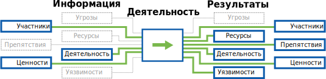

### Вопросы по теме

* Каковы самые важные данные организации? Делаются ли резервные копии этих данных?
* Каким наиболее важным данным нужно обеспечить приватность?
* Как в настоящее время определяется, кто должен иметь доступ к данным?
* Есть ли сейчас доступ к данным у того, кто не должен иметь такой доступ?
* Есть ли у сотрудников общее понимание, что считать особо важными данными?
* К каким данным каждый сотрудник должен иметь доступ для своей работы?

### Подходы

* **Доступ к данным.** Попросите сотрудников определить, где находятся данные (устройства, местонахождение), у кого есть доступ (физический доступ, логин и пароль, права), кому реально нужен доступ для работы организации.
*  **Риск потери данных.** Рассмотрите сценарии с потерей разных данных; что если злоумышленники получат к ним доступ? Оцените риски.
* **Работа с особо важными данными.** Помогите сотрудникам составить список самых важных данных, которые те обрабатывают в организации. [^personal_information_to_keep_private]

Если нет возможности выполнить эти действия на месте, можно сделать это удаленно, см.  [Удаленный доступ](#appendix-remote-facilitation).

### Результаты

  * Станет ясно, что сотрудники знают о важных данных организации:
      * какие данные,
      * где они хранятся,
      * кто имеет к ним доступ,
      * кому реально нужен доступ.

\newpage
<!-- Physical Assessment -->

---
Authors:
- SAFETAG
Info_provided:
- unknown
Info_required:
- unknown
---

## Оценка физической безопасности

### Кратко

Безопасность организации зависит от того, удастся ли смягчить риски, возникающие из-за нахождения цифровых ценностей в физическом мире. Насколько безопасны устройства в офисе? Куда и как сотрудники перемещаются с устройствами, принадлежащими организации? Работают ли сотрудники вне офиса (например, в удаленных офисах, дома, в поездках, в кафе)? Практикуется ли доступ к информации организации с личных устройств? Как эти устройства защищены?

### Цель

Хотя методика SAFETAG ориентирована на безопасность данных, нельзя упускать из виду и технические аспекты устройств, резервных дисков, серверов и даже проводных сетей.

Цифровые угрозы могут зависеть от того, есть ли у злоумышленника физический доступ к устройствам. Некоторые специалисты по безопасности считают, что такой доступ означает неэффективность всякой защиты. Но опускать руки — плохой совет, особенно для небольших гражданских организаций и независимых СМИ из группы риска.

Аудитору важно рассмотреть проблемы одноразовой утечки данных. Но — в зависимости от конкретных угроз — ему следует также оценить возможные способы получения злоумышленником физического доступа или близости к организации или ее устройствам. В этих случаях злоумышленник может получить постоянный удаленный доступ, вести слежку, вредить организации путем целенаправленного уничтожения данных.

### Движение данных

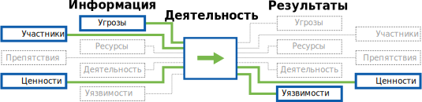

### Вопросы по теме

* У кого есть физический доступ к разным объектам аудита? Когда устройства не контролируются уполномоченными сотрудниками?
* У кого есть независимый доступ к офисным помещениям?
* Как злоумышленники могут получить доступ? (Силовое вторжение, кража, социальная инженерия и др.)
* Как используются повседневные устройства? Где они хранятся? Где они находятся, когда сотрудники уходят домой?
* Где находятся серверы и сетевые компоненты, на которых размещены ценности организации? Которые управляют этими ценностями? Есть ли неиспользуемые активные сетевые разъемы? Находятся ли они в общественных местах? Или там, где люди не заметят, если кто-то подключится к сети через такой разъем?
* Как осуществляется доступ к данным за пределами офиса? Как они там хранятся?
* Берут ли сотрудники в поездки данные, принадлежащие организации?
* Как создаются резервные копии? Где они хранятся?

### Подходы

* **Физический доступ к локальной сети, wi-fi и серверам.** Осмотрите офис, обратите внимание на незащищенные сетевые устройства, серверы и сетевые разъемы. Оцените, насколько легко злоумышленник в рабочее или нерабочее время сможет получить доступ к важным устройствам. Как далеко от офиса можно "поймать" беспроводную сеть организации? Можно ли догадаться, что сеть принадлежит именно этой организации?
* **Определение потенциальных физических уязвимостей, влияющих на цифровую безопасность.** Зафиксируйте потенциальные уязвимости организации в сфере информационной безопасности на основе физических аспектов. Например, незашифрованные устройства (проблемы в случае кражи), записанные на бумаге пароли, даже метаданные беспроводной сети.
* **Один день из жизни.** Пусть сотрудники расскажут, как они проводят обычный рабочий день. Попросите их показать, какие устройства они используют и как, с какими данными они имеют дело.

\newpage
<!-- Risk Modeling -->

---
Authors:
- SAFETAG
Info_provided:
- unknown
Info_required:
- unknown
---

## Создание карты процессов и моделирование рисков

### Кратко
Аудитор помогает сотрудникам организации определить, какие рабочие процессы протекают в организации, и расставить приоритеты. Аудитор подсказывает, что случится, если важные процессы окажутся прерваны, или в них вмешается злоумышленник. Результат работы — матрица рисков, созданная самими сотрудниками. Матрица используется как основа для рекомендаций аудитора.

### Цель

Организация играет ведущую роль в оценке своих рисков. Аудитор лишь помогает зафиксировать проблемы и рекомендации в плане дальнейшей работы. Чем больше сотрудники принимают на себя ответственность за проводимый аудит, тем активнее они займутся работой с проблемами после аудита.[^social_engineering_important_all] Аудитору следует вовлекать в процесс как можно больше сотрудников; тогда им будет легче работать с той информацией, которая может появиться после отъезда аудитора. Существующие формальные и неформальные методы обеспечения безопасности, отмеченные во время аудита, могут помочь устранить организационные и психологические препятствия для запуска новых методик.

### Движение данных
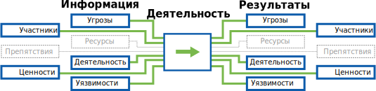

### Вопросы по теме

* Какие виды деятельности организации — основные?
* С какими угрозами сталкивается организация? Ее программы, партнеры, бенефициары?
* Если угрозы будут реализованы, какими окажутся последствия?
* Кто из противников организации (отдельные люди, группы) может попытаться реализовать эти угрозы?
* Способны ли они реализовать угрозы?

### Подходы

* Упражнения по созданию карты процессов и/или данных.
* Индивидуальные интервью с сотрудниками (в дополнение к работе с группой).
* Определение рисков на основе карты процессов/данных.
* Классическая групповая [работа по оценке рисков](http://frontlinedefenders.org/files/workbook_eng.pdf#page=9).

*Примечание.* Моделирование рисков подразумевает разнообразие упражнений. Порядок меняется в зависимости от организации.

Если не получается выполнить эту работу на месте, можно сделать это удаленно, см. [Удаленный доступ] (#appendix-remote-facilitation).

### Результаты

  * Карты самых важных процессов.
  * Список ценностей организации.

\newpage
<!-- Advanced Threat Response -->

---
Authors:
- SAFETAG
Info_provided:
- unknown
Info_required:
- unknown
---

## Другие угрозы

### Кратко
Аудитор определяет, сортирует и анализирует подозрительную активность на устройстве или в сети. В зависимости от результатов аудитор может далее разбираться с заражением устройства вредоносными программами, анализировать двоичные файлы и выяснять, вредоносные они или нет, рекомендовать срочные меры по снижению рисков.

### Цель
Во время аудита часто встречаются разные виды подозрительной активности, странные процессы, труднообъяснимый трафик и пр. Те, кто работает по методике SAFETAG,  должны всегда следить за подозрительными действиями, применяя разные методы SAFETAG. Это касается всего — от взаимодействия с сотрудниками до изучения устройств и анализа трафика.

### Движение данных
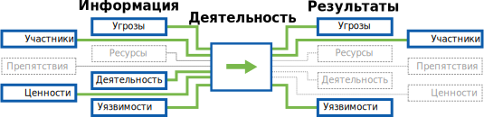

### Вопросы по теме

* Есть ли у организации основания думать, что она уже заражена вредоносными программами? Если да, то какие основания?
* Получали ли сотрудники подозрительные сообщения по e-mail или в мессенджерах?
* Насколько вероятны целевые атаки, если учитывать контекст и работу организации?
* Сколько времени нужно посвятить более полному анализу во время самого аудита? Какие факторы могут на это повлиять?
* Какое влияние целевые вредоносные программы могут оказать на организацию и на сам аудит?
* Какие типы вредоносных программ должны запускать механизм реагирования на инциденты?

### Подходы
**У аудитора мало времени, поэтому он должен сосредоточиться на обнаружении и экспресс-анализе подозрительных действий.** Будет много ложных срабатываний, когда "нормальная" (не вредоносная) программа заставляет устройство "вести себя странно". Будут и не очень страшные (а также нецелевые) вредоносные программы, например, рекламные или вымогательские.

Cбор материалов, базовые исследования и анализ, оценка рисков, оценка вероятного ущерба ценностям организации — все это поможет расставить приоритеты в дальнейших действиях. Углубленный анализ двоичных файлов лучше проводить после аудита, когда готовится отчет (и позже). Если под угрозой главные ценности, аудитору может потребоваться согласовать срочные меры с другими экспертами.

При реагировании на заражение вредоносным ПО и другие угрозы (возможно, более сложные) крайне важно следить за временем. Аудитор должен постоянно спрашивать себя, стоит ли продолжать или лучше перейти к другой части аудита. Если аудитор не сможет четко представлять, насколько организация устойчива к рискам, какие у нее есть информационные ценности, ресурсы, практики, процессы, политики — это помешает аудитору составить отчет и вообще понять контекст обнаруженной проблемы.

* **Оценка возможностей злоумышленника.** Это результат работы по исследованию технического контекста. Есть ли продвинутые постоянные угрозы, которые следует учитывать? Что они из себя представляют? Каковы их симптомы?
* **Анализ определенных подозрительных событий/действий.** Есть ли у организации основание для беспокойства или доказательства, указывающие на целевую атаку? Если да, аудитор может сосредоточить внимание на сопоставлении этих данных с другими известными атаками (или отметить их для дальнейшего изучения).
* **Поиск симптомов угрозы.** Если организация подозревает, что она под ударом, но в качестве доказательства нет подозрительного устройства/процесса/ адреса e-mail, аудитор может использовать методы, которые позволят разумно тратить время на дальнейшее расследование.
* **Сбор доказательств для последующего анализа.** Если аудитор заметил что-то подозрительное, он может собрать доказательства для анализа или поделиться информацией с другими экспертами. Это отнимает много времени, а собранные данные требуют большой аккуратности.
* **Углубленный анализ.** Если вредоносная программа обнаружена, но ее не получается идентифицировать, нужен дополнительный анализ. Этот факт также может повлиять на процесс аудита и на изменение подхода к реагированию на инциденты безопасности.

\newpage
<!-- Threat Assessment -->

---
Authors:
- SAFETAG
Info_provided:
- unknown
Info_required:
- unknown
---

## Оценка угроз

### Кратко

На этом шаге выявляются вероятные злоумышленники. Важно собрать информацию о способностях этих злоумышленников навредить организации. Совершал ли этот конкретный злоумышленник что-либо подобное в прошлом? Может ли он сделать это сегодня? Есть ли доказательства его намерений?

### Цель

Организация и аудитор могут предполагать разное насчет угроз. Эти предположения следует проверить. Тогда аудитор сможет опираться на точные оценки условий, в которых работает организация. Организация сможет обоснованно формулировать свои ожидания, связанные с безопасностью работы. Благодаря более активному участию сотрудников в аудите можно изучить угрозы; сами сотрудники будут активнее работать с угрозами и после аудита. Аудитору следует привлекать как можно больше сотрудников; тогда после окончания работы они смогут самостоятельно разбираться с новой информацией об угрозах.

### Движение данных

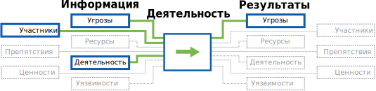

### Вопросы по теме

* Кто потенциальные противники организации?
* Они уже осуществляли атаки? Против кого?
* Какие организации были их целью?
* Есть ли у злоумышленника ресурсы для реализации угрозы сразу против всех подобных организаций, или ему придется расставить приоритеты? Является ли организация приоритетной целью?
* Есть ли у злоумышленника желание и возможность для атаки?

### Подходы

* **Исследование угроз с помощью открытых источников.** Определите возможных противников и угрозы с помощью общедоступных отчетов, новостей и баз данных.
* **Понимание угроз.** Помогите сотрудникам идентифицировать возможных противников и угрозы.

### Результаты

  * Матрица угроз, созданная организацией, включая:
    * **противников** (с оценкой их возможностей и готовности к атаке),
    * **воздействие** атак на **критические процессы** организации (ранжированные по степени серьезности),
    * **вероятность** каждой атаки (на основе анализа противников).
  * Последние угрозы цифровой безопасности.
  * Cуществующие формальные и неформальные практики обеспечения безопасности, которые участники используют для устранения рисков.

\newpage
<!-- Responsive Support -->

---
Authors:
- SAFETAG
Info_provided:
- unknown
Info_required:
- unknown
---

## Оперативная поддержка

### Кратко

Аудитор помогает в любых немедленных действиях (выборочное обучение, помощь в настройке инструментов, консультации по предстоящим проектам). Он также помогает разобраться с уязвимостями, которые связаны с инцидентами безопасности.

### Цель

Аудит и обучение расширяют возможности организации в безотлагательном поиске и решении проблем безопасности. Аудитор также помогает организации безопасно получить и хранить аудиторский отчет.

### Движение данных
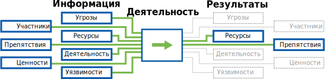

### Вопросы по теме

* Нужно ли отметить в отчете какие-либо критические уязвимости или действия по их устранению, в которых организации следует лучше разобраться?
* Как аудитору подготовить сотрудников и руководство к тем аспектам аудита, которые могут вызвать у них неприятие и помешать аудиту?
* Насколько организация готова использовать технологии для обеспечения безопасности? Насколько вероятно, что она их использует? Какие факторы осложнят эффективное и безопасное применение технологий (или сделают это невозможным)?
* Является ли поддержка, которую вы хотите предоставить организации (устранение неполадок, обновления, обучение и т.д.), особо важной для ее безопасности? Если нет, можно ли заняться этим параллельно с аудитом?
* Сможете ли вы в дальнейшем поддерживать программное и аппаратное обеспечение, которые предложили организации?

### Подходы

* **Целевое обучение.** Может использоваться для того, чтобы обучить сотрудников основам цифровой безопасности, удовлетворить их ожидания, мотивировать их применять правила цифровой безопасности в повседневной жизни.
* **Целевая поддержка.** Аудитор может предоставить ограниченную целевую техническую поддержку или помощь в разработке политик безопасности, если у него есть соответствующий опыт и позволяют сроки аудита.

\newpage
<!-- Debrief -->

---
Authors:
- SAFETAG
Info_provided:
- unknown
Info_required:
- unknown
---

## Подведение итогов

### Кратко

На этом этапе рассматриваются ключевые моменты, как индивидуально, так и в группе, чтобы разрядить атмосферу. Составляется план дальнейшего взаимодействия с организацией и ключевыми сотрудниками.

### Цель

Задача аудита по системе SAFETAG — предоставление небольшим гражданским организациям и независимым СМИ доступа к средствам цифровой безопасности. SAFETAG также учит организацию самостоятельно выявлять и решать проблемы безопасности. Данный этап — возможно, последний шанс для аудитора пообщаться с сотрудниками, чтобы помочь им сформировать их собственное восприятие аудита.

Аудитору важно знать, что, когда он покинет организацию, ее сотрудники будут готовы приступить к решению проблем цифровой безопасности. Аудитор предлагает организации немедленные результаты, обучение и консультации по безопасности (см. раздел о поддержки и обратной связи). Организация должна воспринимать аудит не как порицание, а как руководство к действию.

### Движение данных

### Вопросы по теме

* Есть ли у организации силы для перемен?
* Понимают ли ключевые сотрудники главные выводы аудита?
* Представляет ли организация, какие следующие шаги надо сделать?

### Подходы

  * Обсудите с организацией следующие шаги. Определите, в каких случаях организации может понадобиться связаться с аудитором.
  * Обратите внимание на психологическое состояние участников после аудита. Спросите, как они себя чувствуют после аудита, что они ощущают.
  * Сделайте первые шаги в пост-аудиторском общении (с организацией в целом, индивидуальные).

\newpage
<!-- Follow Up -->

---
Authors:
- SAFETAG
Info_provided:
- unknown
Info_required:
- unknown
---

## Работа после аудита

### Кратко
Аудитору важно получать обратную связь, а также поддерживать контакт с организацией, чтобы оценить эффективность аудита.

Понадобится заключительная встреча с организацией. Через несколько месяцев можно будет связаться с организацией и выяснить, нужна ли дальнейшая помощь, хочет ли организация поделиться опытом работы с рекомендованными ей (и новыми) ресурсами.

### Цель

Работа после аудита стимулирует организацию заниматься цифровой безопасностью. Однако любые действия должны быть востребованы самой организацией и посильны для аудитора. Хорошо, когда эти контакты осуществляются как можно менее навязчиво с обеих сторон.

### Движение данных

### Вопросы по теме

* С какими препятствиями столкнулась организация при реализации рекомендованного плана по снижению рисков?
* Есть ли новые ресурсы, которые аудитор может предложить в дополнение к аудиту?
* Как сделать, чтобы действия аудитора после окончания аудита воспринимались не как оценка успешности организации, а как дополнительная поддержка?

### Подходы

* **Обратная связь с сотрудниками.** Получите отзывы о том, как идут дела, от сотрудников.
* **Встреча после аудита.** Организуйте беседу для обсуждения аудиторского отчета.
* **Дополнительные ресурсы.** По необходимости знакомьте организацию с новыми полезными ресурсами.
* **Долгосрочные контакты.** Через несколько месяцев свяжитесь с организацией, чтобы узнать, как идут дела, предложить новые полезные ресурсы.

# Отчет

\newpage
<!-- Recommendation Development -->

---
Authors:
- SAFETAG
Info_provided:
- unknown
Info_required:
- unknown
---

## Разработка рекомендаций

### Кратко

Аудитор определяет сильные и слабые стороны организации (опыт, финансы, желание учиться, время сотрудников и т.д.) для внедрения новых практик цифровой и физической безопасности. Аудитор предлагает шаги, которые организация может сделать для устранения уязвимостей, обнаруженных во время аудита. Важно уделить внимание тому, насколько сложно выполнить конкретные шаги, какие ресурсы понадобятся организации. В число таких ресурсов могут войти, например, местная техподдержка, помощники при отражении угроз, скидки на компьютерные программы, тренеры и руководства для повышения квалификации.

### Цель

Организация должна быть способна самостоятельно разбираться с проблемами безопасности после аудита. Рекомендации аудитора должны охватывать широкий диапазон, позволяющий организации решать проблемы как в краткосрочной, так и долгосрочной перспективе. Если аудитор знает сильные и слабые стороны организации, он может дать подходящие ей рекомендации, и та будет больше мотивирована к переменам. Аудитор SAFETAG может выступать как надежный канал связи между гражданскими активистами и теми, кто проводит обучение в области цифровой безопасности, оказывает техническую и  юридическую поддержку, помогает разбираться с инцидентами безопасности.

### Вопросы по теме

* Каковы сильные стороны организации (опыт, финансы, желание учиться, время сотрудников и т.д.), которые она может использовать при внедрении или изменении технологий?
* Каковы слабые стороны организации (опыт, финансы, желание учиться, время сотрудников и т.д.), которые нужно учитывать при внедрении или изменении технологий?
* Какие организационные препятствия мешают выполнять рекомендации аудита?
* Связаны ли ваши рекомендации напрямую с аудитом безопасности? Если нет, помогают ли они организации реализовывать свои планы по повышению безопасности или, наоборот, отвлекают от этого?

### Подходы

* **Обозначьте проблемы, для которых не хватает ресурсов.** Обратите внимание на угрозы и источники угроз, с которыми у организации сегодня не хватает ресурсов разобраться.
* **Сформулируйте рекомендации.** Перечислите возможные действия по устранению каждой уязвимости.
* **Добавьте полезные ресурсы.** Предложите ресурсы, которые организация может использовать для выполнения рекомендаций аудита.

\newpage
<!-- Roadmap Development -->

---
Authors:
- SAFETAG
Info_provided:
- неизвестнo
Info_required:
- unknown
---

## Разработка дорожной карты

### Кратко

Аудитор сопоставляет свои рекомендации с угрозами и ресурсами организации. Он определяет, насколько важны те или иные уязвимости, взвешивает затраты на реализацию рекомендаций аудита, создает для организации "дорожную карту". Организация принимает информированные решения о вероятных следующих шагах.

### Цель

SAFETAG подразумевает внедрение более безопасных методов работы организации. Для этого, в частности, важно правильно расставить приоритеты уязвимостей. Тогда результаты аудита не покажутся ошеломляющими. У организации должно получиться выбрать оптимальные варианты решения проблем, не нанося ущерба основной работе, учитывая стоимость реализации угрозы и те риски, на борьбу с которыми нет ресурсов. Дорожная карта дает организации инструменты для принятия этих решений. Организация может следовать рекомендованному сценарию и выиграть от применения средств безопасности. Существующие формальные и неформальные практики безопасности, собранные в ходе этого процесса, будут использованы для устранения организационных и психо-социальных барьеров при создании новых практик.

### Вопросы по теме

* Опираясь на моделирование рисков и изучение контекста, сравните требуемые ресурсы с возможностями организации.
* Опираясь на оценку ресурсов, создайте план действий. Он должен обеспечить реальные результаты и успешные шаги к долгосрочным и трудным целям. Польза для организации должна быть существенна.

### Подходы

* **Создание матрицы рисков.** В этой матрице каждая обнаруженная угроза сопоставлена с вероятностью ее появления и ущербом.
* **Матрица реализации.** Создайте "матрицу реализации" с учетом неотложности угрозы. Важно не потерять из вида сложность реализации ответных мер и ресурсы организации.
* **Разработка дорожной карты.** Определите критические уязвимости с помощью достижимых рекомендаций. Они должны соответствовать угрозам, которые вы получили во время аудита. Вам нужно создать дорожную карту по устранению угроз, с которыми сталкивается организация.
* **Шкала успеха.** Разместите свои рекомендации на временной шкале, которая учитывает включает существующие практики организации. Цель — показать, что решение этих проблем является продолжением действующих в организации практик безопасности.[^Shostack_anchoring]

\newpage
<!-- Reporting Creation -->

---
Authors:
- SAFETAG
Info_provided:
- неизвестнo
Info_required:
- unknown
---

## Создание отчета

### Кратко

Аудитор собирает вместе все свои записи и рекомендации. В итоговом документе должно быть видно, какова ситуация с безопасностью, как проводился аудит. Там также должны содержаться рекомендации для решения задач в области безопасности.

### Цель

В конце концов аудитор уедет, и отчет останется для него возможностью продолжить (статичный) разговор с организацией, даже если он никогда больше с ней не встретится. Хороший отчет может стимулировать принятие нужных мер безопасности. У отчета может быть много разных читателей, которые будут использовать его по-разному. Для самого аудитора и организации это документ о выводах аудитора. Для организации это также сопоставление уязвимостей с реальными рисками, призыв к переменам, обоснование для доноров. Тем, кого организация привлекает для обеспечения цифровой безопасности, отчет предложит дорожную карту. Помимо прочего, это список задач для будущих технических консультантов и тренеров (им организация будет платить за помощь), список для того, чтобы отмечать, какие угрозы устранены.

### Вопросы по теме

* Подходят ли организации ваши рекомендации, учитывая ранее полученную от сотрудников информацию?

### Подходы

* **Обозначьте заинтересованные стороны.** Во время аудита определите тех, кто сможет влиять на процесс устранения уязвимостей (например, доноры, партнеры). Обсудите с организацией, какие элементы аудиторского отчета использовать для коммуникаций с этими сторонами
* **Визуализация.** Создайте диаграммы и другие визуальные элементы для дорожной карты, матриц рисков и реализации, а также критических процессов.
* **Выдержки из отчета.** Составьте тексты, которые будут переданы нужным организации людям (донорам, технической поддержке, тренерам).

\newpage

# Сноски

<!-- Load Footnotes -->

<!-- Notes -->

[^external_funding_and_reporting]:Usually when working with an external funder an engagement report, free of sensitive data about the host organization, will be created for submission the funder. The contents of this report should be clearly outlined and agreed to during the assessment plan stage.

<!-- Penetration/Security/Risk Testing Standards / Guides -->

[^NIST_SP_800-115]:[NIST SP 800-115, Technical Guide to Information Security Testing and Assessment](http://csrc.nist.gov/publications/nistpubs/800-115/SP800-115.pdf)

[^pen_testing_systematic]:[Penetration Testing - A Systematic Approach](http://www.infosecwriters.com/text_resources/pdf/PenTest_MSaindane.pdf)

[^NIST_SP_800-115_planning]:[NIST SP 800-115, Technical Guide to Information Security Testing and Assessment - Planning Methodology](http://csrc.nist.gov/publications/nistpubs/800-115/SP800-115.pdf#page=13)

[^NIST_SP_800-115_assessment_plan]:[NIST SP 800-115, Technical Guide to Information Security Testing and Assessment](http://csrc.nist.gov/publications/nistpubs/800-115/SP800-115.pdf#page=51)

[^NIST_SP_800-115-Section_7.1]:[NIST SP 800-115, Technical Guide to Information Security Testing and Assessment. Section 7.1 Coordination](http://csrc.nist.gov/publications/nistpubs/800-115/SP800-115.pdf#page=55)

[^NIST_SP_800-115_targeting]:[NIST SP 800-115, Technical Guide to Information Security Testing and Assessment](http://csrc.nist.gov/publications/nistpubs/800-115/SP800-115.pdf#page=40)

[^NIST_SP_800-115-travel_prep]:["Traveling teams should maintain a flyaway kit that includes systems, images, additional tools, cables, projectors, and other equipment that a team may need when performing testing at other locations."](http://csrc.nist.gov/publications/nistpubs/800-115/SP800-115.pdf#page=50)

[^pets_pre-engagement_location]:[Determining Audit Location - The Penetration Testing Execution Standard: Pre-Engagement Guidelines](http://www.pentest-standard.org/index.php/Pre-engagement#Locations)

[^pets_emergency_contact_info]:[Emergency Contact and Incidents - The Penetration Testing Execution Standard: Pre-Engagement Guidelines](http://www.pentest-standard.org/index.php/Pre-engagement#Emergency_Contact_Information)

[^interaction_security_risk_management]:[Security Risk Management: NGO Approach - InterAction Security Unit](https://www.scribd.com/doc/156488867/Srm)

[^workbook_on_security]:[Workbook on Security: Practical Steps for Human Rights Defenders at Risk](http://frontlinedefenders.org/files/workbook_eng.pdf)

[^OSSTMM_wireless_security_testing]:[Open Source Security Testing Methodology Manual (OSSTMM) p. 140.](http://www.isecom.org/research/osstmm.html)

<!-- Threat Modeling -->

[^shostack_anchoring]: See: "Threat Modeling: Designing for Security" by Adam Shostack, p. 298.

[^NIST_SP_800_115_soc_eng_hostile]:["Individual targeting can lead to embarrassment for those individuals if testers successfully elicit information or gain access. It is important that the results of social engineering testing are used to improve the security of the organization and not to single out individuals."](http://csrc.nist.gov/publications/nistpubs/800-115/SP800-115.pdf)

[^GPR_8_Likelihood]:["Likelihood: Chapter 2.7 p. 47 - Operational Security Management in Violent Environments"](http://www.odihpn.org/download/gpr_8_revised2pdf#page=38)

[^GPR_8_impacts]:["Impacts: Chapter 2.7 p. 46 - Operational Security Management in Violent Environments"](http://www.odihpn.org/download/gpr_8_revised2pdf#page=38)

<!-- Facilitation -->

[^psych_sec_training]:[The Psychological Underpinnings of Security Training - Craig Higson-Smith](https://level-up.cc/before-an-event/psychosocial-underpinnings-of-security-training/)

[^event_planning_input]:[Event Planning Inputs - Level-Up](https://www.level-up.cc/before-an-event/planning-your-training-event/)

[^integratedsecurity_prep_tips]:[Integrated Security Facilitator Preparation Tips](http://integratedsecuritymanual.org/sites/default/files/integratedsecurity_themanual_1.pdf#page=25)

[^integrated_security_manual]:[Integrated security: The Manual](http://integratedsecuritymanual.org/download-this-manual)

<!-- Censorship Measurement -->

[^herdict_explore]:[Herdict "At-A-Glance" web-blockage dashboard](http://herdict.org/explore/indephth)

<!-- ONI -->

[^ONI_country]:[Open Network Initiative - Country Reports](https://opennet.net/research/profiles)

[^ONI_regional]:[Open Network Inititiative - Regional Overviews](https://opennet.net/research/regions)

[^alkasir]:[A Cyber-Censorship Map automatically plotted based on the data collected from the database that is updated through usage patterns of alkasir software.](https://alkasir.com/map)

[^transparency]:[Who publishes Transparency Reports?](http://jameslosey.com/post/98162645081/who-publishes-transparency-reports-here-is-an)

[^alexa]:[The top 500 sites in each country or territory.](http://www.alexa.com/topsites/countries)

<!-- Country Infrastructure info -->

[^cia_factbook]:[CIA fact-book](https://www.cia.gov/library/publications/the-world-factbook/)

[^cia_factbook_internet-users]:[CIA fact-book country comparison of number of users within a country that access the Internet](https://www.cia.gov/library/publications/the-world-factbook/fields/2153.html)

[^cia_factbook_broadcast-media]:[CIA fact-book country comparison of the approximate number of public and private TV and radio stations in a country](https://www.cia.gov/library/publications/the-world-factbook/fields/2213.html)

[^cia_factbook_telephone-system]:[CIA fact-book country comparison of the telephone system with details on the domestic and international components.](https://www.cia.gov/library/publications/the-world-factbook/fields/2124.html)

[^WTICT_indicators]:[World Telecommunication/ICT Indicators database 2014](http://www.itu.int/en/ITU-D/Statistics/Pages/publications/wtid.aspx)

<!-- Media / Speech Freedom Threats -->

[^threatened_voices]:[Threatened Voices: Tracking suppression of online free speech.](http://threatened.globalvoicesonline.org/)

[^media_sustainability_index]:[IREX’s Media Sustainability Index (MSI) provides in-depth analyses of the conditions for independent media in 80 countries across the world.](http://www.irex.org/project/media-sustainability-index-msi)

[^freedom_on_the_net]:[Freedom House's "Freedom on the Net" index, assessing the degree of internet and digital media freedom around the world.](http://www.freedomhouse.org/report-types/freedom-net)

[^freedom_of_the_press]:[Freedom House's "Freedom of the Press" index assess' global media freedom.](http://www.freedomhouse.org/report-types/freedom-press)

[^article_19_by_country]:[ARTICLE 19 freedom of expression and freedom of information news by region.](http://www.article19.org/pages/en/where-we-work.html)

[^OSF_digital_media]:[Open Society Foundation - Mapping digital media](http://www.opensocietyfoundations.org/projects/mapping-digital-media)

[^press_freedom_index]:[Press Freedom Index (RSF)](https://en.rsf.org/press-freedom-index.html)

[^press_freedom_index_methodology]:[Press Freedom Index Methodology (RSF)](http://rsf.org/index2014/data/2014_wpfi_methodology.pdf)

<!-- Human Rights and Governance-->

[^freedom_in_the_world]:[Freedom House's "Freedom in the World" index is the standard-setting comparative assessment of global political rights and civil liberties.](http://www.freedomhouse.org/report-types/freedom-world)

[^corruptions_perception_index]:[Corruption  Perception  Index](http://www.transparency.org/cpi2013/results/)

[^Amnesty_regional_news]:[Amnesty International regional news on human rights](https://www.amnesty.org/en/countries/)

[^HRW_regional_work]:[Human Rights Watch - Browse by Region](http://www.hrw.org/regions)

<!-- Surveillance and Censorship -->

[^pi_country_reports]:[Privacy International's in-depth country reports and submissions to the United Nations.](https://privacyinternational.org/type-resource/state-privacy)

[^surveillance_whos_who]:[Surveillance Who's Who exposes the government agencies that attended ISS World surveillance trade shows between 2006 and 2011.](https://www.privacyinternational.org/resources/surveillance-whos-who)

[^ISC_country_reports]:[The ISC Project completes evaluations of information security threats in a broad range of countries. The resulting comprehensive written assessments describe each country’s digital security situation through consideration of four main categories: online surveillance, online attacks, online censorship, and user profile/access.](https://iscproject.org/country-assessments/)

<!-- Security Risks -->

[^EISF_Alerts]:[EISF distributes frequent analysis and summaries of issues relevant to humanitarian security risk management.](http://www.eisf.eu/alerts/)

[^PETS_legal_considerations]:[" Some activities common in penetration tests may violate local laws. For this reason, it is advised to check the legality of common pentest tasks in the location where the work is to be performed."](http://www.pentest-standard.org/index.php/Pre-engagement#Legal_Considerations)

[^PTES_testing]:[Vulnerability Analysis - The Penetration Testing Execution Standard](http://www.pentest-standard.org/index.php/Vulnerability_Analysis)

[^NIST_800_14_user_issues]:[NIST SP 800-14, Generally Accepted Principles and Practices for Securing Information Technology Systems](http://csrc.nist.gov/publications/nistpubs/800-14/800-14.pdf#page=30)

[^NIST_exploit_confirm]:["While vulnerability scanners check only for the possible existence of a vulnerability, the attack phase of a penetration test exploits the vulne rability to confirm its existence."](http://csrc.nist.gov/publications/nistpubs/800-115/SP800-115.pdf#page=38)

[^shostack_finding_threats]: See: "Threat Modeling: Designing for Security" by Adam Shostack, p. 125.

[^shostack_addressing_threats]: See: "Threat Modeling: Designing for Security" by Adam Shostack, p. 167.

[^shostack]: "Threat Modeling: Designing for Security" by Adam Shostack

[^shostack_flow]: See: "Threat Modeling: Designing for Security" by Adam Shostack, p. 408.

[^shostack_reports]: See: "Threat Modeling: Designing for Security" by Adam Shostack, p. 401.

[^secure_reporting]:"When a pilot lands an airliner, their job isn’t over. They still have to navigate the myriad of taxiways and park at the gate safely. The same is true of you and your pen test reports, just because its finished doesn't mean you can switch off entirely. You still have to get the report out to the client, and you have to do so securely. Electronic distribution using public key cryptography is probably the best option, but not always possible. If symmetric encryption is to be used, a strong key should be used and must be transmitted out of band. Under no circumstances should a report be transmitted unencrypted. It all sounds like common sense, but all too often people fall down at the final hurdle." - [The Art of Writing Penetration Test Reports](http://resources.infosecinstitute.com/writing-penetration-testing-reports/)

[^stares_and_snide_comments]:"I once performed a social engineering test, the results of which were less than ideal for the client. The enraged CEO shared the report with the whole organization, as a way of raising awareness of social engineering attacks. This was made more interesting, when I visited that same company a few weeks later to deliver some security awareness training. During my introduction, I explained that my company did security testing and was responsible for the social engineering test a few weeks back. This was greeted with angry stares and snide comments about how I’d gotten them all into trouble. My response was, as always, “better to give me your passwords than a genuine bad guy”." - [The Art of Writing Penetration Test Reports](http://resources.infosecinstitute.com/writing-penetration-testing-reports/)

[^NIST_pen_test_danger]:"Penetration testing also poses a high risk to the organization’s networks and systems because it uses real exploits and attacks against production systems and data. Because of its high cost and potential impact, penetration testing of an organization’s network and systems on an annual basis may be sufficient. Also, penetration testing can be designed to stop when the tester reaches a point when an additional action will cause damage." - [NIST SP 800-115, Technical Guide to Information Security Testing and Assessment](http://csrc.nist.gov/publications/nistpubs/800-115/SP800-115.pdf#page=40)

[^PETS_third_parties]:[Dealing with third parties - The Penetration Testing Execution Standard](http://www.pentest-standard.org/index.php/Pre-engagement#Dealing_with_Third_Parties)

[^PETS_separate_permissions]:["In addition, some service providers require advance notice and/or separate permission prior to testing their systems. For example, Amazon has an online request form that must be completed, and the request must be approved before scanning any hosts on their cloud. If this is required, it should be part of the document."](http://www.pentest-standard.org/index.php/Pre-engagement#Permission_to_Test)

[^PETS_emergency_contact]:["Obviously, being able to get in touch with the customer or target organization in an emergency is vital."](http://www.pentest-standard.org/index.php/Pre-engagement#Emergency_Contact_Information)

[^PETS_host_and_ip]:["Before starting a penetration test, all targets must be identified. "](http://www.pentest-standard.org/index.php/Pre-engagement#Specify_IP_Ranges_and_Domains)

[^PETS_logical_intel]:[Accumulating information about partners, clients, and competitors - The Penetration Testing Execution Standard](http://www.pentest-standard.org/index.php/Intelligence_Gathering#Logical)

[^NIST_incident_repose_plan]:["the assessment plan should provide specific guidance on incident handling in the event that assessors cause or uncover an incident during the course of the assessment. This section of the plan should define the term incident and provide guidelines for determining whether or not an incident has occurred. The plan should identify specific primary and alternate points of contact for the assessors... The assessment plan should provide clear-cut instructions on what actions assessors should take in these situations."](http://csrc.nist.gov/publications/nistpubs/800-115/SP800-115.pdf#page=52)

[^PETS_permission_to_test]:["One of the most important documents which need to be obtained for a penetration test is the Permission to Test document."](http://www.pentest-standard.org/index.php/Pre-engagement#Permission_to_Test)

[^PETS_evidence_handling]:["When handling evidence of a test and the differing stages of the report it is incredibly important to take extreme care with the data. Always use encryption and sanitize your test machine between tests."](http://www.pentest-standard.org/index.php/Pre-engagement#Evidence_Handling)

[^org_vuln_analysis]:["Vulnerability Assessment: Training module for NGOs operating in Conflict Zones and High-Crime Areas"](https://www.eisf.eu/wp-content/uploads/2014/09/0603-Dworken-undated-Vulnerability-assesment-training-module.pdf)

[^cryptolaw]:["A survey of existing and proposed laws and regulations on cryptography - systems used for protecting information against unauthorized access."](http://www.cryptolaw.org/) (The Crypto Law Survey)

<!-- Malware and Threat reports -->

[^staying_abreast_of_tech_and_threats]:["Assessors need to remain abreast of new technology and the latest means by which an adversary may attack that technology. They should periodically refresh their knowledge base, reassess their methodology-updating techniques as appropriate, and update their tool kits."](http://csrc.nist.gov/publications/nistpubs/800-115/SP800-115.pdf#page=47)

[^symantec_annual_threat_report]:[The Internet Annual Security Threat Report provides an overview and analysis of the year in global threat activity.](http://www.symantec.com/security_response/publications/threatreport.jsp)

[^symantec_monthly_threat_report]:[The monthly intelligence report, provides the latest analysis of cyber security threats, trends, and insights from the Symantec intelligence team concerning malware, spam, and other potentially harmful business risks.](http://www.symantec.com/security_response/publications/monthlythreatreport.jsp)

[^mandiant_threat_report]:[Mandiant’s annual threat report, reveals key insights, statistics and case studies illustrating how the tools and tactics of advanced persistent threat (APT) actors have evolved over the last year. (REQUIRES EMAIL ADDRESS)](https://www.mandiant.com/resources/mandiant-reports/)

[^mcafee_threat_center]:[McAfee Labs Threat Center includes their Quarterly Threats Report, Blog, and Threat Library.](http://www.mcafee.com/us/threat-center.aspx)

[^fireeye_reports]:[FireEye provides complimentary reports on threats and trends in cyber security. (REQUIRES EMAIL ADDRESS)](http://www.fireeye.com/info-center/)

[^verizon_data_breach_report]:[Verizon Data Breach Investigative Report (REQUIRES EMAIL ADDRESS)](http://www.verizonenterprise.com/DBIR/)

[^internet_storm_center]:[SANS: Internet Storm Center](https://isc.sans.edu//)

[^mcafee_threat_trends]:[McAfee Threat Trends Papers](https://www.mcafee.com/us/security-awareness/threat-trends.aspx)

[^us-cert_current_activity]:[US-CERT Current Activity web page is a regularly updated summary of the most frequent, high-impact types of security incidents currently being reported](https://www.us-cert.gov/ncas/current-activity/)

[^us-cert_bulletins]:[US-CERT Bulletins provide weekly summaries of new vulnerabilities.](https://www.us-cert.gov/ncas/bulletins/)

[^citi_lab_exec_recon]:[Communities @ Risk: Targeted Digital Threats Against Civil Society - Execurtive Summary](https://targetedthreats.net/media/1-ExecutiveSummary.pdf#page=21)

[^social_engineering_important_all]:["CSOs should gradually build a culture in which all staff, regardless of technical background, feel some responsibility for their own digital hygiene. While staff need not become technical experts, CSOs should attempt to raise the awareness of every staff member, from executive directors to interns - groups are only as strong as their weakest link—so that they can spot issues, reduce vulnerabilities, know where to go for further help, and educate others."](https://targetedthreats.net/media/1-ExecutiveSummary.pdf#page=30)

[^informed_staff_decisions]:["Of course, there is no way to anticipate and warn against every form of digital threat; new technologies and new threats emerge constantly, outpacing security awareness. In such an environment, it is important for CSOs to develop a framework for critical thinking and informed decision-making by their staff about digital threats, not tethered to any specific application, device, attack vector, or situation."](https://targetedthreats.net/media/1-ExecutiveSummary.pdf#page=30)

[^secuna_country_reports]:["Secunia Country Reports"](https://secunia.com/resources/countryreports/)

<!-- Security Advisories -->

[^Microsoft_Security_Bulletin]:[Microsoft Security Bulletin](https://technet.microsoft.com/en-us/security/bulletin)

[^ind_univ_external_advisories]:["In-Depth Reading, Vendor Information, & External Advisories"](https://protect.iu.edu/cybersecurity/indepth)

[^OSS_Security_advisories]:["Security-Related Vendor Information"](http://oss-security.openwall.org/wiki/vendors)

[^CERT_CC_Advisories]:["CERT/CC Advisories"](https://www.cert.org/historical/advisories/)

[^CERT_vuln_notes]:["Vulnerability Notes Database"](http://www.kb.cert.org/vuls)

[^security_tracker]:["Security Tracker"](http://securitytracker.com/topics/topics.html)

[^mozilla_vulns]:["Known Vulnerabilities in Mozilla Products"](https://www.mozilla.org/security/known-vulnerabilities/)

[^packetstorm_news]:["Packet Storm News"](http://packetstormsecurity.com/files/)

<!-- Technical Training & Guides -->

[^security_tube]:["Comprehensive, Hands-on, Practical and Affordable infosec training."](http://www.securitytube.net)

[^recon-ng_data_flow]:[The flow of information through the Recon-ng  framework. (See: "Data Flow" section)](http://www.lanmaster53.com/2014/05/recon-ng-update)

[^recon-ng_API_keys]:[Acquiring API Keys](https://bitbucket.org/LaNMaSteR53/recon-ng/wiki/Usage%20Guide#!acquiring-api-keys)
[^security_in_a_box_physical]:[How to protect your information from physical threats - Security in-a-box](https://securityinabox.org/chapter-2)

[^speak_safe_keeping_data_safe]:[Обеспечение безопасности данных - Surveillance Self-Defense](https://ssd.eff.org/en/module/keeping-your-data-safe)

<!-- Tech adoption and usability -->

[^email_adoption_for_paranoid]:["Everyone except computer support staff said
encrypting all e-mail messages was unnecessary. In fact, several mentioned encrypting all messages was for paranoid people rather than pragmatic ones."](https://cups.cs.cmu.edu/soups/2005/2005posters/10-gaw.pdf)

<!-- Sections -->

[^auditor_trainee_tool_resource_list]:[См. список ресурсов стажера-аудитора](#auditor-trainee-tool-resource-list)

[^social_engineering_toolkit_resources]:[Список инструментов аудитора — социальная инженерия](#social-engineering-toolkit)

[^password_dictionary_resources]:[Список инструментов аудитора — создание словаря паролей ](#password-dictionary-creation)

[^social_engineering_section]:[Список инструментов аудитора — социальная инженерия](#social-engineering-toolkit)

[^latest_version_of_tools]:[См. список ресурсов стажера-аудитора](#auditor-trainee-tool-resource-list)

[^vulnerability_analysis]:[См.: Анализ уязвимостей](#vulnerability-analysis)

[^roadmap_development]:[См. Разработка дорожной карты](#roadmap-development)

[^password-security]:[Парольная безопасность](#password-security)

[^network-access]:[Доступ к сети](#network-access)

[^privilege-separation-across-os]:[Разделение прав пользователей в разных операционных системах](#privilege-separation-across-os)

[^examining-firewalls-across-os]:[Брандмауэры в разных операционных системах](#examining-firewalls-across-os)

[^identifying-software-versions]:[Определение версий программ](#identifying-software-versions)

[^anti-virus-updates]:[Обновления антивирусов](#anti-virus-updates)

[^automated-vulnerability-assessment-tools]:[Инструменты автоматической оценки уязвимостей](#automated-vulnerability-assessment-tools)

[^identifying-lockout-thresholds]:[Определение порогов блокировки](#identifying-lockout-thresholds)

[^identifying-oddone-off-services]:[Выявление странных и одноразовых сервисов](#identifying-oddone-off-services)

[^device_encryption_by_os]:[Шифрование устройств в разных операционных системах](#device-encryption-by-os)

<!-- Appendices -->

[^travel_kit_appendix]:[APPENDIX A - Auditor travel kit checklist](#appendix-a)

[^personal_information_to_keep_private]:[APPENDIX B - Personal Information to Keep Private](#appendix-b)

[^password_survey]:[APPENDIX C - Password Survey](#appendix-c)

[^auditor_consent_template]:[APPENDIX D - Auditor Consent Template.](#appendix-d)

[^pre-mortum]:["Pre-Mortum Strategy" - Sources of Power: How People Make Decisions - p.71](http://books.google.com/books?id=nn1kGwL4hRgC&lpg=PP1&pg=PA71#v=onepage&q&f=false)
<!-- Interview -->

[^scope_questions]:["Questionnaires - The Penetration Testing Execution Standard"](http://www.pentest-standard.org/index.php/Pre-engagement#Questionnaires)

[^HCD_toolkit]:["IDEO Human-Centered Design Toolkit"](http://www.ideo.com/work/human-centered-design-toolkit)

[^Techscape_indicators]:["TechScape Indicators - the engine room"](https://www.theengineroom.org/projects/techscape/tsindicators/)

[^BUM_questions]:["Questions for Business Unit Managers - The Penetration Testing Execution Standard"](http://www.pentest-standard.org/index.php/Pre-engagement#Questions_for_Business_Unit_Managers)

[^SA_Questions]:["Questions for Systems Administrators"](http://www.pentest-standard.org/index.php/Pre-engagement#Questions_for_Systems_Administrators)

<!-- Update Footnotes for overview -->
<!-- Overwrite any footnotes that are not found in the overview -->

[^password-security]:The "password security: guides and manuals" resources list can be found in the SAFETAG "full guide."

[^identifying-oddone-off-services]:The "Identifying Odd/One-Off Services" resource list can be found in the SAFETAG "full guide."

[^travel_kit_appendix]:The auditor travel kit checklist can be found in the SAFETAG "full guide."

[^personal_information_to_keep_private]: The "personal information to keep private" handout can be found in the SAFETAG "full guide."

[^password_survey]:The password Survey can be found in the SAFETAG "full guide."

[^auditor_consent_template]:The auditor consent template can be found in the SAFETAG "full guide."

<!-- Load Default Images -->
